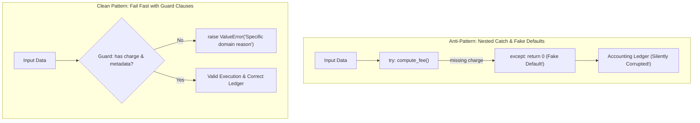

# Absence values and strict edges

## Use when

Use `None`, a private sentinel, a Null Object, or a strict validated type when 'missing' has
meaning at a boundary and callers otherwise repeat defensive checks.

## Why

Modeling absence once keeps uncertainty at the edge. The core workflow can then accept a value with
a stronger invariant, while a Null Object makes an optional capability safe and explicit.

Failing fast ("letting it crash and burn") is essential to this boundary:
- **Prevent Silent Data Corruption**: Replacing missing data with a synthetic default (e.g., returning `0`
  fee when a payment transaction is missing) silently poisons ledgers and databases.
- **Flat, Readable Logic**: Using guard clauses avoids deep, nested `try/except` pyramids that obscure
  primary business logic.
- **Observability-Driven Hardening**: Allowing unexpected inputs to fail visibly in monitored environments
  exposes real-world edge cases, allowing you to write targeted normalizers rather than guessing failure modes.

### Mental Model: Catch-and-Swallow vs. Fail Fast



## Example: Before vs. After

### Before: Nested `try/except` error-handling pyramid

```python
# ❌ BEFORE: Deep indentation, cluttering try/except blocks, catching all exceptions
def construct_invoice_data(payment_intent: dict) -> dict:
    try:
        try:
            fee = get_application_fee(payment_intent)
        except ValueError as e:
            print(f"Failed to retrieve application fee: {e}")
            raise
        try:
            return {
                "contact_id": payment_intent["customer"]["metadata"]["mb_contact_id"],
                "fee": fee,
            }
        except KeyError as e:
            print(f"Failed to construct invoice: {e}")
            raise
    except Exception as e:
        print(f"Unexpected error: {e}")
        raise
```

### After: Linear guard clauses failing fast

```python
# ✅ AFTER: Flat control flow, explicit domain errors, fast failure
def construct_invoice_data(payment_intent: dict) -> dict:
    customer = payment_intent.get("customer", {})
    metadata = customer.get("metadata", {})

    if "mb_contact_id" not in metadata:
        raise ValueError("Customer does not have an accounting contact ID.")

    fee = get_application_fee(payment_intent)

    return {
        "contact_id": metadata["mb_contact_id"],
        "fee": fee,
    }
```

Never return synthetic defaults (`fee = 0`) to mask an absent transaction; fail immediately so
the anomaly is logged and investigated.

Adapted from the [ArjanCodes Fail Fast video](https://www.youtube.com/watch?v=YA0Wq1rcs6U) and
[2024 burn examples](https://github.com/ArjanCodes/examples/tree/main/2024/burn).

## When not to use

Do not replace a meaningful failure with a silent Null Object. Keep `None` when absence is the
actual domain result, use a private sentinel when 'argument omitted' differs from 'argument is None',
and do not add a class for one local check.

Do not fail fast unchecked in life-critical systems (medical devices, aerospace) or real-time control
systems where crashing causes immediate physical danger; employ explicit fallbacks and graceful
degradation there. In microservices, pair local fail-fast with Circuit Breakers to prevent cascading
failures.

## Trade-offs

Strict edge validation moves errors earlier and reduces branching, but it adds conversion code.
A sentinel preserves three states but is easy to confuse with `None`. A Null Object removes
conditionals while potentially hiding that an operation did nothing; name and test that behavior.

## Tests

Test missing, explicit `None`, valid, and invalid inputs separately. For sentinels, assert identity
with `is`. For Null Objects, assert that the no-op contract is safe and observable where needed.
Verify that guard clauses raise explicit domain exceptions (`ValueError`, `KeyError`) with informative
messages rather than letting raw exceptions leak silently.

## Python code

The [ArjanCodes 2026 `none` example](https://github.com/ArjanCodes/examples/blob/main/2026/none/after.py)
turns nullable drone telemetry into a strict `ReadyDrone` before route assignment:

```python
from dataclasses import dataclass


@dataclass(frozen=True)
class Telemetry:
    location: tuple[float, float] | None
    battery: int | None


@dataclass(frozen=True)
class ReadyDrone:
    location: tuple[float, float]
    battery: int


def prepare(telemetry: Telemetry) -> ReadyDrone:
    if telemetry.location is None:
        raise ValueError("GPS location is required")
    if telemetry.battery is None:
        raise ValueError("battery reading is required")
    return ReadyDrone(telemetry.location, telemetry.battery)
```

The strict type is created once; downstream code does not check nullable fields again. For an
optional collaborator, the same source uses a Null Object with a narrow Protocol:

```python
class Diagnostics(Protocol):
    def record(self, message: str) -> None: ...


class NullDiagnostics:
    def record(self, message: str) -> None:
        pass
```

Use a private sentinel when omission and explicit `None` differ:

```python
_MISSING = object()


def read_limit(value: int | None | object = _MISSING) -> int:
    if value is _MISSING:
        return 100
    if value is None:
        raise ValueError("limit cannot be None")
    return int(value)
```

The [zedr clean-code-python table of contents](https://github.com/zedr/clean-code-python#table-of-contents)
supports this edge-focused approach: use defaults where they express the contract, avoid hidden
side effects, and keep the main operation at one abstraction level.

## Framework examples

### Pydantic strict boundary

Pydantic validates external absence and produces a value the application can trust:

```python
from pydantic import BaseModel, ConfigDict


class CreateJob(BaseModel):
    model_config = ConfigDict(extra="forbid")
    name: str
    queue: str = "default"
```

Unknown fields and malformed input are rejected at the API boundary; the service does not need to
carry an untyped dictionary. See the [Pydantic models documentation](https://docs.pydantic.dev/latest/concepts/models/).
