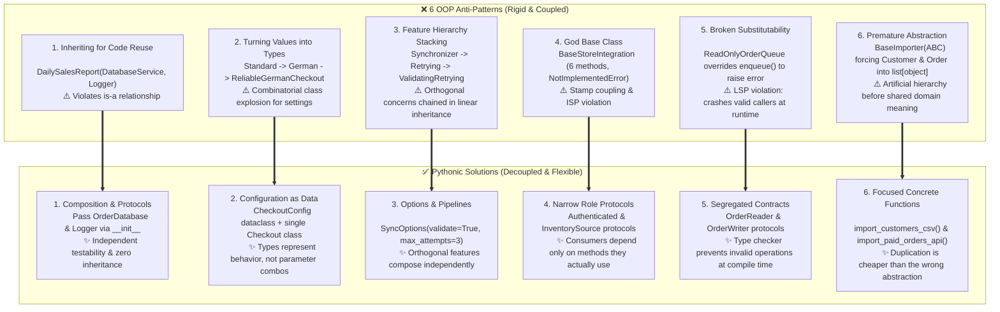

# Object-oriented Python

## Use when

Use a class when identity, invariants, lifecycle, state, or a cohesive protocol must be owned by
one object. Use composition and delegation when behavior varies along independent dimensions.

## Why

Well-shaped objects localize invariants and expose Python's native protocols. Composition avoids
subclass explosion and keeps components independently testable.

## Prefer

- Frozen dataclasses or explicit value objects for immutable domain values.
- `Protocol` and delegation for consumer-defined interfaces: callers describe the shape they need without forcing implementations to import an interface base class.
- `abc.ABC` only when subclasses genuinely share concrete state, common helper methods, or require instantiation-time enforcement (`TypeError`).
- Composition over inheritance: wire concrete dependencies in a single Composition Root (`main.py`) rather than coupling workers to concrete classes.
- Properties only for stable derived or validated attributes.
- Special methods when the object should participate naturally in Python syntax.
- Inheritance for a genuine substitutable “is-a” relationship with a stable extension contract.

## Avoid

Deep hierarchies, mixins that require undocumented initialization order, and classes that only
wrap one function without state. Avoid `isinstance` branching on concrete subclasses inside worker
methods. For Adapter, Decorator, Facade, and Strategy choices, consult `python-design-patterns`.

## Tests

Test invariants, equality/hash consistency, protocol behavior, delegation, lifecycle cleanup, and
composition of independently tested objects.

## Framework examples

### MLflow — a portable model object

```python
class SentimentModel(mlflow.pyfunc.PythonModel):
    def predict(self, context, model_input):
        return classify(model_input)
```

`PythonModel` gives different model implementations one lifecycle and prediction protocol; an
extension class fits because MLflow owns serving while the subclass owns model behavior. See the
[MLflow PyFunc API](https://mlflow.org/docs/latest/api_reference/python_api/mlflow.pyfunc.html).

### Agno — composition of agents into a team

```python
researcher = Agent(name="researcher", tools=[search])
writer = Agent(name="writer")
team = Team(members=[researcher, writer])
```

`Team` composes independently testable agents and delegates work without forcing a deep inheritance
hierarchy. See [Agno teams](https://docs.agno.com/teams/overview).

### Google ADK — workflow objects

```python
pipeline = SequentialAgent(
    name="summarize",
    sub_agents=[fetch_agent, summarize_agent],
)
```

`SequentialAgent` makes ordering and ownership explicit; a workflow object fits because it owns the
execution lifecycle of its child agents. See [Google ADK workflow agents](https://adk.dev/agents/workflow-agents/).

### qwen-agent — subclassable agent behavior

```python
class SearchAgent(Agent):
    def _run(self, messages, **kwargs):
        yield from super()._run(messages, **kwargs)
```

The subclass keeps the framework’s agent protocol while specializing one cohesive behavior, which
is appropriate when the extension is genuinely substitutable. See the qwen-agent [agent guide](https://github.com/QwenLM/Qwen-Agent/blob/main/qwen-agent-docs/website/content/en/guide/core_moduls/agent.md).

## When not to use

Do not create a class for a stateless one-use function or a simple record that a value object or
dictionary expresses clearly. Avoid inheritance when composition can vary the behavior directly.

## Trade-offs

Classes localize state and invariants, but add lifecycle, indirection, and mocking surface. Inheritance
can reduce duplication while coupling subclasses to base-class initialization and implementation.

## ArjanCodes OOP lessons (adapted)

The [ArjanCodes OOP video](https://www.youtube.com/watch?v=RqcEK7sWesQ) ("You Think This Is Good OOP… It’s Not") and its [companion repository](https://github.com/ArjanCodes/examples/tree/main/2026/oop) deconstruct six common object-oriented patterns that look like good design but actively degrade code quality.

### Visual mental model: The 6 OOP traps vs. Pythonic reality



---

### Mistake 1: Inheriting just to reuse code

Subclassing utility or infrastructure classes solely to borrow their methods creates tight coupling and violates the fundamental "is-a" relationship: a daily sales report is neither a database service nor a logger.

```python
# ❌ BEFORE: Multiple inheritance solely to borrow helper methods (01_code_reuse_before.py)
class DailySalesReport(DatabaseService, Logger):
    def generate(self) -> None:
        totals = self.fetch_paid_order_totals()
        self.log(f"Daily sales: {sum(totals)} EUR")

# ✅ AFTER: Pass narrow protocols via constructor injection (01_code_reuse_after.py)
from typing import Protocol

class OrderDatabase(Protocol):
    def fetch_paid_order_totals(self) -> list[int]: ...

class Logger(Protocol):
    def log(self, message: str) -> None: ...

class DailySalesReport:
    def __init__(self, database: OrderDatabase, logger: Logger) -> None:
        self.database = database
        self.logger = logger

    def generate(self) -> None:
        totals = self.database.fetch_paid_order_totals()
        self.logger.log(f"Daily sales: {sum(totals)} EUR")
```

> [!WARNING]
> **The Class Adapter Trap**: Avoid subclassing third-party libraries (e.g. `class XMLAdapter(BeautifulSoup)`) to adapt their interfaces. Subclassing causes method signature collisions (such as overriding `BeautifulSoup.get()`) and pollutes the adapter with external methods. Instead, wrap the instance via composition ([Object Adapter](../../../python-design-patterns/references/composition/adapter.md)) or adapt single-operation contracts via functions and partials ([Functional Adapter](../../../python-design-patterns/references/composition/adapter.md)).

> [!TIP]
> **Avoid Combinatorial Subclass Explosion ($M \times N$)**: If classes vary across multiple independent axes (e.g., payment type $\times$ commission type $\times$ bonus), modeling them through inheritance requires $M \times N$ subclasses with duplicated method logic. Decompose the axes into independent collaborators (`Contract`, `Commission`) and compose them into a stable entity (`Employee`). See [Composition over inheritance](../../../python-design-patterns/references/principles/composition.md) and [ArjanCodes 2021 composition vs inheritance](https://github.com/ArjanCodes/2021-composition-vs-inheritance).

---

### Mistake 2: Turning values into types (configuration subclasses)

Creating subclasses to override constants, thresholds, or configuration settings turns runtime data into compile-time types. Adding new dimensions (e.g., $M$ countries $\times N$ retry policies) leads to combinatorial subclass proliferation.

```python
# ❌ BEFORE: Subclassing to change configuration constants (02_configuration_subclasses_before.py)
@dataclass(frozen=True)
class StandardCheckout:
    tax_rate: Decimal = Decimal("0.21")
    retry_count: int = 3
    def total_for(self, subtotal: Decimal) -> Decimal:
        return subtotal * (Decimal(1) + self.tax_rate)

@dataclass(frozen=True)
class GermanCheckout(StandardCheckout):
    tax_rate: Decimal = Decimal("0.19")

@dataclass(frozen=True)
class ReliableGermanCheckout(GermanCheckout):
    retry_count: int = 10

# ✅ AFTER: Model configuration as data in a frozen dataclass (02_configuration_subclasses_after.py)
@dataclass(frozen=True)
class CheckoutConfig:
    tax_rate: Decimal
    retry_count: int

class Checkout:
    def __init__(self, config: CheckoutConfig) -> None:
        self.config = config

    def total_for(self, subtotal: Decimal) -> Decimal:
        return subtotal * (Decimal(1) + self.config.tax_rate)

def create_german_reliable_config() -> CheckoutConfig:
    return CheckoutConfig(tax_rate=Decimal("0.19"), retry_count=10)
```

**Rule**: Classes should represent distinct behavior, constraints, or identity—not every conceivable combination of settings.

---

### Mistake 3: Modeling independent features with a hierarchy

Stacking orthogonal capabilities (e.g., retries, validation, caching) in an inheritance chain couples unrelated features and prevents using one feature without the other.

```python
# ❌ BEFORE: Linear inheritance stacking for independent features (03_feature_variation_before.py)
class ProductCatalogSynchronizer:
    def __init__(self, api: CatalogApi) -> None:
        self.api = api
    def sync(self, products: list[Product]) -> SyncResult:
        self.api.replace_products(products)
        return SyncResult(products_synced=len(products), attempts=1)

class RetryingProductCatalogSynchronizer(ProductCatalogSynchronizer):
    def sync(self, products: list[Product]) -> SyncResult:
        for attempt in range(1, 4):
            try:
                self.api.replace_products(products)
                return SyncResult(products_synced=len(products), attempts=attempt)
            except ConnectionError:
                if attempt == 3: raise
        raise AssertionError("Unreachable")

class ValidatingRetryingProductCatalogSynchronizer(RetryingProductCatalogSynchronizer):
    def sync(self, products: list[Product]) -> SyncResult:
        if any(p.price_in_cents < 0 for p in products):
            raise ValueError("Product prices cannot be negative")
        return super().sync(products)

# ✅ AFTER: Pass options as data or decompose into independent functions (03_feature_variation_after.py)
@dataclass(frozen=True)
class SyncOptions:
    validate_products: bool = False
    max_attempts: int = 1

def sync_catalog(api: CatalogApi, products: list[Product], options: SyncOptions) -> SyncResult:
    if options.validate_products and any(p.price_in_cents < 0 for p in products):
        raise ValueError("Product prices cannot be negative")

    for attempt in range(1, options.max_attempts + 1):
        try:
            api.replace_products(products)
            return SyncResult(products_synced=len(products), attempts=attempt)
        except ConnectionError:
            if attempt == options.max_attempts: raise
    raise AssertionError("Unreachable")
```

---

### Mistake 4: Creating a base class that forces one shape on everything (God base class)

Broad base classes cause **stamp coupling**: subclasses are forced to inherit methods they cannot fulfill, raising `NotImplementedError`, while callers receive wide objects containing methods they do not need.

```python
# ❌ BEFORE: Monolithic base class with NotImplementedError (04_god_base_class_before.py)
class BaseStoreIntegration:
    def authenticate(self, api_key: str) -> SupplierSession: raise NotImplementedError
    def upload_product_images(self, image_urls: list[str]) -> None: raise NotImplementedError
    def download_inventory(self, session: SupplierSession) -> list[InventoryItem]: raise NotImplementedError
    def download_reserved_skus(self, session: SupplierSession) -> set[str]: raise NotImplementedError
    def subscribe_to_order_webhooks(self, callback_url: str) -> None: raise NotImplementedError
    def request_return_label(self, order_id: str) -> str: raise NotImplementedError

# ✅ AFTER: Interface segregation with small, client-defined protocols (04_god_base_class_after.py)
class Authenticated(Protocol):
    def authenticate(self, api_key: str) -> SupplierSession: ...

class InventorySource(Protocol):
    def download_inventory(self, session: SupplierSession) -> list[InventoryItem]: ...
    def download_reserved_skus(self, session: SupplierSession) -> set[str]: ...

class WarehouseSupplier:
    def authenticate(self, api_key: str) -> SupplierSession: ...
    def download_inventory(self, session: SupplierSession) -> list[InventoryItem]: ...
    def download_reserved_skus(self, session: SupplierSession) -> set[str]: ...

def connect_to_supplier(integration: Authenticated, api_key: str) -> SupplierSession:
    return integration.authenticate(api_key)

def sync_inventory(source: InventorySource, session: SupplierSession) -> list[InventoryItem]:
    inventory = source.download_inventory(session)
    reserved = source.download_reserved_skus(session)
    return [i for i in inventory if i.quantity > 0 and i.sku not in reserved]
```

---

### Mistake 5: Creating subtypes that cannot behave like their parent (LSP violation)

Subclassing to restrict or disable parent functionality violates the **Liskov Substitution Principle**. If a subclass raises runtime errors for methods the parent guarantees, any function accepting the parent type will crash when given the child.

```python
# ❌ BEFORE: ReadOnlyOrderQueue breaks parent contract (05_substitutability_before.py)
class OrderQueue:
    def __init__(self, orders: list[Order]) -> None:
        self._orders = orders.copy()
    def enqueue(self, order: Order) -> None:
        self._orders.append(order)
    def get_orders(self) -> list[Order]:
        return self._orders.copy()

class ReadOnlyOrderQueue(OrderQueue):
    def enqueue(self, order: Order) -> None:
        raise RuntimeError("This order queue is read-only")  # 💥 Breaks LSP!

def add_expedited_order(queue: OrderQueue) -> None:
    queue.enqueue(Order("EXPRESS-1"))  # Type check passes, but crashes at runtime!

# ✅ AFTER: Segregate read and write contracts into separate protocols (05_substitutability_after.py)
class OrderReader(Protocol):
    def get_orders(self) -> list[Order]: ...

class OrderWriter(Protocol):
    def enqueue(self, order: Order) -> None: ...

class OrderQueue:
    def __init__(self, orders: list[Order]) -> None:
        self._orders = orders.copy()
    def enqueue(self, order: Order) -> None:
        self._orders.append(order)
    def get_orders(self) -> list[Order]:
        return self._orders.copy()

class OrderHistory:
    def __init__(self, orders: list[Order]) -> None:
        self._orders = orders.copy()
    def get_orders(self) -> list[Order]:
        return self._orders.copy()

def print_order_history(history: OrderReader) -> None:
    print([o.order_id for o in history.get_orders()])

def add_expedited_order(queue: OrderWriter) -> None:
    queue.enqueue(Order("EXPRESS-1"))  # Passing OrderHistory is caught at compile time!
```

---

### Mistake 6: Abstracting before understanding similarity (Premature abstraction)

Syntactic similarity does not imply shared domain semantics. Forcing disparate operations (such as importing CSV customers and importing API orders) into a generic abstract base class loses type specificity (`list[object]`) and creates coupling between features that evolve for different reasons.

```python
# ❌ BEFORE: Template Method forcing unrelated domains into generic objects (06_premature_abstraction_before.py)
class BaseImporter(ABC):
    def import_records(self) -> list[object]:  # Degraded to object!
        raw = self.load()
        return [self.transform(r) for r in raw if self.is_valid(r)]
    @abstractmethod
    def load(self) -> list[str]: ...
    @abstractmethod
    def is_valid(self, record: str) -> bool: ...
    @abstractmethod
    def transform(self, record: str) -> object: ...

# ✅ AFTER: Focused concrete functions respecting domain types (06_premature_abstraction_after.py)
def import_customers_from_csv(rows: list[str]) -> list[Customer]:
    return [Customer(email=row) for row in rows if "@" in row]

def import_paid_orders_from_api(records: list[str]) -> list[ImportedOrder]:
    return [
        ImportedOrder(order_id=r.removesuffix(":paid"))
        for r in records if r.endswith(":paid")
    ]
```

> [!NOTE]
> **Sandi Metz's Rule**: *"Duplication is far cheaper than the wrong abstraction."*
> Abstract only when concepts share both identical semantics and a common axis of change.

---

### What good OOP actually looks like in Python

1. **Protect Invariants**: Use objects primarily to protect internal consistency and combine state with cohesive behavior operating on that state.
2. **Classes Are Not Default**: In Python, modules and functions are first-class citizens. Prefer plain functions for stateless operations or transformations.
3. **Values Are Data**: Use frozen dataclasses for configuration and value objects, not subclass hierarchies.
4. **Capabilities Are Protocols**: Use small structural protocols (`Protocol`) defined by consumers, eliminating inheritance coupling.
5. **Vary via Composition**: Compose collaborators along independent axes to avoid $M \times N$ subclass combinatorial explosion.

## More 2026 class-boundary examples

The [2026 `coupling` examples](https://github.com/ArjanCodes/examples/tree/main/2026/coupling)
show why a class should receive collaborators instead of reaching into a global service locator.

```python
class BookingService:
    def __init__(self, flights: FlightPort, payments: PaymentPort) -> None:
        self.flights = flights
        self.payments = payments

    def book(self, booking: Booking) -> Confirmation:
        hold = self.flights.hold(booking.flight_id)
        return self.payments.charge(hold, booking.amount)
```

Split a god object by the questions callers ask. A report generator should not also own payment,
inventory, and notification APIs; the [2026 `god` examples](https://github.com/ArjanCodes/examples/tree/main/2026/god)
use narrow collaborators and contracts for that pressure.

```python
class InventoryReader(Protocol):
    def stock_for(self, sku: str) -> int: ...


class StockReport:
    def __init__(self, inventory: InventoryReader) -> None:
        self.inventory = inventory

    def available(self, sku: str) -> bool:
        return self.inventory.stock_for(sku) > 0
```

Use a dataclass when the class is primarily a value with a small invariant, not because every
object needs a method-heavy abstraction. The [2026 `dataclass` example](https://github.com/ArjanCodes/examples/tree/main/2026/dataclass)
and [value examples](https://github.com/ArjanCodes/examples/tree/main/2026/value) are good fits:

```python
@dataclass(frozen=True)
class Money:
    amount: Decimal
    currency: str

    def __post_init__(self) -> None:
        if self.amount < 0 or len(self.currency) != 3:
            raise ValueError("invalid money value")
```

If two implementations differ only in their type-specific operation, a narrow Protocol is usually
enough; see the [2026 `type` examples](https://github.com/ArjanCodes/examples/tree/main/2026/type).
Properties are appropriate for stable derived values, not hidden I/O or surprising mutation:

```python
@dataclass
class Cart:
    lines: list[Money]

    @property
    def total(self) -> Money:
        return Money(sum((line.amount for line in self.lines), Decimal("0")), "EUR")
```

The [2026 `props` examples](https://github.com/ArjanCodes/examples/tree/main/2026/props) explore
the same boundary. Keep the property cheap and deterministic; make expensive work a method.
