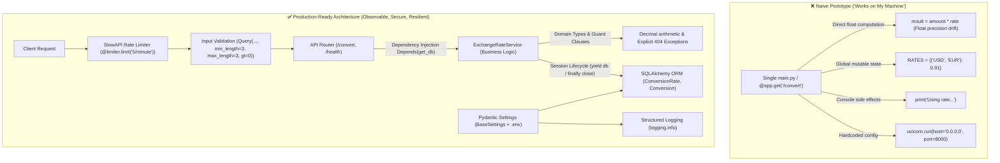
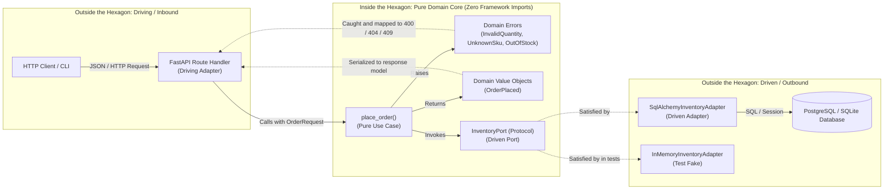

# SOLID boundaries in Python

## Use when

Use SOLID as a diagnostic when a class has several reasons to change, a branch grows with every
feature, a subtype cannot honor its parent contract, or high-level code constructs concrete
infrastructure directly.

## Why

SOLID turns vague 'this is hard to change' feedback into local questions: which responsibility
changes, which extension should be additive, which contract is substitutable, which interface is
needed, and which dependency should point inward.

## When not to use

Do not create an interface, abstract base class, or dependency-injection container for a stable
one-implementation function. SOLID is guidance for change pressure, not a requirement to split every
small module into layers.

## Trade-offs

Narrow boundaries improve testing and extension but introduce names, adapters, and indirection.
Too many interfaces make simple code harder to follow. Prefer a small Protocol and one composition
root over a hierarchy or service locator.

## Tests

Test each responsibility in isolation, contract tests for every adapter, substitutability of
implementations, and the composition root with real wiring. Also test failure behavior at each
boundary and ensure side effects occur only in the owning adapter.

## Python code

The [ArjanCodes 2026 `coupling` examples](https://github.com/ArjanCodes/examples/tree/main/2026/coupling)
and [`god` examples](https://github.com/ArjanCodes/examples/tree/main/2026/god) are practical
diagnostics. A use case depends on small ports, while adapters own infrastructure:

```python
from typing import Protocol


class InventoryPort(Protocol):
    def get_stock(self, sku: str) -> int: ...

    def reserve(self, sku: str, quantity: int) -> int: ...


class ReserveStock:
    def __init__(self, inventory: InventoryPort) -> None:
        self.inventory = inventory

    def execute(self, sku: str, quantity: int) -> int:
        if self.inventory.get_stock(sku) < quantity:
            raise ValueError("not enough stock")
        return self.inventory.reserve(sku, quantity)
```

This is dependency inversion and interface segregation in a small form: the use case needs only
inventory behavior, not a god repository. The [2026 ports source](https://github.com/ArjanCodes/examples/blob/main/2026/ports/domain/ports.py)
shows the same port/adapter split.

> [!TIP]
> **Dependency Inversion (DIP) Requires Dependency Injection (DI)**:
> High-level modules cannot depend on abstractions if they construct concrete dependencies directly.
> Pass dependencies via `__init__` constructor injection to allow test fakes to be supplied with zero mocking.
> For medium-to-large applications, use a modern type-safe DI container like [Dishka](https://dishka.readthedocs.io/)
> to handle scoped lifecycles (`Scope.APP`, `Scope.REQUEST`) and autowire Protocol dependencies without wiring boilerplate.
> See [Dependency Injection and Inversion](../../../python-design-patterns/references/extensibility/registry-di.md)
> and [ArjanCodes 2021 dependency injection/inversion](https://github.com/ArjanCodes/2021-dependency-injection-inversion).

A policy pipeline is an additive open/closed boundary:

```python
from collections.abc import Callable


Policy = Callable[[Request], Request]


def apply_policies(request: Request, policies: list[Policy]) -> Request:
    for policy in policies:
        request = policy(request)
    return request
```

Each policy has one responsibility and can be tested without the pipeline. The [2026 policy
tree](https://github.com/ArjanCodes/examples/tree/main/2026/policy) and [policy video](https://www.youtube.com/watch?v=wYeDGkdMi3g)
show the configured registry form.

A registration decorator provides an additive Open/Closed boundary that eliminates `if/elif` branching:

```python
from collections.abc import Callable
from typing import Any

type Handler = Callable[[Any], None]
HANDLERS: dict[str, Handler] = {}

def register(key: str):
    def decorator(fn: Handler) -> Handler:
        if key in HANDLERS:
            raise ValueError(f"duplicate key: {key}")
        HANDLERS[key] = fn
        return fn
    return decorator

def dispatch(key: str, payload: Any) -> None:
    handler = HANDLERS.get(key)
    if not handler:
        raise ValueError(f"unsupported key: {key}")
    handler(payload)
```

The central dispatcher is closed for modification (it never changes when new handlers arrive), while
the system remains open for extension (new handlers register additively via decorators). The
[ArjanCodes Registry video](https://www.youtube.com/watch?v=g7EGMWvJ1fI) and
[2025 registry tree](https://github.com/ArjanCodes/examples/tree/main/2025/registry) demonstrate
eliminating branching churn with this pattern.

### Liskov Substitution Principle (LSP): Subtypes must not contradict parent guarantees

Subclassing to restrict or disable parent functionality violates LSP. If a subclass raises runtime errors for methods the parent guarantees, any function accepting the parent type will crash when given the child:

```python
# ❌ LSP VIOLATION: ReadOnlyOrderQueue breaks parent OrderQueue contract
class OrderQueue:
    def enqueue(self, order: Order) -> None:
        self._orders.append(order)

class ReadOnlyOrderQueue(OrderQueue):
    def enqueue(self, order: Order) -> None:
        raise RuntimeError("This order queue is read-only")  # 💥 Breaks LSP!

def add_expedited_order(queue: OrderQueue) -> None:
    queue.enqueue(Order("EXPRESS-1"))  # Type-checks, but crashes if given ReadOnlyOrderQueue!

# ✅ REMEDY: Segregate contracts into consumer-defined protocols
class OrderReader(Protocol):
    def get_orders(self) -> list[Order]: ...

class OrderWriter(Protocol):
    def enqueue(self, order: Order) -> None: ...

# Distinct implementations without inheritance
class OrderQueue: ...   # Satisfies OrderReader and OrderWriter
class OrderHistory: ... # Satisfies OrderReader only
```

See [`05_substitutability_after.py`](https://github.com/ArjanCodes/examples/blob/main/2026/oop/05_substitutability_after.py) and the [ArjanCodes OOP video](https://www.youtube.com/watch?v=RqcEK7sWesQ).

### Interface Segregation Principle (ISP): Prevent stamp coupling

A wide base class forces implementers to stub unused methods with `raise NotImplementedError` and causes **stamp coupling**: callers receive huge objects with 10+ methods when they only need one or two operations.

```python
# ❌ ISP VIOLATION & STAMP COUPLING: God base class forces unimplemented methods
class BaseStoreIntegration:
    def authenticate(self, api_key: str) -> Session: raise NotImplementedError
    def upload_images(self, urls: list[str]) -> None: raise NotImplementedError
    def download_inventory(self, session: Session) -> list[Item]: raise NotImplementedError
    def subscribe_webhooks(self, url: str) -> None: raise NotImplementedError

# ✅ REMEDY: Small role protocols defined by consuming workflows
class Authenticated(Protocol):
    def authenticate(self, api_key: str) -> Session: ...

class InventorySource(Protocol):
    def download_inventory(self, session: Session) -> list[Item]: ...

def connect_to_supplier(integration: Authenticated, api_key: str) -> Session:
    return integration.authenticate(api_key)

def sync_inventory(source: InventorySource, session: Session) -> list[Item]:
    return source.download_inventory(session)
```

See [`04_god_base_class_after.py`](https://github.com/ArjanCodes/examples/blob/main/2026/oop/04_god_base_class_after.py).

The [zedr clean-code-python table of contents](https://github.com/zedr/clean-code-python#table-of-contents)
provides the complementary SRP, OCP, LSP, ISP, DIP checklist: use it to diagnose coupling, not to
justify abstractions without a change axis.

## Framework examples

### FastAPI dependency boundary

FastAPI dependencies make the composition root visible while the route depends on behavior:

```python
from typing import Annotated, Protocol
from fastapi import Depends, FastAPI, HTTPException


class UserReader(Protocol):
    def find(self, user_id: int) -> User | None: ...


def get_user_reader() -> UserReader:
    return SqlUserReader()


app = FastAPI()


@app.get("/users/{user_id}")
def get_user(user_id: int, reader: Annotated[UserReader, Depends(get_user_reader)]) -> User:
    user = reader.find(user_id)
    if user is None:
        raise HTTPException(status_code=404)
    return user
```

The route is testable with a fake reader, while the SQL adapter owns the database side effect. See
the [FastAPI dependencies documentation](https://fastapi.tiangolo.com/tutorial/dependencies/).

### The production-ready architecture: From naive prototype to hardened service

In ["How to Tell If Your Code Is Actually Production-Ready"](https://www.youtube.com/watch?v=GMBiCMsEsq8) and its [companion repository](https://github.com/ArjanCodes/examples/tree/main/2025/production), Arjan demonstrates the architectural evolution of a service that "works on my machine" into a system that is observable, secure, maintainable, and resilient.



#### 3-tier boundary separation

A production service enforces strict separation across three layers:
1. **API / Transport Layer (`api.py`)**: Responsible for HTTP routing, request parsing, schema bounds validation (`Query(..., min_length=3, max_length=3, gt=0)`), and rate limiting (`slowapi`). It never performs calculations or raw SQL queries directly.
2. **Domain Service Layer (`services.py`)**: Owns business logic (`ExchangeRateService.convert()`), invariant validation, domain exception raising, and transactional coordination. It is agnostic of HTTP headers or JSON serialization.
3. **Persistence Layer (`database.py`, `models.py`)**: Encapsulates ORM entities (`ConversionRate`, `Conversion`), migrations, and session lifecycle management via generator dependencies (`get_db()` with `yield` and `finally: db.close()`).

#### The 11-step production-readiness checklist

| Step | Dimension | Naive Approach | Production-Ready Remedy |
|---|---|---|---|
| **1** | **Domain Types** | `float` for currency amounts | `Decimal` from stdlib to avoid binary floating-point rounding errors |
| **2** | **Input Validation** | Unbounded `str`, `float` | Pydantic / FastAPI `Query(..., min_length=3, max_length=3, gt=0)` |
| **3** | **Service Extraction** | Business logic inside route handlers | Dedicated `ExchangeRateService` injected via `Depends()` |
| **4** | **Persistence** | In-memory global dictionary (`RATES`) | Relational database (SQLAlchemy models + connection pooling) |
| **5** | **Health Probes** | No health endpoints | Dedicated `/health` probe returning `{"status": "ok"}` for Kubernetes/orchestrator liveness |
| **6** | **Defensive Error Handling** | Assumes record exists (unhandled 500) | Guard clauses verifying positive rates, raising typed 404 exceptions |
| **7** | **Configuration Management** | Hardcoded strings/ports in source | 12-Factor `pydantic-settings` `BaseSettings` reading from `.env` and environment variables |
| **8** | **Abuse Prevention** | Unlimited calls allowed | Rate limiting via `slowapi` (`@limiter.limit("5/minute")` keyed by remote IP) |
| **9** | **Automated Testing** | Manual curl verification | `pytest` test suite with in-memory SQLite fixtures and `app.dependency_overrides` |
| **10** | **Observability** | `print()` calls to stdout | Structured `logging.info()` with configurable log levels (`INFO`, `DEBUG`) |
| **11** | **Deployment Packaging** | Running script directly in terminal | Containerized `Dockerfile` + CI/CD automated test pipeline (GitHub Actions) |

### Ports & Adapters (Hexagonal Architecture): Isolating domain logic from frameworks

In ["Stop Mixing FastAPI with Business Logic: Fix It with Ports & Adapters"](https://www.youtube.com/watch?v=FXwBWS4qDAA) and the [companion repository](https://github.com/ArjanCodes/examples/tree/main/2026/ports), Arjan demonstrates how mixing transport frameworks (FastAPI `HTTPException`) and database drivers (SQLAlchemy `Connection`, raw SQL) directly into business functions creates tightly coupled, untestable code.



#### The 6-step Ports & Adapters refactoring recipe

1. **Create Domain Types**: Replace loose `dict[str, Any]` inputs and outputs with immutable dataclasses (`OrderRequest`, `OrderPlaced`).
2. **Introduce Domain Errors**: Replace framework-specific exceptions (`HTTPException(status_code=404)`) with domain-specific exceptions (`DomainError`, `UnknownSku`, `OutOfStock`, `InvalidQuantity`).
3. **Define Driven Ports**: Define what the domain *needs* using a pure structural `Protocol` (`InventoryPort`), specifying only the operations required by business logic.
4. **Write Use Cases as Pure Logic**: Implement business operations (`place_order`) using only domain models and ports. Core domain files import zero third-party frameworks.
5. **Implement Driven Adapters**: Create concrete infrastructure adapters (`SqlAlchemyInventoryAdapter`, `InMemoryInventoryAdapter`) that implement the port protocol and encapsulate database queries, connections, and commits.
6. **Turn Framework Routes into Driving Translators**: The API route becomes a thin translation layer: it converts HTTP/JSON inputs to domain models, executes the use case, catches domain errors to map them to HTTP status codes (e.g., `OutOfStock` $\to$ HTTP 409 Conflict), and serializes the domain result.

#### Before: Framework-polluted logic (`before_api.py`)

```python
# ❌ ANTI-PATTERN: Business logic polluted with FastAPI, raw SQL, and wire dicts
from typing import Any
from fastapi import APIRouter, Depends, HTTPException
from sqlalchemy import Connection, text

router = APIRouter()

@router.post("/orders")
def place_order_endpoint(payload: dict[str, Any], db: Connection = Depends(get_db)):
    sku = payload.get("sku")
    quantity = payload.get("quantity", 0)

    # Transport pollution in business validation
    if quantity <= 0:
        raise HTTPException(status_code=400, detail="Quantity must be positive")

    # Direct database coupling inside business logic
    row = db.execute(text("SELECT stock FROM inventory WHERE sku = :sku"), {"sku": sku}).fetchone()
    if not row:
        raise HTTPException(status_code=404, detail="SKU not found")
    if row[0] < quantity:
        raise HTTPException(status_code=409, detail="Insufficient stock")

    db.execute(
        text("UPDATE inventory SET stock = stock - :qty WHERE sku = :sku"),
        {"sku": sku, "qty": quantity}
    )
    db.commit()

    # Returning API wire format directly
    return {"status": "success", "sku": sku, "reserved": quantity}
```

#### After: Pure Hexagon separation (`2026/ports`)

```python
# ✅ PURE DOMAIN (Inside the Hexagon: zero framework imports)
from dataclasses import dataclass
from typing import Protocol

class DomainError(Exception): """Base domain error."""
class InvalidQuantity(DomainError): """Quantity must be positive."""
class UnknownSku(DomainError): """SKU does not exist in inventory."""
class OutOfStock(DomainError): """Requested quantity exceeds available stock."""

@dataclass(frozen=True)
class OrderRequest:
    sku: str
    quantity: int

@dataclass(frozen=True)
class OrderPlaced:
    sku: str
    quantity_reserved: int

class InventoryPort(Protocol):
    def exists_sku(self, sku: str) -> bool: ...
    def get_stock(self, sku: str) -> int: ...
    def reserve(self, sku: str, quantity: int) -> None: ...

def place_order(req: OrderRequest, inventory: InventoryPort) -> OrderPlaced:
    if req.quantity <= 0:
        raise InvalidQuantity(f"Quantity must be positive: {req.quantity}")
    if not inventory.exists_sku(req.sku):
        raise UnknownSku(f"Unknown SKU: {req.sku}")
    if inventory.get_stock(req.sku) < req.quantity:
        raise OutOfStock(f"Insufficient stock for {req.sku}")

    inventory.reserve(req.sku, req.quantity)
    return OrderPlaced(sku=req.sku, quantity_reserved=req.quantity)
```

```python
# ✅ DRIVING ADAPTER (Outside the Hexagon: FastAPI Translation Layer)
from fastapi import APIRouter, Depends, HTTPException, status
from pydantic import BaseModel

router = APIRouter()

class OrderInput(BaseModel):
    sku: str
    quantity: int

class OrderOutput(BaseModel):
    sku: str
    quantity_reserved: int

@router.post("/orders", response_model=OrderOutput)
def create_order(input_data: OrderInput, inventory: InventoryPort = Depends(get_inventory_adapter)) -> OrderOutput:
    domain_req = OrderRequest(sku=input_data.sku, quantity=input_data.quantity)
    try:
        result = place_order(domain_req, inventory)
        return OrderOutput(sku=result.sku, quantity_reserved=result.quantity_reserved)
    except InvalidQuantity as exc:
        raise HTTPException(status_code=status.HTTP_400_BAD_REQUEST, detail=str(exc)) from exc
    except UnknownSku as exc:
        raise HTTPException(status_code=status.HTTP_404_NOT_FOUND, detail=str(exc)) from exc
    except OutOfStock as exc:
        raise HTTPException(status_code=status.HTTP_409_CONFLICT, detail=str(exc)) from exc
```

