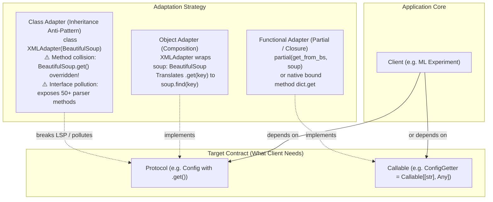

# Adapter

## Intent

Present an existing provider through the smaller interface the client already understands.

## Use when

Use an Adapter when two components have compatible responsibilities but incompatible method names,
argument shapes, return types, sync/async behavior, or error types. It is especially useful at
vendor, model-provider, storage, and legacy-system boundaries.

## Why

The client depends on a stable local contract while the provider can change independently. The
adapter also gives tests a seam for a fake provider.

### Mental model: Object vs. Functional vs. Class Adapter



## Example

```python
from typing import Protocol

class ChatModel(Protocol):
    def complete(self, prompt: str) -> str: ...

class ProviderClient:
    def generate(self, *, input: str) -> dict[str, str]: ...

class ProviderAdapter:
    def __init__(self, client: ProviderClient) -> None:
        self.client = client

    def complete(self, prompt: str) -> str:
        return self.client.generate(input=prompt)["text"]
```

This solves provider-specific request and response shapes without spreading them through callers.

## Next-level adapter: from classes to callables

In modern Python, adapters do not always need a full class hierarchy or explicit `Protocol`. As
demonstrated in ArjanCodes' video [*Let's Take The Adapter Design Pattern To The Next Level*](https://www.youtube.com/watch?v=fsB8_79zI_A)
and companion repository [`ArjanCodes/2022-adapter`](https://github.com/ArjanCodes/2022-adapter),
Python's first-class functions allow adapters to scale down to partial applications and bound methods.

### 1. The problem: tightly coupled client

A machine learning pipeline expects configuration as a raw dictionary:

```python
# ❌ BEFORE: Client is hardwired to dict; fails when config source changes to XML or API
class Experiment:
    def __init__(self, config: dict[str, Any]) -> None:
        self.config = config

    def run(self) -> None:
        data_path = self.config.get("data_path")
        if not data_path:
            raise ValueError("No data path specified.")
        print(f"Loading data from {data_path}.")
```

When configuration needs to be loaded from an XML file using `BeautifulSoup`, `Experiment` cannot
use it directly because `BeautifulSoup` provides a DOM query API (`soup.find(key)`), not a dictionary.

### 2. The Object Adapter (Composition + Protocol)

Define a target `Protocol` representing only the operations the client requires, and implement an
adapter that delegates to the underlying provider instance:

```python
from typing import Any, Protocol
from bs4 import BeautifulSoup

# Client-owned target protocol
class Config(Protocol):
    def get(self, key: str, default: Any = None) -> Any | None: ...

class XMLAdapter:
    """Object Adapter: Wraps BeautifulSoup via composition."""
    def __init__(self, soup: BeautifulSoup) -> None:
        self.soup = soup

    def get(self, key: str, default: Any = None) -> Any | None:
        element = self.soup.find(key)
        return element.get_text() if element else default

# Client consumes the abstract protocol, decoupled from BeautifulSoup
class Experiment:
    def __init__(self, config: Config) -> None:
        self.config = config

    def run(self) -> None:
        data_path = self.config.get("data_path")
        ...
```

### 3. The Functional Adapter (Callable + `functools.partial`)

When the adapter interface has only a single operation (e.g. getting a configuration value or
rendering a prompt), creating a class is unnecessary boilerplate. Define a `Callable` type alias:

```python
from functools import partial
from typing import Any, Callable
from bs4 import BeautifulSoup

# The contract is just a function signature
type ConfigGetter = Callable[[str], Any | None]

class Experiment:
    def __init__(self, config_getter: ConfigGetter) -> None:
        self.config_getter = config_getter

    def run(self) -> None:
        data_path = self.config_getter("data_path")
        if not data_path:
            raise ValueError("No data path specified.")
        print(f"Loading data from {data_path}.")

# Pure adapter function for BeautifulSoup
def get_from_bs(soup: BeautifulSoup, key: str, default: Any = None) -> Any | None:
    element = soup.find(key)
    return element.get_text() if element else default

# Zero-boilerplate adaptation:
# 1. Native dict adapts for free via its bound method!
raw_dict = {"data_path": "./data"}
exp_json = Experiment(raw_dict.get)

# 2. BeautifulSoup adapts via partial application (or closure)
soup = BeautifulSoup("<config><data_path>./data</data_path></config>", "xml")
exp_xml = Experiment(partial(get_from_bs, soup))
```

### 4. The Class Adapter Trap: why inheritance fails in Python

In classic Gang of Four literature, a "Class Adapter" inherits from both the target interface and the
adaptee:

```python
# ❌ ANTI-PATTERN: Class Adapter via inheritance
class XMLConfigAdapter(BeautifulSoup):
    def get(self, key: str, default: Any = None) -> Any | None:
        element = self.find(key)
        return element.get_text() if element else default
```

**Why this breaks in Python:**
1. **Method collision & LSP violation**: `BeautifulSoup.get(attribute, default)` already exists with
   completely different semantics (it retrieves HTML attributes from tags). Overriding `get()` breaks
   the contract for any downstream caller that passes the object to a BeautifulSoup utility.
2. **Interface pollution**: The client (`Experiment`) gains access to 50+ internal BeautifulSoup methods
   (`decompose`, `find_all`, `prettify`), coupling business logic to external parser internals.
3. **Rigid lifetime**: The adapter cannot easily switch underlying instances at runtime.

### Adapter Selection Matrix

| Pattern Style | Mechanism | Best Used When | Pitfalls / Avoid When |
| :--- | :--- | :--- | :--- |
| **Functional Adapter** | `Callable` + `partial` / closure / bound method | Interface is a single operation (`query`, `get`, `predict`) | Provider has multiple cohesive methods or mutable state lifecycle |
| **Object Adapter** | Composition (`Protocol` + wrapper class) | Interface has multiple related methods (`read` + `write`, `reserve` + `release`) | Overkill for simple 1-method mappings |
| **Class Adapter** | Multiple inheritance / subclassing | Almost **never** in Python | Causes method collisions, violates LSP, and exposes provider internals |

## When not to use

Do not add an adapter when the dependency is already small and stable, or when the translation is
so large that it is actually a domain service or Facade. Avoid Class Adapters (inheritance) whenever
the adaptee has existing methods that could collide with target methods.

## Trade-offs and tests

Adapters can hide latency, retries, streaming, or loss of provider features. Test translation,
timeouts, error mapping, streaming semantics, and whether cancellation reaches the provider.

## Framework evidence

The same boundary appears in LiteLLM's provider-normalized API, MLflow PyFunc model interfaces,
and the OpenAI-compatible interfaces used by vLLM and OpenRLHF. Start with the [framework matrix](../frameworks/index.md)
and verify the exact release before copying an API shape.

## Framework examples

### LiteLLM — provider-normalized `completion` (adapted)

```python
from litellm import completion

class ChatAdapter:
    def __init__(self, model: str) -> None:
        self.model = model

    def complete(self, prompt: str) -> str:
        response = completion(
            model=self.model,
            messages=[{"role": "user", "content": prompt}],
        )
        return response.choices[0].message.content or ""
```

This solves application code having to learn each provider's request and response shape. The
adapter fits because `ChatAdapter.complete()` is the local contract while LiteLLM translates it
to a selected provider. See the official [LiteLLM documentation](https://docs.litellm.ai/).

### MLflow — `PythonModel.predict` (adapted)

```python
import mlflow

class AnswerModel(mlflow.pyfunc.PythonModel):
    def predict(self, context, model_input):
        return [answer(prompt) for prompt in model_input["prompt"]]
```

This solves serving different Python model implementations through one `predict` boundary. It
fits Adapter because MLflow PyFunc translates a model-specific callable into the interface used
by generic loading and serving code. See the official [MLflow PyFunc API
documentation](https://mlflow.org/docs/latest/api_reference/python_api/mlflow.pyfunc.html).


## ArjanCodes 2026 examples (adapted)

### Driving (Inbound) vs. Driven (Outbound) Adapters: Hexagonal Architecture

In ["Stop Mixing FastAPI with Business Logic: Fix It with Ports & Adapters"](https://www.youtube.com/watch?v=FXwBWS4qDAA) and the [companion repository](https://github.com/ArjanCodes/examples/tree/main/2026/ports), Arjan demonstrates how the Adapter pattern splits across two distinct architectural roles in modern services:

| Adapter Role | Position | Responsibility | Example in `2026/ports` |
|---|---|---|---|
| **Driving (Inbound)** | Outside $\to$ Inside | Drives the application by converting external protocol (HTTP, CLI, events) to domain models; invokes use cases; translates domain errors to transport responses. | FastAPI `@router.post("/orders")` handler (`api.py`) |
| **Driven (Outbound)** | Inside $\to$ Outside | Driven by the application; implements domain structural ports (`Protocol`) to communicate with secondary infrastructure (databases, caches, third-party APIs). | `SqlAlchemyInventoryAdapter` (`adapters/sqlalchemy_inventory.py`) |

#### Driven (Outbound) Adapter: Concrete persistence satisfying domain port

```python
from dataclasses import dataclass
from typing import Protocol
from sqlalchemy import Connection, text

class InventoryPort(Protocol):
    def exists_sku(self, sku: str) -> bool: ...
    def get_stock(self, sku: str) -> int: ...
    def reserve(self, sku: str, quantity: int) -> None: ...

@dataclass
class SqlAlchemyInventoryAdapter:
    conn: Connection

    def exists_sku(self, sku: str) -> bool:
        row = self.conn.execute(
            text("SELECT 1 FROM inventory WHERE sku = :sku"), {"sku": sku}
        ).fetchone()
        return row is not None

    def get_stock(self, sku: str) -> int:
        row = self.conn.execute(
            text("SELECT stock FROM inventory WHERE sku = :sku"), {"sku": sku}
        ).fetchone()
        if row is None:
            return 0
        return int(row[0])

    def reserve(self, sku: str, quantity: int) -> None:
        self.conn.execute(
            text("UPDATE inventory SET stock = stock - :qty WHERE sku = :sku"),
            {"sku": sku, "qty": quantity},
        )
        self.conn.commit()
```

#### Driving (Inbound) Adapter: FastAPI transport translation

```python
from fastapi import APIRouter, Depends, HTTPException, status
from pydantic import BaseModel

router = APIRouter()

class OrderInput(BaseModel):
    sku: str
    quantity: int

class OrderOutput(BaseModel):
    sku: str
    quantity_reserved: int

@router.post("/orders", response_model=OrderOutput)
def create_order(
    input_data: OrderInput,
    inventory: InventoryPort = Depends(get_inventory_adapter),
) -> OrderOutput:
    # 1. Translate wire model to pure domain request
    domain_req = OrderRequest(sku=input_data.sku, quantity=input_data.quantity)
    try:
        # 2. Drive the pure use case
        result = place_order(domain_req, inventory)
        # 3. Translate domain output to wire schema
        return OrderOutput(sku=result.sku, quantity_reserved=result.quantity_reserved)
    except InvalidQuantity as exc:
        raise HTTPException(status_code=status.HTTP_400_BAD_REQUEST, detail=str(exc)) from exc
    except UnknownSku as exc:
        raise HTTPException(status_code=status.HTTP_404_NOT_FOUND, detail=str(exc)) from exc
    except OutOfStock as exc:
        raise HTTPException(status_code=status.HTTP_409_CONFLICT, detail=str(exc)) from exc
```

This ensures that neither FastAPI nor SQLAlchemy leaks into the core business domain. Adapted from
[`domain/ports.py`](https://github.com/ArjanCodes/examples/blob/main/2026/ports/domain/ports.py),
[`domain/use_cases.py`](https://github.com/ArjanCodes/examples/blob/main/2026/ports/domain/use_cases.py),
[`adapters/sqlalchemy_inventory.py`](https://github.com/ArjanCodes/examples/blob/main/2026/ports/adapters/sqlalchemy_inventory.py),
and [`api.py`](https://github.com/ArjanCodes/examples/blob/main/2026/ports/api.py).
