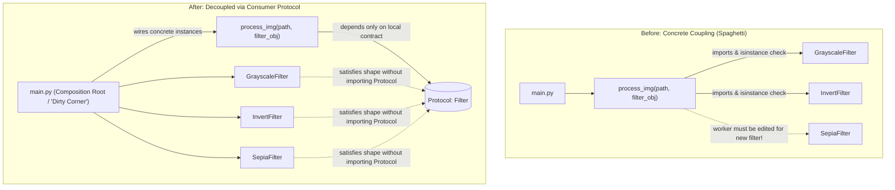
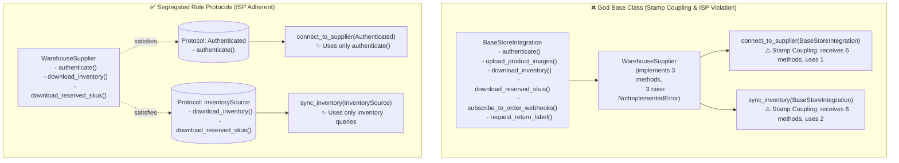

# Structural typing and interface segregation

## Intent

Describe the smallest behavior a collaborator needs with a structural `Protocol`, rather than
requiring every implementation to inherit from a broad base class.

## Use when

Use a narrow Protocol when unrelated objects should be interchangeable by behavior, or when a
consumer needs only one capability from a larger service.

## Why

Structural typing keeps contracts local, supports existing and test-double implementations, and
reduces the chance that a shared base class accumulates unrelated methods.

In Python, failing to use appropriate abstractions is the primary reason code degrades into
"spaghetti code":
1. **Import Explosion**: High-level worker functions import concrete implementation classes directly.
2. **`isinstance` Spaghetti**: Functions inspect concrete types with `if isinstance(obj, ConcreteClass):`
   to call specific method names or configure private parameters.
3. **Configuration Leakage**: Workers configure internal parameters instead of accepting pre-configured
   collaborators from the composition root.

### Mental Model: Concrete Coupling vs. Structural Abstraction



### The Abstraction Spectrum: Which Tool to Choose?

| Level | Abstraction Mechanism | When to Choose | Trade-offs & Notes |
|---|---|---|---|
| **Level 0** | **No Abstraction** | Throwaway scripts or 1-off internal functions with no variants. | Causes tight coupling, circular imports, and `isinstance` branches as code grows. |
| **Level 1** | **`Callable[[A], B]`** | Behavior is a single transformation or action (`image -> image`). | Zero boilerplate. Use closures or `functools.partial` to bind parameters. Loses `__name__` metadata under `partial`. |
| **Level 2** | **`typing.Protocol`** | Collaborator has multiple methods, properties, or duck-typed implementations. | **Best default for Python.** Zero import coupling: implementations do not inherit from the Protocol. Defined by the consumer. |
| **Level 3** | **`abc.ABC`** | Subclasses must share concrete state, helper methods, or require instantiation enforcement. | Strict nominal inheritance: subclasses must import and inherit from the ABC. Less flexible for third-party classes. |

### The "Single Dirty Corner" Principle

Every well-designed software system has exactly one place where concrete dependencies are imported
and wired together—the **Composition Root** (typically `main.py`). The rest of the codebase remains
clean and depends strictly on abstractions (`Protocol` or `Callable`). If your application has a single
messy corner where wiring happens and all domain functions remain decoupled, the architecture is sound.

## Example: Before vs. After

### Before: Concrete imports and `isinstance` branching

```python
# ❌ BEFORE: process_img imports concrete classes and branches on type
from typing import Any
from filters.grayscale import GrayscaleFilter
from filters.invert import InvertFilter
from PIL import Image

def process_img(image_path: str, output_path: str, filter_obj: Any) -> None:
    image = Image.open(image_path)
    if isinstance(filter_obj, GrayscaleFilter):
        filter_obj.configure({"intensity": 0.8})
        image = filter_obj.apply(image)
    elif isinstance(filter_obj, InvertFilter):
        image = filter_obj.do_invert(image)  # Inconsistent method name!
    image.save(output_path)
```

### After: Consumer-defined structural `Protocol`

```python
# ✅ AFTER: Consumer defines the protocol; zero concrete imports
from typing import Protocol
from PIL import Image

class ImageFilter(Protocol):
    @property
    def name(self) -> str: ...
    def apply(self, image: Image.Image) -> Image.Image: ...

def process_img(image_path: str, output_path: str, filter_obj: ImageFilter) -> None:
    image = Image.open(image_path)
    image = filter_obj.apply(image)
    image.save(output_path)
```

Concrete filters implement `.name` and `.apply(...)` without importing or subclassing `ImageFilter`.
Configuration (`intensity=0.8`) is done before passing the filter into `process_img`.

Adapted from the [ArjanCodes Abstraction video](https://www.youtube.com/watch?v=SNqwNILX1Gg) and
[2025 abstraction examples](https://github.com/ArjanCodes/examples/tree/main/2025/abstraction).

## When not to use

Do not create a Protocol for a single private call with no substitution or contract boundary. A
function parameter or `Callable` is enough when a single transformation describes the entire requirement.
Do not introduce an ABC when structural subtyping (`Protocol`) avoids a rigid inheritance hierarchy.

## Trade-offs and tests

Narrow Protocols can produce several small interfaces and do not enforce runtime behavior by
themselves. Test the behavioral contract, especially ordering, exceptions, partial reads, and
resource ownership. Verify that concrete implementations satisfy the protocol statically with mypy/pyright.

## ArjanCodes OOP lessons (adapted)

### Interface Segregation: Eliminating stamp coupling and god base classes

When a workflow requires only one capability, a monolithic base class forces unrelated implementations to inherit dozens of irrelevant methods (often raising `NotImplementedError`). This creates **stamp coupling** where callers receive wide objects containing methods they shouldn't access.

Small structural `Protocol`s solve that interface-segregation problem naturally: classes qualify simply by having the required methods, with zero inheritance boilerplate.



```python
from dataclasses import dataclass
from typing import Protocol

@dataclass(frozen=True)
class SupplierSession:
    supplier_name: str
    access_token: str

@dataclass(frozen=True)
class InventoryItem:
    sku: str
    quantity: int

class Authenticated(Protocol):
    def authenticate(self, api_key: str) -> SupplierSession: ...

class InventorySource(Protocol):
    def download_inventory(self, session: SupplierSession) -> list[InventoryItem]: ...
    def download_reserved_skus(self, session: SupplierSession) -> set[str]: ...

def connect_to_supplier(integration: Authenticated, api_key: str) -> SupplierSession:
    return integration.authenticate(api_key)

def sync_inventory(source: InventorySource, session: SupplierSession) -> list[InventoryItem]:
    inventory = source.download_inventory(session)
    reserved = source.download_reserved_skus(session)
    return [item for item in inventory if item.quantity > 0 and item.sku not in reserved]
```

Adapted from [`04_god_base_class_after.py`](https://github.com/ArjanCodes/examples/blob/main/2026/oop/04_god_base_class_after.py).

### Separate reader and writer contracts to preserve Liskov substitutability

When a subtype cannot support every operation promised by its base class—such as a read-only queue being forced to implement `enqueue()` and raising `RuntimeError`—the hierarchy violates the Liskov Substitution Principle (LSP).

Separating reader and writer `Protocol`s ensures functions declare exactly the permissions they require:

```python
from typing import Protocol

class OrderReader(Protocol):
    def get_orders(self) -> list[Order]: ...

class OrderWriter(Protocol):
    def enqueue(self, order: Order) -> None: ...

def print_order_history(history: OrderReader) -> None:
    print([order.order_id for order in history.get_orders()])

def add_expedited_order(queue: OrderWriter) -> None:
    queue.enqueue(Order("EXPRESS-1"))
```

Adapted from [`05_substitutability_after.py`](https://github.com/ArjanCodes/examples/blob/main/2026/oop/05_substitutability_after.py) and the [ArjanCodes OOP video](https://www.youtube.com/watch?v=RqcEK7sWesQ). Functions accepting `OrderWriter` statically reject read-only objects at type-check time rather than blowing up at runtime.

## Framework examples

### PydanticAI — typed dependency boundary (adapted)

When an agent tool needs an external service, directly depending on a concrete client couples the
tool to one implementation and makes tests awkward. A narrow `Protocol` defines only the capability
the tool uses; PydanticAI's typed `deps_type` and `RunContext` then make that boundary explicit.
Structural typing fits because any production client or test double with the required `search`
method can be injected without inheriting from a framework base class.

```python
from typing import Protocol
from pydantic_ai import Agent, RunContext

class SearchService(Protocol):
    async def search(self, query: str) -> list[str]: ...

agent = Agent("model", deps_type=SearchService)

@agent.tool
async def search(ctx: RunContext[SearchService], query: str) -> list[str]:
    return await ctx.deps.search(query)
```

Adapted from the official [PydanticAI dependencies documentation](https://pydantic.dev/docs/ai/core-concepts/dependencies/).
