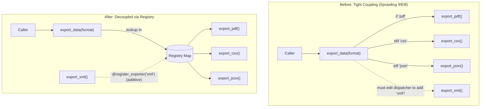
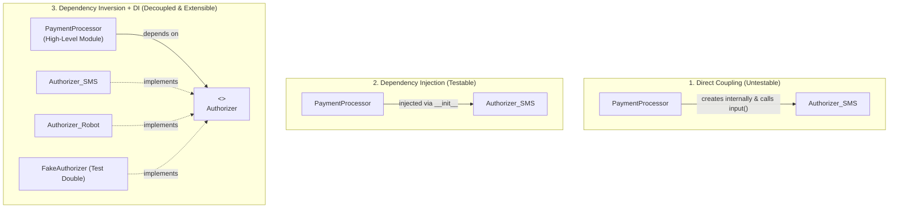

# Registry and dependency injection

## Intent

Make implementations discoverable and dependencies replaceable without editing a central
dispatcher or reaching into global state.

## Use when

Use a Registry when independent modules or plugins add named implementations. Use Dependency
Injection when a component needs a service, policy, client, or clock that tests or deployments may
replace.

## Why

Registration separates extension from core code; injection makes ownership and test seams explicit.
Together they support provider selection, tool systems, callbacks, and model backends.

In Python, the Registry pattern solves the problem of ever-growing `if/elif/else` dispatch chains.
Dispatching directly on string formats or command names couples the central dispatcher to every
concrete implementation, violating both the Single Responsibility Principle (SRP) and the
Open-Closed Principle (OCP).

### Mental Model: Before vs. After



### The Problem: Before

```python
# ❌ BEFORE: Every new format requires modifying the core dispatch function
def export_data(data: Data, format: str) -> None:
    if format == "pdf":
        export_pdf(data)
    elif format == "csv":
        export_csv(data)
    elif format == "json":
        export_json(data)
    else:
        raise ValueError(f"Unknown format: {format}")
```

Every addition to this function increases cognitive load, risks regression in existing formats,
and violates the Open-Closed Principle.

### Quick Selection Guide: Which Level Do I Need?

| Level | Pattern | When to Choose | Key Benefit |
|---|---|---|---|
| **Level 0** | `if/else` or `match/case` | 2–3 fixed branches or closed internal enums | Zero indirection; straightforward control flow |
| **Level 1** | Dictionary Dispatch Table | Handlers known in advance in the same module | Eliminates branching; clean $O(1)$ lookup |
| **Level 2** | Self-Registering Decorator | Handlers spread across multiple files/modules | Additive extension; definition co-located with registration |
| **Level 3** | Dynamic Discovery (`pkgutil`) | Plugin architecture or extensible CLI commands | Zero-touch: drop a `.py` file into a directory to activate |

## Architecture and evolution

The Registry pattern typically evolves across three tiers:

### 1. Dictionary dispatch table

The simplest registry replaces hard-coded conditional chains with a typed dictionary mapping keys
to callables. The dispatcher performs a single lookup, raising a domain exception on missing keys.

```python
from collections.abc import Callable
from typing import Any

type Data = dict[str, Any]
type ExportFn = Callable[[Data], None]

exporters: dict[str, ExportFn] = {
    "pdf": export_pdf,
    "csv": export_csv,
    "json": export_json,
}

def export_data(data: Data, format: str) -> None:
    exporter = exporters.get(format)
    if exporter is None:
        raise ValueError(f"unknown format: {format}")
    exporter(data)
```

### 2. Self-registering decorators

When handlers are scattered across modules, manually maintaining a centralized dictionary creates
import churn. A registration decorator allows functions or classes to register themselves additively
at definition time.

```python
from collections.abc import Callable
from functools import wraps
from typing import Any

type Data = dict[str, Any]
type ExportFn = Callable[[Data], None]

exporters: dict[str, ExportFn] = {}

def register_exporter(name: str):
    def decorator(func: ExportFn) -> ExportFn:
        if name in exporters:
            raise ValueError(f"duplicate registration: {name}")
        @wraps(func)
        def wrapper(*args: Any, **kwargs: Any) -> Any:
            return func(*args, **kwargs)

        exporters[name] = wrapper
        return wrapper
    return decorator

@register_exporter("pdf")
def export_pdf(data: Data) -> None:
    ...
```

Adding a new exporter is now 100% additive: write the function, apply the decorator, and the core
dispatcher remains untouched.

> [!TIP]
> **How Self-Registration Works**:
> 1. **At Import Time**: When Python imports a module containing a decorated function, `@register_exporter("pdf")` runs immediately, registering the function in `exporters`.
> 2. **Metadata Preservation**: `@wraps(func)` preserves docstrings, `__name__`, and type annotations on the registered callable.
> 3. **At Dispatch Time**: When `export_data(data, "pdf")` runs, it performs an $O(1)$ dictionary lookup and invokes the handler directly.

### 3. Dynamic module discovery and plugin architecture

To achieve zero-touch extensibility without maintaining a manual list of module imports, scan the
directory or package at startup using `pkgutil.iter_modules` and `importlib.import_module`.

> [!TIP]
> **Why Dynamic Discovery Solves the "Forgot to Import" Problem**:
> Python only executes registration decorators when a module is imported. If a developer creates
> `plugins/shout.py` but forgets to import it in `main.py`, the command will not exist at runtime!
> Dynamic discovery solves this by automatically walking the package path and importing all modules.

```python
import importlib
import pkgutil
from collections.abc import Callable
from typing import Any

# Registry storing hierarchical commands: (group, name, handler)
_registry: list[tuple[str, str, Callable[..., Any]]] = []

def register_command(group: str, name: str):
    def decorator(func: Callable[..., Any]):
        _registry.append((group, name, func))
        return func
    return decorator

def get_registry() -> list[tuple[str, str, Callable[..., Any]]]:
    """Return a defensive shallow copy of registered commands."""
    return _registry.copy()

def load_plugins(package) -> None:
    """Dynamically discover and import all modules in a plugin package."""
    for _, module_name, _ in pkgutil.iter_modules(package.__path__):
        importlib.import_module(f"{package.__name__}.{module_name}")
```

New plugins dropped into the `plugins/` directory are automatically discovered and registered
without altering the host application or CLI entry point.

Adapted from the [ArjanCodes Registry video](https://www.youtube.com/watch?v=g7EGMWvJ1fI) and the
companion [2025 registry examples](https://github.com/ArjanCodes/examples/tree/main/2025/registry).

## Dependency injection and inversion

While a Registry manages discoverable, named extensions, **Dependency Injection (DI)** and the
**Dependency Inversion Principle (DIP)** manage collaborators, lifecycles, and test seams.

### Mental Model: The Difference Between DI and DIP



### The 3-stage evolution: from untestable coupling to DIP

In [*Dependency Inversion: The Secret to Decoupled Code*](https://www.youtube.com/watch?v=2ejbLVkCndI) and
[`ArjanCodes/2021-dependency-injection-inversion`](https://github.com/ArjanCodes/2021-dependency-injection-inversion),
Arjan demonstrates that:
> *"Without dependency injection, there is no dependency inversion."*
> If a class creates its own dependencies, it must name and construct concrete classes, making inversion impossible.

#### Stage 1: Internal Construction (Untestable)

```python
# ❌ BEFORE: Tightly coupled to concrete Authorizer_SMS and untestable interactive input()
class PaymentProcessor:
    def pay(self, order: Order) -> None:
        authorizer = Authorizer_SMS()  # Hardcoded dependency creation!
        authorizer.generate_sms_code()
        authorizer.authorize()
        if not authorizer.is_authorized():
            raise RuntimeError("Not authorized")
        order.set_status("paid")
```
*Why this fails tests:* You cannot test `PaymentProcessor.pay()` without triggering real SMS generation and interactive `input()`. Testing requires brittle monkeypatching.

#### Stage 2: Constructor Dependency Injection (Testable, but concretely coupled)

Pass the collaborator in `__init__`. The class uses the dependency, but does not own its creation:

```python
# ⚠️ DI without DIP: Testable, but still tightly coupled to Authorizer_SMS
class PaymentProcessor:
    def __init__(self, authorizer: Authorizer_SMS) -> None:
        self.authorizer = authorizer

    def pay(self, order: Order) -> None:
        self.authorizer.authorize()
        if not self.authorizer.is_authorized():
            raise RuntimeError("Not authorized")
        order.set_status("paid")
```
*Testing breakthrough:* Tests can now instantiate `auth = Authorizer_SMS()` beforehand and pass it to `PaymentProcessor(auth)`. However, `PaymentProcessor` cannot accept other authorizers (such as biometrics or CAPTCHA).

#### Stage 3: Dependency Inversion (Decoupled & Swappable)

Invert the dependency using a client-defined `Protocol`. High-level policy depends on an abstraction:

```python
# ✅ DIP + DI: High-level processor and low-level authorizers both depend on Protocol
from typing import Protocol

class Authorizer(Protocol):
    def authorize(self) -> None: ...
    def is_authorized(self) -> bool: ...

class PaymentProcessor:
    def __init__(self, authorizer: Authorizer) -> None:
        self.authorizer = authorizer

    def pay(self, order: Order) -> None:
        self.authorizer.authorize()
        if not self.authorizer.is_authorized():
            raise RuntimeError("Not authorized")
        order.set_status("paid")
```

Now, unit tests can run in 0 milliseconds using an in-memory fake without mocks:

```python
class FakeAuthorizer:
    def __init__(self, authorized: bool = True) -> None:
        self._authorized = authorized
    def authorize(self) -> None: pass
    def is_authorized(self) -> bool: return self._authorized

def test_payment_success():
    processor = PaymentProcessor(FakeAuthorizer(authorized=True))
    order = Order()
    processor.pay(order)
    assert order.status == "paid"
```

---

### Modern Dependency Injection with Dishka

For small scripts or simple apps, manual DI in a single **Composition Root** (`main.py`) is sufficient.
However, in larger modular systems (e.g. FastAPI applications, microservices, or complex data pipelines),
manually wiring dozens of services, database sessions, and lifecycle scopes creates tedious "wiring boilerplate".

[Dishka](https://dishka.readthedocs.io/) is Python's premier modern, type-safe, scoped Dependency Injection framework:
- **Explicit Scopes**:
  - `Scope.APP`: Application-wide singletons (database connection pool, configuration, HTTP clients).
  - `Scope.REQUEST`: Scoped to a single web request, message queue task, or unit of work.
  - `Scope.ACTION` / `Scope.STEP`: Finer-grained sub-scopes.
- **Protocol Aliasing**: Map concrete implementations to domain abstractions cleanly via `alias(source=Authorizer_SMS, provides=Authorizer)`.
- **Type-Hint Autowiring**: Dishka inspects constructor annotations (`authorizer: Authorizer`) and resolves dependencies automatically.
- **Resource Management**: Generator providers with `yield` are guaranteed to clean up when the scope exits.
- **Effortless Test Overrides**: Swap dependencies in unit tests using provider overrides without monkeypatching.

#### Production Dishka Example

```python
from typing import Protocol
from dishka import Provider, Scope, alias, make_container, provide

# 1. Domain Abstraction & High-level service
class Authorizer(Protocol):
    def authorize(self) -> None: ...
    def is_authorized(self) -> bool: ...

class PaymentProcessor:
    def __init__(self, authorizer: Authorizer) -> None:
        self.authorizer = authorizer

    def pay(self, order: Order) -> None:
        self.authorizer.authorize()
        if not self.authorizer.is_authorized():
            raise RuntimeError("Not authorized")
        order.set_status("paid")

# 2. Concrete implementation
class SMSAuthorizer:
    def authorize(self) -> None:
        self._authorized = True

    def is_authorized(self) -> bool:
        return getattr(self, "_authorized", False)

# 3. Dishka Provider configuring scopes and bindings
class PaymentProvider(Provider):
    scope = Scope.REQUEST

    # Provide concrete authorizer and alias it to the domain Protocol
    auth = provide(SMSAuthorizer)
    auth_proto = alias(source=SMSAuthorizer, provides=Authorizer)

    # Autowire PaymentProcessor: Dishka inspects __init__(authorizer: Authorizer)
    processor = provide(PaymentProcessor)

# 4. Container initialization & Scoped Execution
container = make_container(PaymentProvider())

# Enter request-level scope (e.g. during a web request or event handling)
with container() as request_container:
    processor = request_container.get(PaymentProcessor)
    order = Order()
    processor.pay(order)
```

#### Test Overrides with Dishka

```python
# In tests: override Authorizer with a fast test double
class TestProvider(Provider):
    @provide(scope=Scope.REQUEST)
    def test_authorizer(self) -> Authorizer:
        return FakeAuthorizer(authorized=True)

test_container = make_container(TestProvider(), PaymentProvider())

with test_container() as req:
    test_proc = req.get(PaymentProcessor)
    order = Order()
    test_proc.pay(order)
    assert order.status == "paid"
```

### DI Decision Matrix

| Mechanism | Best Used When | Pitfalls / Avoid When |
| :--- | :--- | :--- |
| **Manual DI (Composition Root)** | Small applications, CLI tools, libraries with 2–5 services | Becomes sprawling boilerplate in large multi-layer web APIs |
| **FastAPI `Depends()` & Overrides** | Web APIs with request-scoped database sessions and service injection | Framework-bound; requires `dependency_overrides` cleanup in tests |
| **Dishka DI Container** | Medium-to-large apps, modular architectures, multi-framework services | Overkill for simple scripts with no lifecycle management |
| **Service Locator Anti-Pattern** | **Never** | Components pull dependencies from a global registry, hiding dependencies and breaking purity |

### FastAPI generator dependencies and test overrides

In web frameworks like FastAPI, dependency injection handles both parameter resolution and resource lifecycle management. Using generator dependencies with `yield` ensures database connections and file handles are safely closed after each request:

```python
# 1. Generator dependency manages session lifecycle and guaranteed cleanup
def get_db():
    db = SessionLocal()
    try:
        yield db
    finally:
        db.close()

# 2. Service factory depends on the database session
def get_exchange_service(db: Session = Depends(get_db)) -> ExchangeRateService:
    return ExchangeRateService(db)

# 3. Route receives pre-configured service with zero manual wiring
@router.get("/convert")
def convert(
    amount: Decimal,
    service: ExchangeRateService = Depends(get_exchange_service),
) -> dict:
    return service.convert(amount)
```

#### Test override seams without monkeypatching

FastAPI exposes `app.dependency_overrides`, allowing tests to swap production database sessions with in-memory SQLite instances cleanly:

```python
def test_convert_success(client, in_memory_db):
    # Override production DB dependency with in-memory test session
    app.dependency_overrides[get_db] = lambda: in_memory_db
    try:
        response = client.get("/convert?from_currency=USD&to_currency=EUR&amount=100")
        assert response.status_code == 200
        assert response.json()["result"] == 91.0
    finally:
        app.dependency_overrides.clear()
```

Adapted from [`ArjanCodes 2025 production`](https://github.com/ArjanCodes/examples/tree/main/2025/production) and the [ArjanCodes Production-Ready video](https://www.youtube.com/watch?v=GMBiCMsEsq8).

## When not to use

Use a constructor parameter for one or two dependencies. Keep an `if/else` or `match/case` statement
when handling a small, closed set of variants (e.g., an internal enum) that will not expand at runtime.
Avoid import-time global registries when registration order, isolation, or test parallelism is difficult
to control. Do not use heavy DI containers for small scripts where manual constructor passing in
`main.py` is straightforward.

## Trade-offs and tests

Registries and DI introduce trade-offs that require disciplined testing:
- **Hidden logic**: Registration occurs implicitly upon module import. Use explicit discovery functions
  like `load_plugins()` rather than scattered side-effect imports.
- **Import-order coupling**: If a module is never imported, its decorators never execute. Dynamic
  discovery ensures all handlers in designated packages are loaded before first dispatch.
- **Global state & test leakage**: Avoid shared mutable module state across tests. Provide
  `get_registry()` with defensive copies, or encapsulate the registry in a class instance passed
  via dependency injection.
- **Duplicate names**: Decide whether duplicate registrations should raise an immediate `ValueError`
  or overwrite earlier registrations, and test both collisions and missing keys.
- **Injected fakes**: Test dispatchers with isolated test registries rather than mutating production
  tables. Use constructor injection and fake doubles (`FakeAuthorizer`) to eliminate mocking libraries.

## Framework evidence

Transformers AutoClass, qwen-agent tool registries, PydanticAI capabilities/dependencies, verl
worker selection, and slime import-path hooks illustrate this family. See the [framework matrix](../frameworks/index.md).

## Framework examples

### Transformers — `AutoConfig.register()` and `AutoModel.register()`

Transformers solves the problem of making a custom model discoverable by configuration without
editing the loader central dispatcher. These registration calls fit Registry, while the model
class receives collaborators through normal construction rather than global lookups.

```python
from transformers import AutoConfig, AutoModel

AutoConfig.register("my_model", MyConfig)
AutoModel.register(MyConfig, MyModel)
model = AutoModel.from_config(MyConfig())
```

Adapted from the [Transformers custom models guide](https://huggingface.co/docs/transformers/en/custom_models)
(latest, fetched 2026-08-30; adapted).

### PydanticAI — `deps_type` and tool capabilities

PydanticAI solves the problem of adding tools that need runtime services without importing a
process-wide client. Typed dependencies fit Dependency Injection because ownership and test
substitution are explicit at the agent boundary.

```python
from pydantic_ai import Agent, RunContext

agent = Agent("provider:model", deps_type=SearchClient)

@agent.tool
def search(ctx: RunContext[SearchClient], query: str) -> str:
    return ctx.deps.search(query)
```

Adapted from [PydanticAI dependencies](https://pydantic.dev/docs/ai/core-concepts/dependencies/)
(latest, fetched 2026-08-30; adapted).

### Dishka — Scoped autowired dependency injection

Dishka solves scalable dependency management and scoped lifecycles (application, request, session)
with type-hint autowiring and zero boilerplate.

```python
from typing import Protocol
from dishka import Provider, Scope, alias, make_container, provide

class Cache(Protocol):
    def get(self, key: str) -> str | None: ...

class RedisCache:
    def get(self, key: str) -> str | None:
        return "cached_value"

class ServiceProvider(Provider):
    scope = Scope.REQUEST
    cache_impl = provide(RedisCache)
    cache_proto = alias(source=RedisCache, provides=Cache)

container = make_container(ServiceProvider())
with container() as request_container:
    cache = request_container.get(Cache)
```

Adapted from official [Dishka documentation](https://dishka.readthedocs.io/).
