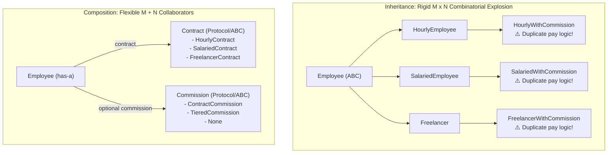

# Composition over inheritance

## Intent

Assemble small objects or functions at runtime instead of creating a subclass for every
combination of independent features.

## Use when

Use this principle when a class varies along two or more axes—such as provider, retry policy,
format, transport, or authorization—and combinations are beginning to create subclasses or
conditional attributes.

## Why

Composition localizes each feature, makes deletion and testing easier, and lets the caller choose
the combination at runtime. It follows the central lesson of the Python patterns guide: named
patterns are secondary to the design principle behind them.

### Mental model: Combinatorial Subclass Explosion ($M \times N$) vs. Composition ($M + N$)



## Example

```python
from collections.abc import Callable

Emit = Callable[[str], None]
Filter = Callable[[str], bool]

def make_logger(emit: Emit, accept: Filter) -> Callable[[str], None]:
    def log(message: str) -> None:
        if accept(message):
            emit(message)
    return log
```

This solves the need for “file logger”, “filtered logger”, and “filtered socket logger” classes
without multiplying types.

## The employee payroll case: eliminating subclass explosion

In [*Composition Over Inheritance in Python*](https://www.youtube.com/watch?v=0mcP8ZpUR38) and
[`ArjanCodes/2021-composition-vs-inheritance`](https://github.com/ArjanCodes/2021-composition-vs-inheritance),
Arjan demonstrates how inheritance creates the strongest possible coupling in OOP and how composition
tames feature-axis explosion.

### 1. The inheritance trap: subclass proliferation and duplicated logic

Consider an HR payroll system with three payment mechanisms (Hourly, Salaried, Freelancer). When some
workers earn a sales commission, modeling this with inheritance creates subclasses for every variant:

```python
# ❌ INHERITANCE: Combinatorial subclass explosion and copy-pasted commission logic
from abc import ABC, abstractmethod
from dataclasses import dataclass

@dataclass
class Employee(ABC):
    name: str
    id: int
    @abstractmethod
    def compute_pay(self) -> float: ...

@dataclass
class HourlyEmployee(Employee):
    pay_rate: float
    hours_worked: int = 0
    employer_cost: float = 1000
    def compute_pay(self) -> float:
        return self.pay_rate * self.hours_worked + self.employer_cost

@dataclass
class SalariedEmployee(Employee):
    monthly_salary: float
    percentage: float = 1.0
    def compute_pay(self) -> float:
        return self.monthly_salary * self.percentage

# Duplication starts here: each subclass must be subclassed again!
@dataclass
class HourlyEmployeeWithCommission(HourlyEmployee):
    commission: float = 100.0
    contracts_landed: int = 0
    def compute_pay(self) -> float:
        return super().compute_pay() + self.commission * self.contracts_landed

@dataclass
class SalariedEmployeeWithCommission(SalariedEmployee):
    commission: float = 100.0
    contracts_landed: int = 0
    def compute_pay(self) -> float:
        return super().compute_pay() + self.commission * self.contracts_landed
```

**Consequences:**
- **Combinatorial Explosion**: 3 payment types $\times$ 2 commission types $= 6$ subclasses. Adding a
  third axis (e.g. bonus, health stipend) triggers $3 \times 2 \times 2 = 12$ subclasses!
- **Code Duplication**: The commission calculation is copy-pasted across `HourlyEmployeeWithCommission`,
  `SalariedEmployeeWithCommission`, and `FreelancerWithCommission`.
- **Tightest Coupling**: Every subclass depends intimately on its parent's constructor shape and
  `super().compute_pay()` execution details.

### 2. The composition remedy: decomposing into independent roles

Separate the independent concepts into distinct, reusable classes:
- **`Contract`**: Encapsulates base pay calculation (`HourlyContract`, `SalariedContract`, `FreelancerContract`).
- **`Commission`**: Encapsulates incentive payouts (`ContractCommission`).
- **`Employee`**: A single stable class that *has-a* `Contract` and an optional `Commission`.

```python
# ✅ COMPOSITION: M + N small collaborators combined at runtime
from dataclasses import dataclass
from typing import Protocol

class Contract(Protocol):
    def get_payment(self) -> float: ...

class Commission(Protocol):
    def get_payment(self) -> float: ...

@dataclass
class HourlyContract:
    pay_rate: float
    hours_worked: int = 0
    employer_cost: float = 1000.0
    def get_payment(self) -> float:
        return self.pay_rate * self.hours_worked + self.employer_cost

@dataclass
class SalariedContract:
    monthly_salary: float
    percentage: float = 1.0
    def get_payment(self) -> float:
        return self.monthly_salary * self.percentage

@dataclass
class ContractCommission:
    commission: float = 100.0
    contracts_landed: int = 0
    def get_payment(self) -> float:
        return self.commission * self.contracts_landed

@dataclass
class Employee:
    """Stable domain entity that delegates compensation to composed collaborators."""
    name: str
    id: int
    contract: Contract
    commission: Commission | None = None

    def compute_pay(self) -> float:
        payout = self.contract.get_payment()
        if self.commission is not None:
            payout += self.commission.get_payment()
        return payout

# Usage: assemble flexible combinations with zero subclass explosion
henry = Employee("Henry", 12346, HourlyContract(pay_rate=50, hours_worked=100))
sarah = Employee(
    "Sarah", 47832,
    SalariedContract(monthly_salary=5000),
    ContractCommission(contracts_landed=10),
)
```

### Why GoF patterns rarely exceed a single layer of inheritance

Notice that in classical Gang of Four patterns (Strategy, State, Adapter, Command), inheritance is
used almost exclusively for **one layer**: defining an interface or ABC and implementing concrete
leaf strategies. Deep multi-tiered inheritance trees bind subclasses to implementation details and
create the fragile base class dilemma. Composition reduces coupling by letting objects depend on
narrow contracts rather than concrete ancestor state.

### Composition vs. Inheritance Trade-Off Matrix

| Dimension | Inheritance ("Is-A") | Composition ("Has-A") |
| :--- | :--- | :--- |
| **Coupling** | **Strongest in OOP**: child is bound to parent state & methods | **Weak / Decoupled**: depends on a narrow interface or protocol |
| **Feature Scaling** | **Multiplicative ($M \times N$)**: subclass for every combination | **Additive ($M + N$)**: assemble independent collaborators |
| **Code Reuse** | Leaks parent internals; copy-pastes logic across sibling trees | Code is localized in one collaborator and reused everywhere |
| **Runtime Mutability** | Rigid: an object cannot change its class at runtime | Dynamic: swap `employee.contract` or `employee.commission` anytime |
| **Best Used When** | Truly substitutable is-a contract with single-layer inheritance | Multiple independent axes of variation or pluggable features |

## When not to use

Keep a small cohesive class when the variants are fixed, the invariant is shared, and composition
would make the public API harder to understand. Do not split every line into an object.

## Trade-offs and tests

Composition adds wiring and can hide call order. Test each component alone and at least one
assembled configuration; document ownership, ordering, and error propagation.

## Framework examples

### LangGraph — `StateGraph` (adapted)

```python
from typing_extensions import TypedDict
from langgraph.graph import END, START, StateGraph

class State(TypedDict):
    question: str

builder = StateGraph(State)
builder.add_node("retrieve", retrieve)
builder.add_node("answer", answer)
builder.add_edge(START, "retrieve")
builder.add_edge("retrieve", "answer")
builder.add_edge("answer", END)
workflow = builder.compile()
```

This solves a workflow with independently replaceable retrieval and answer steps. `StateGraph`
fits composition over inheritance because the application assembles nodes and edges at runtime
instead of creating a subclass for every workflow variant. See the official [LangGraph graph API
documentation](https://docs.langchain.com/oss/python/langgraph/graph-api).

### Google ADK — `SequentialAgent` (adapted)

```python
from google.adk.agents import LlmAgent, SequentialAgent

workflow = SequentialAgent(
    name="support_flow",
    sub_agents=[
        LlmAgent(name="draft", model="model", instruction="Draft a reply"),
        LlmAgent(name="review", model="model", instruction="Review the draft"),
    ],
)
```

This solves a fixed sequence of specialist steps while keeping each agent independently
replaceable. It fits the principle because the workflow is assembled from collaborators rather
than encoded in an inheritance tree. See the official [Google ADK workflow agents
documentation](https://adk.dev/agents/workflow-agents/).

## ArjanCodes OOP lessons (adapted)

### Compose capabilities, not implementation inheritance

When reuse is about independent capabilities—such as filtering and emitting—inheritance creates a
subclass matrix and couples unrelated changes. Compose those capabilities so the problem is solved
by wiring, while each collaborator remains replaceable and testable.

```python
from collections.abc import Callable

class Logger:
    def __init__(self, emit: Callable[[str], None], accept: Callable[[str], bool]) -> None:
        self.emit = emit
        self.accept = accept

    def log(self, message: str) -> None:
        if self.accept(message):
            self.emit(message)
```

Adapted from [ArjanCodes' code-reuse example](https://github.com/ArjanCodes/examples/blob/main/2026/oop/01_code_reuse_after.py).

### Use options, functions, or strategies for independent axes

When two capabilities vary independently (e.g. retry policy and validation), chaining them in a linear subclass hierarchy (`Synchronizer` $\to$ `RetryingSynchronizer` $\to$ `ValidatingRetryingSynchronizer`) forces an arbitrary order and prevents using validation without retry.

Instead, model variation as a frozen options dataclass or compose independent callables:

```python
from dataclasses import dataclass

@dataclass(frozen=True)
class SyncOptions:
    validate_products: bool = False
    max_attempts: int = 1

def sync_catalog(api: CatalogApi, products: list[Product], options: SyncOptions) -> SyncResult:
    if options.validate_products and any(p.price_in_cents < 0 for p in products):
        raise ValueError("Product prices cannot be negative")

    for attempt in range(1, options.max_attempts + 1):
        try:
            api.replace_products(products)
            return SyncResult(products_synced=len(products), attempts=attempt)
        except ConnectionError:
            if attempt == options.max_attempts:
                raise
    raise AssertionError("Unreachable")
```

Adapted from [ArjanCodes' feature-variation example](https://github.com/ArjanCodes/examples/blob/main/2026/oop/03_feature_variation_after.py). Alternatively, extract validation out of the synchronizer entirely so the function receives pre-validated domain items.

### Delay abstraction until shared meaning is proven

When operations merely share superficial syntactic steps (e.g. loading, validating, and transforming rows), forcing disparate domains (like CSV customer imports and API order imports) into an abstract base class degrades return types to `list[object]` and couples unrelated lifecycles.

Write two clear, explicit functions instead. As Sandi Metz observed, *duplication is far cheaper than the wrong abstraction*. Introduce a Protocol or collaborator only after multiple implementations prove a shared domain meaning and identical reasons to change.

See the [ArjanCodes OOP video](https://www.youtube.com/watch?v=RqcEK7sWesQ) and [`06_premature_abstraction_after.py`](https://github.com/ArjanCodes/examples/blob/main/2026/oop/06_premature_abstraction_after.py).

## Related patterns

[Adapter](../composition/adapter.md), [Decorator](../composition/decorator.md), [Strategy](../behavior/strategy.md),
and [Dependency Injection](../extensibility/registry-di.md) are common implementations of this principle.
