# Sentinel, lazy evaluation, and shared resources

## Intent

Represent boundary states precisely and defer or reuse expensive work deliberately.

## Use when

Use a Sentinel when `None`, an empty value, and “argument omitted” have different meanings. Use
lazy evaluation when a result may not be needed. Use pooling or shared immutable state when setup
is expensive and ownership is explicit.

## Why

Identity-based sentinels prevent accidental conflation. Laziness saves work and memory, while
controlled reuse avoids repeatedly creating clients, tokenizers, connections, or model state.

## Example

```python
_MISSING = object()

def get_setting(settings: dict[str, str], key: str, default: object = _MISSING) -> str:
    if key in settings:
        return settings[key]
    if default is _MISSING:
        raise KeyError(key)
    return default  # type: ignore[return-value]
```

This solves the ambiguity between an omitted default and an explicitly supplied `None`-like value.

## When not to use

Do not add a sentinel when `None` is the only valid absence state. Do not use global caches or
pools without a clear invalidation, thread-safety, and shutdown policy.

## Trade-offs and tests

Sentinel identity does not automatically survive serialization. Lazy code complicates timing and
errors; shared resources complicate isolation. Test omission, explicit values, cache misses,
invalidation, concurrency, and cleanup.

## Framework examples

### vLLM — cached engine construction

vLLM solves the problem of repeatedly constructing an expensive inference engine when a process
serves multiple requests. A lazy, keyed factory fits this Python-specific pattern because the
engine is created only on first use and reused by identity; the application still owns cache
invalidation and shutdown.

```python
from functools import lru_cache
from vllm import LLM

@lru_cache(maxsize=2)
def engine(model_id: str) -> LLM:
    return LLM(model=model_id)

outputs = engine("model-id").generate(["hello"])
```

Adapted from the [vLLM offline inference guide](https://docs.vllm.ai/en/stable/serving/offline_inference/)
(stable, fetched 2026-08-30; adapted).

## ArjanCodes 2025 examples (adapted)

### The Lazy Loading Pattern: Making Python Applications Feel Instant

In ["The Lazy Loading Pattern: How to Make Python Programs Feel Instant"](https://www.youtube.com/watch?v=ENnDxEOAKKc) and the [companion repository](https://github.com/ArjanCodes/examples/tree/main/2025/lazy), Arjan explores how deferring execution, streaming data, and layering smart caches transforms sluggish, memory-heavy scripts into responsive applications.

```mermaid
flowchart TD
    subgraph S1["1. Eager Loading (Naive)"]
        E1["Process Starts"] --> E2["Load Millions of Rows into RAM (10s delay)"]
        E2 --> E3["Show UI Menu"]
        E3 --> E4["Fast operations, but user waited 10s even to quit!"]
    end

    subgraph S2["2. Naive Lazy Loading (Reload on Demand)"]
        L1["Process Starts"] --> L2["Show UI Menu Instantly"]
        L2 -->|"Pick Option 1"| L3["Load CSV from Disk (10s delay)"]
        L2 -->|"Pick Option 2"| L4["Reload CSV from Disk AGAIN (10s delay)!"]
    end

    subgraph S3["3. Lazy + Unbounded Cache (functools.cache)"]
        C1["Process Starts"] --> C2["Show UI Menu Instantly"]
        C2 -->|"First Call"| C3["Load from Disk (10s) + Store in RAM"]
        C2 -->|"Subsequent Calls"| C4["Return from Memory in O(1) time"]
    end

    subgraph S4["4. Time-To-Live Cache (@ttl_cache)"]
        T1["External Volatile State (e.g. Exchange Rates)"] --> T2{"Cache Age < TTL?"}
        T2 -->|Yes| T3["Return Cached Rate (Instant)"]
        T2 -->|No / Expired| T4["Fetch Fresh API Data & Reset Timer"]
    end

    subgraph S5["5. Lazy Streaming (Generators)"]
        G1["Large Dataset on Disk"] --> G2["yield row by row via csv.DictReader"]
        G2 --> G3["Consumer reads first N items & breaks"]
        G3 --> G4["Bounded O(1) Memory, Zero Unnecessary Work"]
    end

    subgraph S6["6. Proactive Background Preloading"]
        P1["Process Starts"] --> P2["Show UI Menu Immediately"]
        P1 --> P3["threading.Thread: Preload & Cache in Background"]
        P4["User selects menu option"] --> P5["Data is already warm in cache!"]
    end
```



#### Strategy comparison matrix

| Strategy | Startup Latency | Operational Latency | Memory Footprint | Volatile Data Freshness | Best Suited For |
|---|---|---|---|---|---|
| **Eager Loading** | High (10s+) | Instant ($O(1)$) | High ($O(N)$) | Fixed at startup | Batch scripts, tiny configurations, immutable lookups |
| **Naive Lazy** | Zero | High on every call | Spiky ($O(N)$ during run) | Always fresh from disk | Infrequently called actions where memory cannot be held |
| **Lazy + `@cache`** | Zero | High on 1st run, Instant after | High ($O(N)$ retained) | Stale (never invalidates) | Pure immutable computations, static file parses |
| **TTL Cache (`@ttl_cache`)** | Zero | High on expiration, Instant within window | Controlled | Boundedly fresh (max TTL lag) | Remote HTTP APIs, currency rates, auth tokens |
| **Lazy Generator** | Zero | Low ($O(k)$ for $k$ records read) | Constant ($O(1)$) | Streamed from source | Aggregations, searches, top-$N$ queries over massive datasets |
| **Background Preloader** | Zero | Zero (if warmed before click) | High ($O(N)$ once warm) | Fixed at preload time | Desktop/CLI apps with interactive user think-time |

---

### Code evolution from `2025/lazy`

#### 1. Naive eager loading (`01_eager_ui.py`)

```python
# ❌ ANTI-PATTERN: Heavy disk I/O at application startup
def load_sales(path: str) -> list[dict[str, str]]:
    print("Loading CSV data...")
    with open(path) as f:
        return list(csv.DictReader(f))

def main() -> None:
    # Blocks UI menu for 10+ seconds, even if user only wanted to quit
    sales = load_sales("sales.csv")
    while True:
        choice = input("1. Analyze 2. Count 3. Quit > ")
        ...
```

#### 2. Lazy loading with TTL cache for volatile APIs (`05_ttl.py`)

```python
import time
from functools import wraps
from typing import Any, Callable

def ttl_cache(seconds: int) -> Callable[[Callable[..., Any]], Callable[..., Any]]:
    """A time-limited cache decorator for volatile external state."""
    def decorator(func: Callable[..., Any]) -> Callable[..., Any]:
        cache_data: dict[tuple[Any, ...], Any] = {}
        cache_time: dict[tuple[Any, ...], float] = {}

        @wraps(func)
        def wrapper(*args: Any, **kwargs: Any) -> Any:
            key = (args, tuple(kwargs.items()))
            now = time.time()
            if key in cache_data and (now - cache_time[key]) < seconds:
                return cache_data[key]
            result = func(*args, **kwargs)
            cache_data[key] = result
            cache_time[key] = now
            return result
        return wrapper
    return decorator

@ttl_cache(seconds=60)
def get_conversion_rates() -> dict[str, float]:
    """Fetched on demand, cached for 60 seconds, then re-fetched."""
    print("Fetching conversion rates from remote service...")
    time.sleep(2)
    return {"USD": 1.0, "EUR": 1.1, "JPY": 0.007}
```

#### 3. Streaming with generators and early termination (`03_generator_ui_reload.py`)

```python
from collections.abc import Iterator
import csv

def stream_sales(path: str) -> Iterator[dict[str, str]]:
    """Stream sales rows one by one without materializing the entire file into RAM."""
    with open(path) as f:
        reader = csv.DictReader(f)
        for row in reader:
            yield row

def sample_sales_total(path: str, limit: int = 10_000) -> float:
    """Consumes only what is needed, stopping immediately when limit is reached."""
    total = 0.0
    for i, sale in enumerate(stream_sales(path), start=1):
        total += float(sale["amount"])
        if i >= limit:
            break
    return total
```

#### 4. Proactive background preloading (`06_final.py`)

```python
import threading
from functools import cache

@cache
def compute_total_sales(path: str) -> float:
    return sum(float(s["amount"]) for s in stream_sales(path))

def preload_sales_data(path: str) -> None:
    """Spawn a background daemon thread while the user reads the menu."""
    def _preload() -> None:
        compute_total_sales(path)
    threading.Thread(target=_preload, daemon=True).start()

def main() -> None:
    # UI is rendered instantly; preloading happens while the user thinks
    preload_sales_data("sales.csv")
    while True:
        choice = input("1. Analyze 2. Quit > ")
        ...
```

---

### Critical anti-patterns & pitfalls

1. **The Generator Caching Trap**:
   Never decorate a generator function directly with `@cache`. The cache stores the *generator object* itself. On the second call, `@cache` returns the already-exhausted generator, which yields zero items:
   ```python
   # ❌ BUG: Caches the exhausted generator iterator!
   @cache
   def get_records():
       for r in fetch(): yield r

   list(get_records())  # Returns records
   list(get_records())  # 💥 Returns [] because generator is exhausted!
   ```
   **Remedy**: Cache the materialized data structure (`tuple` or frozen dataclass) or cache aggregate calculation results.

2. **The Stale Volatile State Trap**:
   Using permanent `@functools.cache` or `@lru_cache` on dynamic external data (exchange rates, JWT verification keys, inventory stock) causes silent data drift. Always use a TTL cache (`@ttl_cache(seconds=N)`) for external services.

3. **The Hidden Latency Property Trap**:
   Avoid placing heavy database queries or network calls inside `@property` getters:
   ```python
   class User:
       @property
       def orders(self) -> list[Order]:
           return db.query(...)  # 💥 Hidden surprise latency in repr(), logging, or serializers
   ```
   **Remedy**: Make expensive operations explicit methods (`def fetch_orders(self) -> list[Order]:`) so callers know latency is expected.

