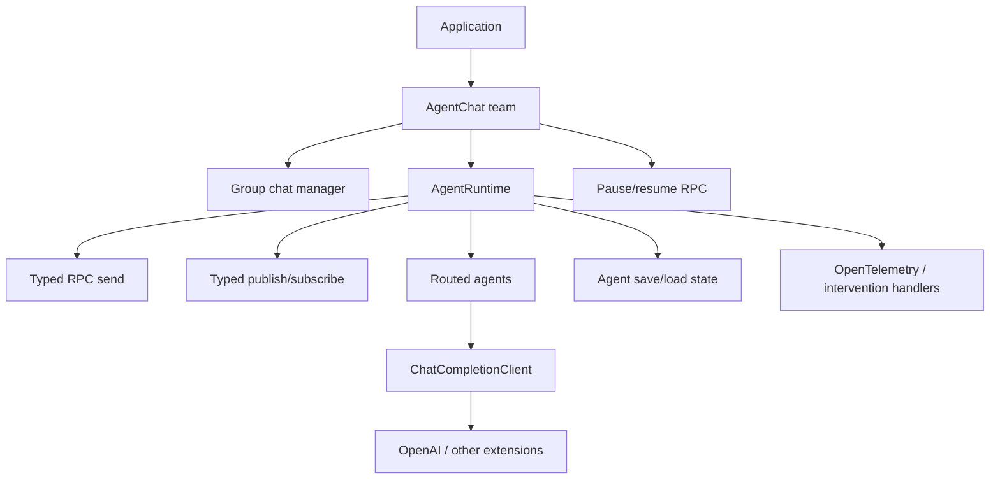

# Project Case Study: AutoGen

> **Repository**: [microsoft/autogen](https://github.com/microsoft/autogen/tree/027ecf0a379bcc1d09956d46d12d44a3ad9cee14)
> **Default branch**: `main`
> **Commit**: `027ecf0a379bcc1d09956d46d12d44a3ad9cee14`
> **License**: Python package code is MIT via `LICENSE-CODE`; the repository root also contains CC BY 4.0 documentation/assets
> **Domain**: Typed agent runtime, publish/subscribe messaging, RPC, group chat teams, model clients, serialization, and distributed extensions
> **Python version**: `>=3.10` (`python/packages/autogen-core/pyproject.toml`)
> **Package version at the revision**: `0.7.5`
> **Evidence level**: A for typed handlers, runtime dispatch, group-chat state, pause/resume, model-client boundaries, and tests; B for strategy/composite mappings

APwP means *Architecture Patterns with Python*, CAP means *Clean Architecture with Python*, and SDP means *Software Design for Python Programmers*.

## 1. Architecture Summary

AutoGen is split into a foundational `autogen-core` runtime and higher-level `autogen-agentchat` teams/agents, with provider and runtime extensions in `autogen-ext`. Agents register factories, subscriptions, message serializers, and typed handlers. The runtime accepts direct RPC messages and topic-published events, routes them to agents, and manages cancellation, tracing, and lifecycle.

`autogen-agentchat` builds group chat teams over that runtime. A group-chat manager receives starts and agent responses, selects the next speakers, publishes requests, applies termination conditions, and signals a `TaskResult`. Team state can be saved/loaded; live teams can be paused/resumed through direct RPCs, but each agent owns the actual pause behavior.

The architecture is a **typed actor/event runtime with a team façade**. It is especially useful for understanding P06, P07, P08, P09, P10, P12, P13, P14, P15, P16, and P17.

This is not a classic domain model. The messages and agent state are infrastructure/application protocol objects; domain invariants belong in the application agents. The design instead optimizes for explicit message routing, testable runtimes, and the option to replace the embedded runtime with a distributed runtime.

## 2. Python/native Boundary

The core runtime, agents, team manager, state models, serialization, and orchestration are Python. There is no C++/CUDA/Rust hot path in the assigned core. The external boundary includes:

- model providers and their HTTP clients;
- protobuf/gRPC or other distributed runtime transports;
- Docker/code execution, browser, and tool extensions;
- OpenTelemetry and persistence/infrastructure services.

The model client interface normalizes message creation, streaming, token accounting, structured output, cancellation, and close behavior. `autogen-ext` contains concrete provider adapters. The runtime’s protobuf-generated or transport-specific artifacts are boundary implementations, not the place where group-chat policy lives.

## 3. Pattern Map

| ID | Pattern observed | Exact source | Exact test | Book mapping | Evidence | Production trade-off |
|---|---|---|---|---|---|---|
| P02 | Typed agent/team state boundary | [`state/_states.py`](https://github.com/microsoft/autogen/blob/027ecf0a379bcc1d09956d46d12d44a3ad9cee14/python/packages/autogen-agentchat/src/autogen_agentchat/state/_states.py) | [`tests/test_state.py`](https://github.com/microsoft/autogen/blob/027ecf0a379bcc1d09956d46d12d44a3ad9cee14/python/packages/autogen-core/tests/test_state.py) | APwP ch07; CAP ch17 | B | Pydantic state validates protocol/runtime state, but it is not automatically a behavior-rich domain aggregate. |
| P05 | Group-chat manager and team run as application service | [`teams/_group_chat/_base_group_chat.py`](https://github.com/microsoft/autogen/blob/027ecf0a379bcc1d09956d46d12d44a3ad9cee14/python/packages/autogen-agentchat/src/autogen_agentchat/teams/_group_chat/_base_group_chat.py), [`_base_group_chat_manager.py`](https://github.com/microsoft/autogen/blob/027ecf0a379bcc1d09956d46d12d44a3ad9cee14/python/packages/autogen-agentchat/src/autogen_agentchat/teams/_group_chat/_base_group_chat_manager.py) | APwP ch04; CAP ch18 | [`tests/test_group_chat.py`](https://github.com/microsoft/autogen/blob/027ecf0a379bcc1d09956d46d12d44a3ad9cee14/python/packages/autogen-agentchat/tests/test_group_chat.py) | A | The façade makes a team easy to run, while manager policy and runtime lifecycle remain coupled. |
| P06 | AgentRuntime and ChatCompletionClient protocols | [`_agent_runtime.py`](https://github.com/microsoft/autogen/blob/027ecf0a379bcc1d09956d46d12d44a3ad9cee14/python/packages/autogen-core/src/autogen_core/_agent_runtime.py), [`models/_model_client.py`](https://github.com/microsoft/autogen/blob/027ecf0a379bcc1d09956d46d12d44a3ad9cee14/python/packages/autogen-core/src/autogen_core/models/_model_client.py) | [`tests/test_runtime.py`](https://github.com/microsoft/autogen/blob/027ecf0a379bcc1d09956d46d12d44a3ad9cee14/python/packages/autogen-core/tests/test_runtime.py) | CAP ch14–16, ch19–20 | A | The ports are explicit, but message serializers and runtime IDs are part of the practical contract. |
| P07 | Factory registration and runtime composition | [`_base_agent.py`](https://github.com/microsoft/autogen/blob/027ecf0a379bcc1d09956d46d12d44a3ad9cee14/python/packages/autogen-core/src/autogen_core/_base_agent.py) | [`tests/test_base_agent.py`](https://github.com/microsoft/autogen/blob/027ecf0a379bcc1d09956d46d12d44a3ad9cee14/python/packages/autogen-core/tests/test_base_agent.py) | APwP ch13; CAP ch16 | A | Registration is explicit, but subscriptions/serializers/factories must agree before messages can flow. |
| P08 | Subscription, serializer, and agent-factory registry | [`_base_agent.py`](https://github.com/microsoft/autogen/blob/027ecf0a379bcc1d09956d46d12d44a3ad9cee14/python/packages/autogen-core/src/autogen_core/_base_agent.py), [`_serialization.py`](https://github.com/microsoft/autogen/blob/027ecf0a379bcc1d09956d46d12d44a3ad9cee14/python/packages/autogen-core/src/autogen_core/_serialization.py) | [`tests/test_serialization.py`](https://github.com/microsoft/autogen/blob/027ecf0a379bcc1d09956d46d12d44a3ad9cee14/python/packages/autogen-core/tests/test_serialization.py) | SDP ch34; CAP ch19–20 | A | Registries enable dynamic agents/transport, but registration and serializer compatibility can fail at runtime. |
| P09 | Speaker selection and termination/round policies | [`_base_group_chat_manager.py`](https://github.com/microsoft/autogen/blob/027ecf0a379bcc1d09956d46d12d44a3ad9cee14/python/packages/autogen-agentchat/src/autogen_agentchat/teams/_group_chat/_base_group_chat_manager.py) | [`tests/test_group_chat.py`](https://github.com/microsoft/autogen/blob/027ecf0a379bcc1d09956d46d12d44a3ad9cee14/python/packages/autogen-agentchat/tests/test_group_chat.py) | SDP ch33, ch38 | B | Speaker and termination strategies are replaceable, but the manager still owns shared turn/thread state. |
| P10 | Direct commands/RPC and topic events/messages | [`_routed_agent.py`](https://github.com/microsoft/autogen/blob/027ecf0a379bcc1d09956d46d12d44a3ad9cee14/python/packages/autogen-core/src/autogen_core/_routed_agent.py), [`_single_threaded_agent_runtime.py`](https://github.com/microsoft/autogen/blob/027ecf0a379bcc1d09956d46d12d44a3ad9cee14/python/packages/autogen-core/src/autogen_core/_single_threaded_agent_runtime.py) | [`tests/test_routed_agent.py`](https://github.com/microsoft/autogen/blob/027ecf0a379bcc1d09956d46d12d44a3ad9cee14/python/packages/autogen-core/tests/test_routed_agent.py), [`tests/test_runtime.py`](https://github.com/microsoft/autogen/blob/027ecf0a379bcc1d09956d46d12d44a3ad9cee14/python/packages/autogen-core/tests/test_runtime.py) | APwP ch08–11; SDP ch37 | A | RPC replies propagate differently from event-handler failures; delivery semantics must be selected intentionally. |
| P12 | Provider model-client adapters and transformations | [`models/_model_client.py`](https://github.com/microsoft/autogen/blob/027ecf0a379bcc1d09956d46d12d44a3ad9cee14/python/packages/autogen-core/src/autogen_core/models/_model_client.py), [`autogen_ext/models/openai/_openai_client.py`](https://github.com/microsoft/autogen/blob/027ecf0a379bcc1d09956d46d12d44a3ad9cee14/python/packages/autogen-ext/src/autogen_ext/models/openai/_openai_client.py) | [`tests/models/test_openai_model_client.py`](https://github.com/microsoft/autogen/blob/027ecf0a379bcc1d09956d46d12d44a3ad9cee14/python/packages/autogen-ext/tests/models/test_openai_model_client.py) | SDP ch35; CAP ch19–20 | A | The common client contract preserves features, but provider-specific capability flags and message transformations remain visible. |
| P13 | Group-chat state, live pause/resume, and save/load | [`_base_group_chat.py`](https://github.com/microsoft/autogen/blob/027ecf0a379bcc1d09956d46d12d44a3ad9cee14/python/packages/autogen-agentchat/src/autogen_agentchat/teams/_group_chat/_base_group_chat.py), [`state/_states.py`](https://github.com/microsoft/autogen/blob/027ecf0a379bcc1d09956d46d12d44a3ad9cee14/python/packages/autogen-agentchat/src/autogen_agentchat/state/_states.py) | [`tests/test_group_chat_pause_resume.py`](https://github.com/microsoft/autogen/blob/027ecf0a379bcc1d09956d46d12d44a3ad9cee14/python/packages/autogen-agentchat/tests/test_group_chat_pause_resume.py), [`tests/test_group_chat.py`](https://github.com/microsoft/autogen/blob/027ecf0a379bcc1d09956d46d12d44a3ad9cee14/python/packages/autogen-agentchat/tests/test_group_chat.py) | SDP ch38; CAP ch18, ch24 | A | Live pause is not durable checkpointing; save/load excludes subscription state and may be inconsistent while running. |
| P14 | Intervention handlers, OpenTelemetry, and runtime hooks | [`_single_threaded_agent_runtime.py`](https://github.com/microsoft/autogen/blob/027ecf0a379bcc1d09956d46d12d44a3ad9cee14/python/packages/autogen-core/src/autogen_core/_single_threaded_agent_runtime.py) | [`tests/test_cancellation.py`](https://github.com/microsoft/autogen/blob/027ecf0a379bcc1d09956d46d12d44a3ad9cee14/python/packages/autogen-core/tests/test_cancellation.py) | CAP ch23; SDP ch39 | B | Hooks can drop/intercept messages and trace envelopes, which adds cross-cutting lifecycle behavior to delivery. |
| P15 | Nested/composite teams and routed-agent composition | [`teams/_group_chat/_base_group_chat.py`](https://github.com/microsoft/autogen/blob/027ecf0a379bcc1d09956d46d12d44a3ad9cee14/python/packages/autogen-agentchat/src/autogen_agentchat/teams/_group_chat/_base_group_chat.py) | [`tests/test_group_chat_nested.py`](https://github.com/microsoft/autogen/blob/027ecf0a379bcc1d09956d46d12d44a3ad9cee14/python/packages/autogen-agentchat/tests/test_group_chat_nested.py), [`tests/test_group_chat_graph.py`](https://github.com/microsoft/autogen/blob/027ecf0a379bcc1d09956d46d12d44a3ad9cee14/python/packages/autogen-agentchat/tests/test_group_chat_graph.py) | SDP ch36, ch39 | A | Nested teams reuse the runtime model but multiply topic, identity, and shutdown coordination. |
| P16 | Async queue scheduling, cancellation, and runtime lifecycle | [`_single_threaded_agent_runtime.py`](https://github.com/microsoft/autogen/blob/027ecf0a379bcc1d09956d46d12d44a3ad9cee14/python/packages/autogen-core/src/autogen_core/_single_threaded_agent_runtime.py) | [`tests/test_runtime.py`](https://github.com/microsoft/autogen/blob/027ecf0a379bcc1d09956d46d12d44a3ad9cee14/python/packages/autogen-core/tests/test_runtime.py), [`tests/test_cancellation.py`](https://github.com/microsoft/autogen/blob/027ecf0a379bcc1d09956d46d12d44a3ad9cee14/python/packages/autogen-core/tests/test_cancellation.py) | SDP ch41 | A | A single queue provides clear delivery order but the implementation still runs each message in a separate concurrent task. |
| P17 | Serialization, replay/cache model clients, and runtime fakes | [`_serialization.py`](https://github.com/microsoft/autogen/blob/027ecf0a379bcc1d09956d46d12d44a3ad9cee14/python/packages/autogen-core/src/autogen_core/_serialization.py), [`autogen_ext/models/replay/_replay_chat_completion_client.py`](https://github.com/microsoft/autogen/blob/027ecf0a379bcc1d09956d46d12d44a3ad9cee14/python/packages/autogen-ext/src/autogen_ext/models/replay/_replay_chat_completion_client.py) | [`tests/test_serialization.py`](https://github.com/microsoft/autogen/blob/027ecf0a379bcc1d09956d46d12d44a3ad9cee14/python/packages/autogen-core/tests/test_serialization.py), [`tests/models/test_chat_completion_cache.py`](https://github.com/microsoft/autogen/blob/027ecf0a379bcc1d09956d46d12d44a3ad9cee14/python/packages/autogen-ext/tests/models/test_chat_completion_cache.py) | CAP ch21; APwP ch13 | A | Replay/cache makes tests deterministic, but a replay client validates recorded conversations rather than provider availability. |

P01, P03, P04, and P11 are not authoritative claims: the assigned code has no domain aggregate, domain repository/UoW, or CQRS read-model split.

## 4. Source Walkthrough

### 4.1 `BaseAgent` makes registration explicit

[`python/packages/autogen-core/src/autogen_core/_base_agent.py`](https://github.com/microsoft/autogen/blob/027ecf0a379bcc1d09956d46d12d44a3ad9cee14/python/packages/autogen-core/src/autogen_core/_base_agent.py) provides `subscription_factory` and `handles` class decorators, binds an agent ID/runtime, forwards `send_message` and `publish_message`, and exposes `save_state`/`load_state`. `register()` installs a factory, subscriptions, direct prefix subscription, and message serializers. `register_instance()` performs the equivalent work for an existing instance.

This is a composition root with a real runtime registry. A message can only be routed correctly if the factory, agent type, topic subscriptions, and serializer registrations agree.

### 4.2 `RoutedAgent` turns type hints into dispatch metadata

[`python/packages/autogen-core/src/autogen_core/_routed_agent.py`](https://github.com/microsoft/autogen/blob/027ecf0a379bcc1d09956d46d12d44a3ad9cee14/python/packages/autogen-core/src/autogen_core/_routed_agent.py) defines a runtime-checkable `MessageHandler` protocol. `@message_handler`, `@event`, and `@rpc` inspect annotations with `get_type_hints`, record target/return types, apply optional routing predicates, and enforce exact concrete message/return types in strict mode.

The result is a typed command/event seam with runtime validation. It is not compile-time safety: reflection, concrete-type matching, and registration order still matter.

### 4.3 The single-threaded runtime separates queue order from task concurrency

[`_single_threaded_agent_runtime.py`](https://github.com/microsoft/autogen/blob/027ecf0a379bcc1d09956d46d12d44a3ad9cee14/python/packages/autogen-core/src/autogen_core/_single_threaded_agent_runtime.py) uses typed message envelopes and one asyncio queue. The queue preserves arrival order, but each message is processed in its own asyncio task, so handlers can overlap. Direct sends carry a response future; publishes broadcast to subscribed agents. Intervention handlers can drop or transform messages, and runtime envelopes are traced with OpenTelemetry.

The source documentation explicitly positions this runtime for development and standalone use, not high-throughput/high-concurrency production. Distributed runtime extensions are a separate deployment choice.

### 4.4 Group Chat is a façade over typed topics

[`_base_group_chat.py`](https://github.com/microsoft/autogen/blob/027ecf0a379bcc1d09956d46d12d44a3ad9cee14/python/packages/autogen-agentchat/src/autogen_agentchat/teams/_group_chat/_base_group_chat.py) creates an embedded runtime by default, registers participant factories and a manager, sends `GroupChatStart`, collects events until `GroupChatTermination`, and exposes `run`, `run_stream`, `reset`, `pause`, `resume`, `save_state`, and `load_state`.

[`_base_group_chat_manager.py`](https://github.com/microsoft/autogen/blob/027ecf0a379bcc1d09956d46d12d44a3ad9cee14/python/packages/autogen-agentchat/src/autogen_agentchat/teams/_group_chat/_base_group_chat_manager.py) validates participant names, tracks the message thread/current turn/active speakers, selects the next speakers, publishes requests, aggregates responses, and applies termination conditions. A manager can publish to several active speakers, so response ordering and termination policy are explicit concerns.

### 4.5 State and model clients expose the production seams

[`state/_states.py`](https://github.com/microsoft/autogen/blob/027ecf0a379bcc1d09956d46d12d44a3ad9cee14/python/packages/autogen-agentchat/src/autogen_agentchat/state/_states.py) defines Pydantic state models for assistants, teams, managers, speaker indexes, and nested teams. The team façade saves participant/manager states by portable names, then loads them through runtime APIs; subscriptions are not persisted.

[`models/_model_client.py`](https://github.com/microsoft/autogen/blob/027ecf0a379bcc1d09956d46d12d44a3ad9cee14/python/packages/autogen-core/src/autogen_core/models/_model_client.py) defines the provider port. `autogen-ext` OpenAI/cache/replay clients implement it. A fake or replay client can therefore exercise group-chat behavior without network calls.

## 5. Theory Versus Practice

### Theoretical ideal

APwP’s message bus separates commands/events from handlers; Clean Architecture puts runtime and provider implementations behind ports; a state machine persists explicit state; and a composition root wires factories without global registration surprises. Durable pause/resume would persist both state and the delivery topology needed to continue.

### Production implementation

AutoGen uses explicit decorators and runtime registries for typed messages, factories, subscriptions, and serializers. A single-threaded runtime offers an approachable async queue and per-message tasks. AgentChat wraps that runtime in group-chat managers/topics. `pause()`/`resume()` send direct RPCs to live participants; `save_state()`/`load_state()` separately serialize agent and manager state. Provider clients live in extension packages.

### Difference and rationale

- **Reflection-backed typing:** `get_type_hints` makes handler declarations concise and validates message/return types at registration/call time. It cannot provide static exhaustiveness and uses exact concrete types in important paths.
- **Embedded single-thread runtime:** one queue and explicit lifecycle are ideal for local development and tests. High-throughput deployments need a different runtime/transport and must preserve message contracts.
- **Event failure policy:** event handlers can run concurrently and unhandled exceptions may be ignored by the default runtime setting, while RPC failures are surfaced. That isolates broadcast failures but can hide an event problem unless the application configures/awaits errors.
- **Live pause versus durable state:** pause/resume is intentionally delegated to each agent’s `on_pause`/`on_resume`; the team run does not return. Durable continuation is an explicit save/load operation and is cautioned against while the team is running.
- **Portable state versus topology:** team state uses agent names instead of runtime IDs, which improves portability across teams/runtimes. Subscriptions and runtime topology are reconstructed, not persisted.
- **Provider extensions:** keeping OpenAI and cache/replay clients out of core limits dependency weight, but feature support and version compatibility cross package boundaries.

## 6. Testing Strategy

`autogen-core/tests/test_routed_agent.py` proves typed handler decoration/routing; `test_runtime.py` exercises direct sends, publishes, factories, delivery, and lifecycle; `test_serialization.py` validates message serializers; `test_cancellation.py` covers cancellation propagation.

The AgentChat tests are particularly revealing. `test_group_chat.py` checks manager/team behavior; `test_group_chat_pause_resume.py` defines an agent whose `on_pause`/`on_resume` toggles its own long-running work and verifies the counter stops/starts; `test_group_chat_graph.py` and `test_group_chat_nested.py` cover composite teams. The test shows that pause correctness belongs to the participant implementation, not only the team façade.

Provider seams have dedicated tests: `autogen-ext/tests/models/test_openai_model_client.py` covers provider behavior, while `test_chat_completion_cache.py` and replay-client tests support deterministic execution. These tests should be combined with failure-injection tests for message handlers, since event error isolation is a runtime policy.

## 7. Lessons

- Use AutoGen’s core shape when the system is naturally message-driven and agents need independent identities, subscriptions, RPC, or publish/subscribe events.
- Separate direct commands from broadcast events; their response/error semantics are different.
- Treat `SingleThreadedAgentRuntime` as a local/test runtime unless the deployment explicitly accepts its throughput model.
- Implement `save_state`/`load_state` and `on_pause`/`on_resume` as distinct contracts; one does not imply the other.
- Use model-client fakes, cache clients, or replay clients to test orchestration without a provider network.
- Do not assume state serialization persists subscriptions, in-flight messages, or arbitrary live clients.
- For a single linear agent call, a direct service/model port is simpler than setting up topics and runtime factories.

## 8. Practice Exercise

Build a small typed runtime:

1. Define dataclass `Request`, `Response`, and `Event` messages plus a `RoutedAgent` with `@rpc` and `@event` handlers.
2. Register an agent factory and serializer in a `SingleThreadedAgentRuntime`; test direct send versus topic publish.
3. Add cancellation and an intervention handler that drops one event.
4. Add a fake `ChatCompletionClient`, a two-agent round-robin manager, and Pydantic `TeamState` save/load.
5. Implement live pause/resume and separately test state persistence while stopped; verify that a replayed event cannot duplicate an external side effect.

The exercise is complete when the team manager can be reused with a different runtime and model client without changing message types or participant handlers.
