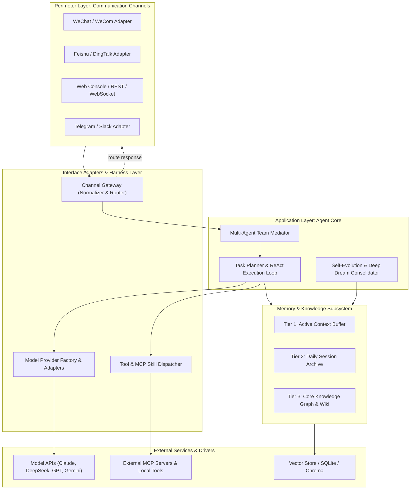

# Project Case Study: CowAgent

> **Repository**: [zhayujie/CowAgent](https://github.com/zhayujie/CowAgent)  
> **Domain**: Multi-Agent Harness, Proactive Assistant & Enterprise Communication Bridge  
> **Scale & Maturity**: 25k+ stars, production multi-platform deployment (WeChat, Feishu, DingTalk, Web)  
> **Core Tech Stack**: Python 3.10+, Asyncio, Pydantic v2, FastAPI/WebSockets, MCP SDK, Pytest  

---

## 1. Executive Architecture Summary

CowAgent is an open-source super AI assistant and a reference implementation of **Agent Harness Engineering**. While many agent frameworks couple model prompting directly to single-user terminal loops, CowAgent designs a clean, multi-tenant harness where **Input/Output Channels**, **Agent Core Reasoning**, **Memory Lifecycle**, and **Model Providers** are decoupled into independent, replaceable architectural layers.

Messages arrive through diverse messaging platforms (WeChat, Feishu, DingTalk, Telegram, Slack, Web). The **Channel Gateway** normalizes inbound platform events into unified message DTOs. The **Agent Core** orchestrates reasoning across a **3-tier memory hierarchy** (Contextual $\rightarrow$ Daily $\rightarrow$ Core) powered by *Deep Dream distillation*, dispatches tasks to **Multi-Agent Teams**, invokes tools via **Native MCP**, and calls out to swappable **Model Adapters** before returning replies through the originating channel.

### High-Level Architectural Diagram



---

## 2. Layering & Boundary Discipline

| Layer | Directory / Module | Responsibilities | Permitted Inward Dependencies |
| :--- | :--- | :--- | :--- |
| **Domain (Core)** | `cowagent/domain/` | Agent identity, Message DTOs, Memory records, Task contracts | None (Standard library & pure Pydantic) |
| **Application (Core)** | `cowagent/core/` | Planner, Team Mediator, ReAct engine, Self-evolution loops | Domain only |
| **Harness & Adapters** | `cowagent/channels/`, `models/`, `tools/` | Channel bridges, LLM provider clients, MCP tool wrappers | Application, Domain |
| **Drivers / Perimeter**| `cowagent/entry/`, `web/` | FastMCP servers, CLI runner, FastAPI web console | Adapters, Application |

### Inward Dependency Rule Audit
- **Channel Purity**: Channel-specific SDKs (e.g., WeCom protocol libraries, Slack Bolt, Telegram bot API) are isolated inside `cowagent/channels/`. The Agent Core never knows whether a message originated from WeChat or a terminal.
- **Model Inversion**: The core interacts with an abstract `BaseModelClient` interface. Provider-specific payload quirks (e.g., DeepSeek reasoning tokens vs Claude tool use schema) are translated inside individual model adapters.
- **Contract-Driven Skills**: Skills are defined via `SKILL.md` specifications and MCP schemas, decoupling tool definitions from the core execution loop.

---

## 3. Macro Architectural Patterns in Action

### A. The 3-Tier Memory & Deep Dream Distillation
CowAgent solves memory degradation and context token limits through a staged lifecycle:
1. **Tier 1: Context Memory**: In-memory sliding window of recent conversation turns.
2. **Tier 2: Daily Memory**: Raw daily conversation logs indexed for fast temporal search.
3. **Tier 3: Core Memory**: Distilled user persona, persistent preferences, and knowledge graph entries produced asynchronously via the *Deep Dream* background job.

```python
# cowagent/domain/memory.py
from dataclasses import dataclass, field
from datetime import datetime
from enum import Enum

class MemoryTier(str, Enum):
    CONTEXT = "context"
    DAILY = "daily"
    CORE = "core"

@dataclass
class MemoryRecord:
    id: str
    tier: MemoryTier
    content: str
    importance_score: float
    created_at: datetime = field(default_factory=datetime.utcnow)
    tags: list[str] = field(default_factory=list)

    def is_eligible_for_consolidation(self) -> bool:
        """Domain invariant: only daily memories with high significance distill into core."""
        return self.tier == MemoryTier.DAILY and self.importance_score >= 0.7
```

### B. Multi-Agent Team Collaboration via Mediator
Specialized agents (e.g. Researcher, Coder, Critic) collaborate within a shared context using the **Mediator Pattern**:

```python
# cowagent/core/team.py
from typing import Protocol

class AgentParticipant(Protocol):
    role: str
    async def process_turn(self, context: dict) -> str: ...

class TeamMediator:
    """Mediates multi-agent conversation flow without pairwise agent coupling."""
    def __init__(self, agents: list[AgentParticipant]) -> None:
        self._agents = {a.role: a for a in agents}
        self._history: list[dict] = []

    async def broadcast_and_synthesize(self, prompt: str, leader_role: str) -> str:
        leader = self._agents.get(leader_role)
        if not leader:
            raise ValueError(f"Team leader '{leader_role}' not found in team")
        
        # Dispatch sub-tasks, collect peer findings, and deliver synthesized result
        result = await leader.process_turn({"prompt": prompt, "team": self._agents})
        return result
```

---

## 4. Meso Tactical Design Patterns in Action

| Pattern | Module Location | Purpose & Implementation Details |
| :--- | :--- | :--- |
| **Mediator** | `cowagent/core/team.py` | `TeamMediator` coordinates collaboration between diverse specialized agents. |
| **Strategy & Factory** | `cowagent/models/` | `ModelFactory.create(provider_name)` dynamically instantiates Claude, DeepSeek, or GPT clients. |
| **Adapter** | `cowagent/channels/` | Channel adapters normalize WeChat, Telegram, Feishu events into unified `ChannelMessage`. |
| **Registry** | `cowagent/tools/registry.py` | Tool & MCP registry allowing dynamic tool loading via decorators (`@register_tool`). |
| **Observer** | `cowagent/events/` | Event bus emitting hooks on message arrival, tool start/completion, and memory distillation. |

---

## 5. Micro Code Craftsmanship & Idioms

- **Async Boundary Management**: All I/O channels and tool executions run on `asyncio` event loops with strict timeout wrappers (`asyncio.wait_for()`) preventing hung external API calls.
- **Fail-Fast Channel Heartbeats**: Each channel implements an explicit health check (`check_health()`) enabling the harness to report disconnected IM webhooks immediately.
- **Pydantic Perimeter Validation**: Inbound webhooks and outbound LLM tool payloads validate against strict Pydantic schemas before reaching core domain handlers.

---

## 6. Pragmatic Compromises & Architectural Trade-offs

1. **Lightweight SQLite + Hybrid Vector vs. Distributed Cluster**:
   - *Textbook purity*: Deploy distributed Elasticsearch + Milvus cluster.
   - *Pragmatic choice*: Embedded SQLite with FTS5 for keyword search + local Chroma/Qdrant vector store.
   - *Rationale*: Allows single-line `bash run.sh` deployment on inexpensive personal VPS or home lab without massive RAM overhead.

2. **Tool Execution Sandboxing**:
   - *Trade-off*: Running local terminal commands directly vs fully isolated Docker containers.
   - *Pragmatic choice*: Configurable execution modes: standard sandboxed vs developer direct mode with user confirmation prompts.

---

## 7. Curated File Tours

1. **`cowagent/core/harness.py`**: The central harness coordinating Channel Gateway $\rightarrow$ Planner $\rightarrow$ Model Adapter.
2. **`cowagent/channels/base.py`**: The abstract channel seam defining the interface contract for all chat platforms.
3. **`cowagent/memory/distiller.py`**: The Deep Dream memory consolidation engine translating daily logs into core knowledge.
