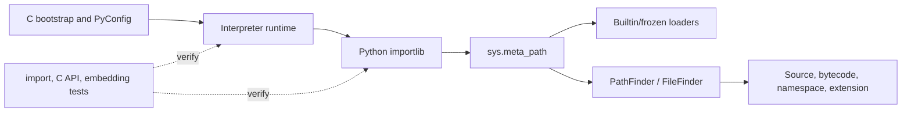

# Project Case Study: CPython

> Repository: [python/cpython](https://github.com/python/cpython/tree/7bfa97f4dca58ab45def2ca0a1e8088997a4fa0b)
> Checkout: `/media/tinhanhnguyen/sub/oss-architecture/tmp/python-oss-architecture.LEjXfG/cpython`
> Default branch: `main`
> Commit: `7bfa97f4dca58ab45def2ca0a1e8088997a4fa0b`
> Python: `3.16.0 alpha 0` (from README.rst)
> Revision: Python 3.16.0 alpha 0, as stated by the checked-out `README.rst`
> License: Python Software Foundation License 2.0, with additional licenses for incorporated components ([LICENSE](https://github.com/python/cpython/blob/7bfa97f4dca58ab45def2ca0a1e8088997a4fa0b/LICENSE))
> Domain: Reference Python interpreter, standard library, C API, and embedding runtime
> Evidence level: A for the Python/native boundary, import protocols, initialization, and tests; pattern labels are architectural mappings rather than claims that CPython follows an application architecture book literally.

## 1. Architecture Summary

CPython is a deliberately split Python/C system. A C bootstrap path initializes an interpreter from `PyConfig`; the Python import implementation then selects finders and loaders through mutable protocol lists such as `sys.meta_path` and `sys.path_hooks`. Built-in, frozen, source, bytecode, namespace, and extension modules can therefore participate through a common import contract. The test suite crosses both Python-level and C/API/embedding boundaries.

This is a runtime/kernel architecture with stable extension protocols and a Python/native implementation boundary. It is a useful reference for registries, adapters, lifecycle, and integration fitness, not a template for ordinary business-service layering.

## 2. Python Boundary

The boundary is explicit and first-party:

| Area | Main language/role | Responsibility |
|---|---|---|
| `Lib/` and `Lib/importlib/` | Python | Standard-library policies, finder/loader protocols, and import orchestration |
| `Python/`, `Objects/`, `Include/` | C | Interpreter lifecycle, object model, C API, and runtime internals |
| `Modules/` | C and extension modules | Built-in/extension-module implementations and native system integration |
| `Programs/` | C | Interpreter startup and embedding/test executables |
| `Lib/test/` | Python plus subprocess/C API tests | Contract, compatibility, concurrency, and integration verification |

`Programs/_bootstrap_python.c` calls the configuration-based initialization API, while `Lib/importlib` supplies higher-level discovery behavior. The split is not merely an optimization: it permits a stable Python import protocol over multiple loader implementations and a stable C embedding API over runtime internals.

## 3. Pattern Map

| Pattern ID | Pattern | Source evidence | Test evidence | Book mapping |
|---|---|---|---|---|
| P06 | Ports, adapters, and dependency inversion | [`ModuleSpec`](https://github.com/python/cpython/blob/7bfa97f4dca58ab45def2ca0a1e8088997a4fa0b/Lib/importlib/_bootstrap.py#L599-L633) defines the module/finder/loader contract; C API and Python API are separate boundary surfaces | [`test_import.py`](https://github.com/python/cpython/blob/7bfa97f4dca58ab45def2ca0a1e8088997a4fa0b/Lib/test/test_capi/test_import.py#L114-L217) checks import API contracts | Clean Architecture ch14, ch16, ch19–20; Software Design ch35 |
| P08 | Registry, factory, and plugin architecture | [`_find_spec`](https://github.com/python/cpython/blob/7bfa97f4dca58ab45def2ca0a1e8088997a4fa0b/Lib/importlib/_bootstrap.py#L1192-L1234) iterates `sys.meta_path`; [`PathFinder`/`FileFinder`](https://github.com/python/cpython/blob/7bfa97f4dca58ab45def2ca0a1e8088997a4fa0b/Lib/importlib/_bootstrap_external.py#L1183-L1255) select loaders | [`test_threaded_import.py`](https://github.com/python/cpython/blob/7bfa97f4dca58ab45def2ca0a1e8088997a4fa0b/Lib/test/test_importlib/test_threaded_import.py#L64-L175) and path-hook tests | Software Design ch34; Clean Architecture ch19–20 |
| P12 | Adapter, façade, and provider router | Importlib translates one module request into builtin, frozen, path, namespace, or extension loader implementations | [`test_path.py`](https://github.com/python/cpython/blob/7bfa97f4dca58ab45def2ca0a1e8088997a4fa0b/Lib/test/test_importlib/import_/test_path.py) and C API import tests | Clean Architecture ch19–20; Software Design ch35 |
| P16 | Concurrency, scheduling, and resource lifecycle | Import lock coordination in the import machinery and configuration-based interpreter initialization in [`_bootstrap_python.c`](https://github.com/python/cpython/blob/7bfa97f4dca58ab45def2ca0a1e8088997a4fa0b/Programs/_bootstrap_python.c#L48-L107) | [`test_threaded_import.py`](https://github.com/python/cpython/blob/7bfa97f4dca58ab45def2ca0a1e8088997a4fa0b/Lib/test/test_importlib/test_threaded_import.py#L24-L190) and [`test_embed.py`](https://github.com/python/cpython/blob/7bfa97f4dca58ab45def2ca0a1e8088997a4fa0b/Lib/test/test_embed.py#L101-L160) | Clean Architecture ch21; Software Design ch41 |
| P17 | Testing seams and architecture fitness | Import hooks, C API calls, and embedding executables are independently testable boundaries | [`test_capi/test_import.py`](https://github.com/python/cpython/blob/7bfa97f4dca58ab45def2ca0a1e8088997a4fa0b/Lib/test/test_capi/test_import.py), [`test_embed.py`](https://github.com/python/cpython/blob/7bfa97f4dca58ab45def2ca0a1e8088997a4fa0b/Lib/test/test_embed.py), and threaded import tests | Clean Architecture ch21; ch23 |

## 4. Source Walkthrough

### Import protocol and registry

[`_find_spec`](https://github.com/python/cpython/blob/7bfa97f4dca58ab45def2ca0a1e8088997a4fa0b/Lib/importlib/_bootstrap.py#L1192-L1234) copies and iterates the meta-path finder registry under the import lock. [`PathFinder` and `FileFinder`](https://github.com/python/cpython/blob/7bfa97f4dca58ab45def2ca0a1e8088997a4fa0b/Lib/importlib/_bootstrap_external.py#L1183-L1408) then use path hooks, importer caches, and loader details to choose a concrete implementation. New loader types can participate through the finder/loader contract.

### Native bootstrap

[`Programs/_bootstrap_python.c`](https://github.com/python/cpython/blob/7bfa97f4dca58ab45def2ca0a1e8088997a4fa0b/Programs/_bootstrap_python.c#L48-L107) initializes an isolated `PyConfig`, reads command-line configuration, calls `Py_InitializeFromConfig`, runs the interpreter, and clears configuration state. The runtime implementation is in C, while much import policy is supplied by frozen/bootstrap Python code.

### Boundary tests

[`test_threaded_import.py`](https://github.com/python/cpython/blob/7bfa97f4dca58ab45def2ca0a1e8088997a4fa0b/Lib/test/test_importlib/test_threaded_import.py#L64-L190) checks import-lock behavior, concurrent module initialization, path hooks, cache behavior, and circular/import-hang cases. [`test_capi/test_import.py`](https://github.com/python/cpython/blob/7bfa97f4dca58ab45def2ca0a1e8088997a4fa0b/Lib/test/test_capi/test_import.py#L114-L217) verifies the C-facing import contract. [`test_embed.py`](https://github.com/python/cpython/blob/7bfa97f4dca58ab45def2ca0a1e8088997a4fa0b/Lib/test/test_embed.py#L101-L160) runs embedding executables as subprocesses and checks isolated configuration behavior.

## 5. Theory Versus Practice

### Theoretical ideal

The books' protocol and adapter guidance favors small stable interfaces, explicit dependency direction, and replaceable implementations. A registry should have a clear ownership/lifecycle policy, and concurrency boundaries should be tested rather than assumed.

### Production implementation

CPython exposes global, mutable registries (`sys.meta_path`, `sys.path_hooks`, `sys.modules`) because imports must be extensible at runtime and remain compatible with decades of Python code. It combines Python-level finder/loader protocols with C runtime and C API contracts, and uses locks/caches/frozen modules to make that flexibility viable.

### Difference and rationale

Global state and import-time behavior are deliberately accepted here: an interpreter is the host that must discover arbitrary user and extension modules. The C/Python split also creates more failure and compatibility modes than a pure-Python plugin system, but it provides startup performance, ABI/API stability, and native system access. These are useful boundary lessons, not reasons to put global registries in every application.

## 6. Testing Strategy

- Importlib tests use custom finders, path hooks, temporary modules, cache invalidation, and failure cases to exercise the registry seam.
- Threaded import tests verify serialization and concurrency around module initialization, including circular and hanging imports.
- C API tests call import functions directly and check success/error behavior and frozen modules.
- Embedding tests launch compiled helper programs, checking `PyConfig`, environment isolation, repeated initialization, and executable behavior.
- The full CPython matrix also tests platform/build variations; this checkout was inspected for the source/test boundaries, not rebuilt during dossier writing.

## 7. Lessons

- Copy the finder/loader protocol idea when a system must support third-party implementations without a central switch statement.
- Keep registries scoped and explicit in normal applications; CPython's process-wide registries are justified by interpreter semantics and compatibility requirements.
- Test Python/native boundaries with subprocess or ABI/API contract tests, not only unit tests of Python wrappers.
- Import-time registration is powerful but makes ordering and failure diagnosis harder. Prefer explicit registration when startup determinism matters.
- Do not infer that a custom application needs CPython's lifecycle complexity merely because it uses Python.

## 8. Practice Exercise

Write a `MetaPathFinder` and loader for modules stored in an in-memory dictionary. Install it temporarily, test normal and missing imports, verify `sys.modules`/cache behavior, and run two threads importing the same module. Then document which parts would need a C/API contract if the loader were implemented as an extension.
