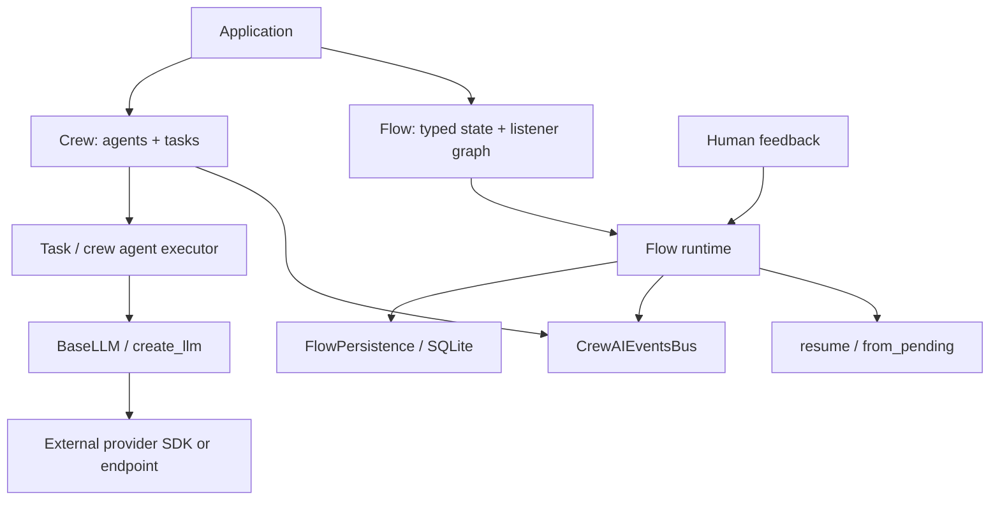

# Project Case Study: CrewAI

> **Repository**: [crewAIInc/crewAI](https://github.com/crewAIInc/crewAI/tree/894898f84c4ac0a89f24bf7bee6c381eb0e67f51)
> **Default branch**: `main`
> **Commit**: `894898f84c4ac0a89f24bf7bee6c381eb0e67f51`
> **License**: MIT (root `LICENSE`)
> **Domain**: Role-based crews, task execution, declarative flows, events, checkpoints, and human feedback
> **Python version**: `>=3.10,<3.14` (workspace `pyproject.toml`)
> **Evidence level**: A for Crew/Flow execution, persistence, event dispatch, provider factories, and tests; B for DDD/CQRS analogues

APwP means *Architecture Patterns with Python*, CAP means *Clean Architecture with Python*, and SDP means *Software Design for Python Programmers*.

## 1. Architecture Summary

CrewAI has two closely related orchestration surfaces. `Crew` models agents, tasks, process policy, memory, callbacks, and manager behavior. `Flow` models a typed stateful workflow using `@start`, `@listen`, `@router`, `or_`, and `and_` declarations. The runtime executes task/listener methods, emits lifecycle events, and can checkpoint/resume state or pause for asynchronous human feedback.

The architecture is a **Pydantic runtime object plus event-driven workflow engine**. Pydantic models make the public configuration and state convenient to validate and serialize. The event bus handles observability and lifecycle reactions, while a persistence interface abstracts flow state. LLM construction is routed through `BaseLLM` and `create_llm`, allowing provider-specific implementations behind a common call surface.

CrewAI is useful for studying P05, P06, P07, P08, P09, P10, P12, P13, P14, P15, P16, and P17. It also shows the practical cost of an ergonomic API: configuration, runtime state, event scope, persistence, and tracing live near one another instead of in strictly isolated domain/application/infrastructure packages.

## 2. Python/native Boundary

The orchestration core, Flow DSL, event bus, checkpoint serialization, task executors, and provider interfaces are Python. No C++/CUDA/Rust hot path is present in the examined core. The external boundary is made of:

- LLM and embedding provider SDKs/endpoints;
- vector stores and knowledge/RAG integrations;
- SQLite or a custom flow persistence backend;
- optional tools, files, browsers, and other application services.

Python controls task scheduling, state transitions, event ordering, callbacks, retry/error policy, and cleanup. Provider adapters own API-specific request construction and response handling. A Flow checkpoint contains enough serialized state to restore method progress, but live Python callables, clients, and arbitrary closures cannot be reconstructed without an explicit reference/serialization strategy.

## 3. Pattern Map

| ID | Pattern observed | Exact source | Exact test | Book mapping | Evidence | Production trade-off |
|---|---|---|---|---|---|---|
| P02 | Typed `FlowState` consistency boundary (aggregate analogue, not a DDD aggregate) | [`flow/runtime/__init__.py`](https://github.com/crewAIInc/crewAI/blob/894898f84c4ac0a89f24bf7bee6c381eb0e67f51/lib/crewai/src/crewai/flow/runtime/__init__.py) | [`test_flow.py`](https://github.com/crewAIInc/crewAI/blob/894898f84c4ac0a89f24bf7bee6c381eb0e67f51/lib/crewai/tests/test_flow.py) | APwP ch07; CAP ch17 | B | Pydantic validates state, but business invariants may remain in methods/listeners rather than an aggregate root. |
| P03 | Flow persistence port and concrete state store | [`flow/persistence/base.py`](https://github.com/crewAIInc/crewAI/blob/894898f84c4ac0a89f24bf7bee6c381eb0e67f51/lib/crewai/src/crewai/flow/persistence/base.py), [`flow/persistence/sqlite.py`](https://github.com/crewAIInc/crewAI/blob/894898f84c4ac0a89f24bf7bee6c381eb0e67f51/lib/crewai/src/crewai/flow/persistence/sqlite.py) | [`test_flow_persistence.py`](https://github.com/crewAIInc/crewAI/blob/894898f84c4ac0a89f24bf7bee6c381eb0e67f51/lib/crewai/tests/test_flow_persistence.py) | APwP ch02; CAP ch19–20 | A | This is a workflow-state repository seam, not a domain repository or a cross-resource transaction. |
| P05 | Crew kickoff and Flow method execution as use cases | [`crew.py`](https://github.com/crewAIInc/crewAI/blob/894898f84c4ac0a89f24bf7bee6c381eb0e67f51/lib/crewai/src/crewai/crew.py), [`flow/runtime/__init__.py`](https://github.com/crewAIInc/crewAI/blob/894898f84c4ac0a89f24bf7bee6c381eb0e67f51/lib/crewai/src/crewai/flow/runtime/__init__.py) | [`test_crew.py`](https://github.com/crewAIInc/crewAI/blob/894898f84c4ac0a89f24bf7bee6c381eb0e67f51/lib/crewai/tests/test_crew.py), [`test_flow.py`](https://github.com/crewAIInc/crewAI/blob/894898f84c4ac0a89f24bf7bee6c381eb0e67f51/lib/crewai/tests/test_flow.py) | APwP ch04; CAP ch18 | A | The framework owns much of the application service, which reduces setup but makes the execution object large. |
| P06 | `FlowPersistence` and `BaseLLM` abstract ports | [`flow/persistence/base.py`](https://github.com/crewAIInc/crewAI/blob/894898f84c4ac0a89f24bf7bee6c381eb0e67f51/lib/crewai/src/crewai/flow/persistence/base.py), [`llms/base_llm.py`](https://github.com/crewAIInc/crewAI/blob/894898f84c4ac0a89f24bf7bee6c381eb0e67f51/lib/crewai/src/crewai/llms/base_llm.py) | [`test_custom_llm.py`](https://github.com/crewAIInc/crewAI/blob/894898f84c4ac0a89f24bf7bee6c381eb0e67f51/lib/crewai/tests/test_custom_llm.py) | CAP ch14–16, ch19–20 | A | Narrow ABCs preserve substitution, while the surrounding runtime still passes framework-specific context and event metadata. |
| P07 | Pydantic validation and Flow metaclass composition | [`flow/runtime/__init__.py`](https://github.com/crewAIInc/crewAI/blob/894898f84c4ac0a89f24bf7bee6c381eb0e67f51/lib/crewai/src/crewai/flow/runtime/__init__.py), [`crew.py`](https://github.com/crewAIInc/crewAI/blob/894898f84c4ac0a89f24bf7bee6c381eb0e67f51/lib/crewai/src/crewai/crew.py) | [`test_flow_definition.py`](https://github.com/crewAIInc/crewAI/blob/894898f84c4ac0a89f24bf7bee6c381eb0e67f51/lib/crewai/tests/test_flow_definition.py) | APwP ch13; CAP ch16 | B | Metaclass/decorator discovery is convenient, but the composition root is implicit in class creation and runtime scope. |
| P08 | Persistence subclass registry and LLM factory/provider selection | [`flow/persistence/base.py`](https://github.com/crewAIInc/crewAI/blob/894898f84c4ac0a89f24bf7bee6c381eb0e67f51/lib/crewai/src/crewai/flow/persistence/base.py), [`utilities/llm_utils.py`](https://github.com/crewAIInc/crewAI/blob/894898f84c4ac0a89f24bf7bee6c381eb0e67f51/lib/crewai/src/crewai/utilities/llm_utils.py) | [`test_flow_persistence.py`](https://github.com/crewAIInc/crewAI/blob/894898f84c4ac0a89f24bf7bee6c381eb0e67f51/lib/crewai/tests/test_flow_persistence.py), [`test_custom_llm.py`](https://github.com/crewAIInc/crewAI/blob/894898f84c4ac0a89f24bf7bee6c381eb0e67f51/lib/crewai/tests/test_custom_llm.py) | SDP ch34; CAP ch19–20 | A | Auto-registration and environment fallback reduce boilerplate but move missing-provider failures to runtime. |
| P09 | Sequential/hierarchical processes and conditional Flow routers | [`crew.py`](https://github.com/crewAIInc/crewAI/blob/894898f84c4ac0a89f24bf7bee6c381eb0e67f51/lib/crewai/src/crewai/crew.py), [`flow/runtime/__init__.py`](https://github.com/crewAIInc/crewAI/blob/894898f84c4ac0a89f24bf7bee6c381eb0e67f51/lib/crewai/src/crewai/flow/runtime/__init__.py) | [`test_crew.py`](https://github.com/crewAIInc/crewAI/blob/894898f84c4ac0a89f24bf7bee6c381eb0e67f51/lib/crewai/tests/test_crew.py), [`test_flow_definition.py`](https://github.com/crewAIInc/crewAI/blob/894898f84c4ac0a89f24bf7bee6c381eb0e67f51/lib/crewai/tests/test_flow_definition.py) | SDP ch33, ch38 | A | Multiple process policies make the API expressive, but they add a second execution model beside the Flow listener graph. |
| P10 | Event bus, dependency-aware handlers, and replay | [`events/event_bus.py`](https://github.com/crewAIInc/crewAI/blob/894898f84c4ac0a89f24bf7bee6c381eb0e67f51/lib/crewai/src/crewai/events/event_bus.py), [`events/handler_graph.py`](https://github.com/crewAIInc/crewAI/blob/894898f84c4ac0a89f24bf7bee6c381eb0e67f51/lib/crewai/src/crewai/events/handler_graph.py) | [`events/test_event_ordering.py`](https://github.com/crewAIInc/crewAI/blob/894898f84c4ac0a89f24bf7bee6c381eb0e67f51/lib/crewai/tests/events/test_event_ordering.py), [`events/test_event_replay.py`](https://github.com/crewAIInc/crewAI/blob/894898f84c4ac0a89f24bf7bee6c381eb0e67f51/lib/crewai/tests/events/test_event_replay.py) | APwP ch08–11; SDP ch37 | A | A singleton bus and background executors make lifecycle/global-context behavior part of correctness. |
| P12 | LLM façade, factory, and custom-provider seam | [`llms/base_llm.py`](https://github.com/crewAIInc/crewAI/blob/894898f84c4ac0a89f24bf7bee6c381eb0e67f51/lib/crewai/src/crewai/llms/base_llm.py), [`utilities/llm_utils.py`](https://github.com/crewAIInc/crewAI/blob/894898f84c4ac0a89f24bf7bee6c381eb0e67f51/lib/crewai/src/crewai/utilities/llm_utils.py) | [`llms/openai/test_openai.py`](https://github.com/crewAIInc/crewAI/blob/894898f84c4ac0a89f24bf7bee6c381eb0e67f51/lib/crewai/tests/llms/openai/test_openai.py), [`test_custom_llm.py`](https://github.com/crewAIInc/crewAI/blob/894898f84c4ac0a89f24bf7bee6c381eb0e67f51/lib/crewai/tests/test_custom_llm.py) | SDP ch35; CAP ch19–20 | A | A common `call` surface is useful, but provider names, environment variables, and parameter differences remain visible in the factory. |
| P13 | Flow state machine, checkpoint restore, and human-feedback pause/resume | [`flow/runtime/__init__.py`](https://github.com/crewAIInc/crewAI/blob/894898f84c4ac0a89f24bf7bee6c381eb0e67f51/lib/crewai/src/crewai/flow/runtime/__init__.py), [`flow/persistence/sqlite.py`](https://github.com/crewAIInc/crewAI/blob/894898f84c4ac0a89f24bf7bee6c381eb0e67f51/lib/crewai/src/crewai/flow/persistence/sqlite.py) | [`test_flow_resumability_regression.py`](https://github.com/crewAIInc/crewAI/blob/894898f84c4ac0a89f24bf7bee6c381eb0e67f51/lib/crewai/tests/test_flow_resumability_regression.py), [`test_human_feedback_integration.py`](https://github.com/crewAIInc/crewAI/blob/894898f84c4ac0a89f24bf7bee6c381eb0e67f51/lib/crewai/tests/test_human_feedback_integration.py) | SDP ch38; CAP ch18, ch24 | A | Replay/restoration is explicit, but live method references and side effects require idempotency and serialization discipline. |
| P14 | Callbacks, event scopes, stream events, and tracing | [`events/event_bus.py`](https://github.com/crewAIInc/crewAI/blob/894898f84c4ac0a89f24bf7bee6c381eb0e67f51/lib/crewai/src/crewai/events/event_bus.py), [`flow/runtime/__init__.py`](https://github.com/crewAIInc/crewAI/blob/894898f84c4ac0a89f24bf7bee6c381eb0e67f51/lib/crewai/src/crewai/flow/runtime/__init__.py) | [`events/test_event_replay.py`](https://github.com/crewAIInc/crewAI/blob/894898f84c4ac0a89f24bf7bee6c381eb0e67f51/lib/crewai/tests/events/test_event_replay.py) | CAP ch23; SDP ch39 | A | Replay-aware listeners must distinguish timeline reconstruction from side effects. |
| P15 | Listener graph, nested Flow, and concurrent task composition | [`flow/runtime/__init__.py`](https://github.com/crewAIInc/crewAI/blob/894898f84c4ac0a89f24bf7bee6c381eb0e67f51/lib/crewai/src/crewai/flow/runtime/__init__.py), [`task.py`](https://github.com/crewAIInc/crewAI/blob/894898f84c4ac0a89f24bf7bee6c381eb0e67f51/lib/crewai/src/crewai/task.py) | [`test_flow.py`](https://github.com/crewAIInc/crewAI/blob/894898f84c4ac0a89f24bf7bee6c381eb0e67f51/lib/crewai/tests/test_flow.py), [`test_crew_thread_safety.py`](https://github.com/crewAIInc/crewAI/blob/894898f84c4ac0a89f24bf7bee6c381eb0e67f51/lib/crewai/tests/test_crew_thread_safety.py) | SDP ch36, ch39 | A | Composition improves throughput and reuse, but concurrent listeners/tasks need deterministic state and idempotent writes. |
| P16 | Async kickoff, futures, background event loop, locks, and cleanup | [`crew.py`](https://github.com/crewAIInc/crewAI/blob/894898f84c4ac0a89f24bf7bee6c381eb0e67f51/lib/crewai/src/crewai/crew.py), [`events/event_bus.py`](https://github.com/crewAIInc/crewAI/blob/894898f84c4ac0a89f24bf7bee6c381eb0e67f51/lib/crewai/src/crewai/events/event_bus.py) | [`test_crew_thread_safety.py`](https://github.com/crewAIInc/crewAI/blob/894898f84c4ac0a89f24bf7bee6c381eb0e67f51/lib/crewai/tests/test_crew_thread_safety.py), [`utilities/events/test_async_event_bus.py`](https://github.com/crewAIInc/crewAI/blob/894898f84c4ac0a89f24bf7bee6c381eb0e67f51/lib/crewai/tests/utilities/events/test_async_event_bus.py) | SDP ch41 | A | Threads plus an asyncio loop provide compatibility, but make shutdown and error propagation less local. |
| P17 | Fake/custom LLMs, persistence tests, replay tests, and regression seams | [`llms/base_llm.py`](https://github.com/crewAIInc/crewAI/blob/894898f84c4ac0a89f24bf7bee6c381eb0e67f51/lib/crewai/src/crewai/llms/base_llm.py), [`flow/persistence/sqlite.py`](https://github.com/crewAIInc/crewAI/blob/894898f84c4ac0a89f24bf7bee6c381eb0e67f51/lib/crewai/src/crewai/flow/persistence/sqlite.py) | [`test_custom_llm.py`](https://github.com/crewAIInc/crewAI/blob/894898f84c4ac0a89f24bf7bee6c381eb0e67f51/lib/crewai/tests/test_custom_llm.py), [`test_flow_persistence.py`](https://github.com/crewAIInc/crewAI/blob/894898f84c4ac0a89f24bf7bee6c381eb0e67f51/lib/crewai/tests/test_flow_persistence.py) | CAP ch21 | A | Fast fakes expose orchestration behavior, while provider and SQLite tests protect external contracts. |

P01 is not directly evidenced as a domain model. P04 is not a Unit of Work, and P11 is not a full CQRS read projection; checkpoint history is runtime state history. Those IDs should not be treated as authoritative claims for CrewAI.

## 4. Source Walkthrough

### 4.1 `Crew` is a rich Pydantic execution object

[`lib/crewai/src/crewai/crew.py`](https://github.com/crewAIInc/crewAI/blob/894898f84c4ac0a89f24bf7bee6c381eb0e67f51/lib/crewai/src/crewai/crew.py) defines `Crew(FlowTrackable, BaseModel)` with agents, tasks, process policy, memory, callbacks, manager LLM/agent, streaming, limits, and checkpoint options. `kickoff()` applies callbacks, establishes event/runtime scope, prepares inputs, executes sequential or hierarchical tasks, and cleans up. `from_checkpoint()` restores `RuntimeState`, attaches it to the event bus, rebinds live runtime objects, and returns a Crew ready to continue.

The public model is pleasant to configure, but it is not a pure domain aggregate. Private runtime fields hold caches, logging, memory, RPM control, event IDs, and execution state.

### 4.2 Flow is a typed listener graph

[`lib/crewai/src/crewai/flow/runtime/__init__.py`](https://github.com/crewAIInc/crewAI/blob/894898f84c4ac0a89f24bf7bee6c381eb0e67f51/lib/crewai/src/crewai/flow/runtime/__init__.py) defines `FlowState`, `FlowMeta`, and `Flow`. The metaclass collects the serializable Flow definition from decorator-marked methods. Runtime state tracks completed methods, outputs, method-call counts, checkpoint state, and pending feedback. Start methods can trigger listeners, routers can select branches, and independent starts/listeners can execute concurrently.

`from_pending()`/`resume()` handle a human-feedback checkpoint. The runtime persists state and feedback context, emits a `FlowPausedEvent`, and later replays/continues from the recorded boundary. `max_method_calls` protects against infinite listener loops.

### 4.3 Persistence is a small, replaceable contract

[`flow/persistence/base.py`](https://github.com/crewAIInc/crewAI/blob/894898f84c4ac0a89f24bf7bee6c381eb0e67f51/lib/crewai/src/crewai/flow/persistence/base.py) defines `FlowPersistence` with `init_db`, `save_state`, and `load_state`, plus optional pending-feedback operations. Its `__init_subclass__` registers concrete persistence classes by name. [`flow/persistence/sqlite.py`](https://github.com/crewAIInc/crewAI/blob/894898f84c4ac0a89f24bf7bee6c381eb0e67f51/lib/crewai/src/crewai/flow/persistence/sqlite.py) uses a file-backed SQLite database, WAL mode, a lock, append-like `flow_states`, and a unique `pending_feedback` row.

This is an effective workflow repository seam: tests can use it directly, and a custom backend can preserve the Flow runtime contract. It is not a transaction coordinator for arbitrary tools or business databases.

### 4.4 The event bus combines lifecycle, replay, and concurrency

[`events/event_bus.py`](https://github.com/crewAIInc/crewAI/blob/894898f84c4ac0a89f24bf7bee6c381eb0e67f51/lib/crewai/src/crewai/events/event_bus.py) is a singleton. It registers synchronous and asynchronous handlers, lazily creates a thread pool and dedicated asyncio loop, records event scope/sequence metadata, and returns futures for handler completion. `Depends` expresses handler dependencies; [`events/handler_graph.py`](https://github.com/crewAIInc/crewAI/blob/894898f84c4ac0a89f24bf7bee6c381eb0e67f51/lib/crewai/src/crewai/events/handler_graph.py) topologically groups independent handlers into parallel levels and rejects cycles.

`replay()` dispatches recorded events without re-recording them, and `is_replaying()` gives side-effectful listeners a chance to opt out. That explicit escape hatch is essential when checkpoint restoration reconstructs history.

### 4.5 `BaseLLM` and `create_llm` are provider seams

[`llms/base_llm.py`](https://github.com/crewAIInc/crewAI/blob/894898f84c4ac0a89f24bf7bee6c381eb0e67f51/lib/crewai/src/crewai/llms/base_llm.py) defines the abstract `call` surface, streaming events, per-call context, configuration serialization, and provider metadata. [`utilities/llm_utils.py`](https://github.com/crewAIInc/crewAI/blob/894898f84c4ac0a89f24bf7bee6c381eb0e67f51/lib/crewai/src/crewai/utilities/llm_utils.py) accepts an existing instance, string, dict, or compatible object and normalizes model/base URL/environment/provider settings.

The factory is a pragmatic façade: it keeps user code independent of concrete provider classes, while still retaining enough provider-specific configuration to make real deployments work.

## 5. Theory Versus Practice

### Theoretical ideal

The books would separate a domain workflow from application services, ports, adapters, and a transaction/persistence boundary. Events would be explicit messages, handlers would be deterministic, and replay would never repeat external side effects. A composition root would construct the graph and dependencies without hidden global state.

### Production implementation

CrewAI uses Pydantic models and decorators to make Crews and Flows declarative. Runtime state, event scope, persistence, tracing, callbacks, and provider factories are integrated into the framework. A singleton event bus dispatches handlers through threads/asyncio; Flow persistence defaults to SQLite-style storage; `Crew.from_checkpoint()` and `Flow.from_pending()` rebind live framework objects around serialized state.

### Difference and rationale

- **Rich Pydantic runtime objects:** validation and serialization are valuable for a user-facing agent framework, but the same object carries configuration, execution state, telemetry, and lifecycle.
- **Decorator/metaclass DSL:** `@start`/`@listen`/`@router` makes workflow intent readable and discoverable. It also makes class creation an implicit composition phase and can hide graph edges from ordinary call-graph tools.
- **Singleton event bus:** global registration and lazy executors make cross-cutting telemetry simple. They introduce context-variable scope, shutdown, handler isolation, and test-order concerns.
- **Dependency levels rather than total ordering:** independent handlers run in parallel and dependencies impose only necessary order. This improves throughput but does not promise a deterministic order among peers.
- **SQLite default:** a file database with WAL and a lock is low-operations and adequate for development/moderate load. High-scale or multi-process deployments should implement a stronger `FlowPersistence` backend.
- **Replay plus idempotency:** replay reconstructs state and timeline but cannot make an external email/API/write safe. Listeners must inspect replay state or use idempotency keys.
- **Crew and Flow models:** offering both task-centric crews and state-centric flows is useful for different problems, but it means an application must choose between two related policy models.

## 6. Testing Strategy

Flow tests (`test_flow.py`, `test_flow_definition.py`, and `test_flow_persistence.py`) validate DSL discovery, state transitions, serialization, and concrete persistence. `test_flow_resumability_regression.py`, `test_flow_human_input_integration.py`, and `test_human_feedback_integration.py` exercise paused/resumed paths rather than only successful kickoff.

Event tests cover dependency ordering, replay, async dispatch, and thread safety: `events/test_depends.py`, `events/test_event_ordering.py`, `events/test_event_replay.py`, `utilities/events/test_async_event_bus.py`, and `utilities/events/test_thread_safety.py`. `test_custom_llm.py` gives the application a cheap provider fake; the OpenAI tests cover a real provider adapter shape.

The important test seam is to test replay and side-effect suppression separately. A handler that only updates a trace should run during replay; a handler that sends an email or writes an external record should prove it is idempotent or skips replay.

## 7. Lessons

- Use Flow when the work has explicit state, branching, listener dependencies, pause/resume, or human feedback.
- Use Crew when a task/agent process and manager policy are the dominant abstraction.
- Keep custom LLMs behind `BaseLLM`; use a fake implementation for orchestration tests.
- Choose a persistence backend deliberately. SQLite is a convenient default, not a distributed checkpoint service.
- Treat event replay as a first-class execution mode and mark side-effectful handlers accordingly.
- Avoid the framework’s full event/runtime machinery for a small synchronous function chain.
- Do not infer a domain aggregate or Unit of Work from Pydantic state/checkpoint rows alone.

## 8. Practice Exercise

Build a miniature Flow runtime:

1. Define a Pydantic `FlowState` with a start method, two listeners, and a router.
2. Add a `FlowPersistence` interface and a SQLite or in-memory implementation that records completed methods and pending feedback.
3. Implement a human-feedback pause that persists state, then `from_pending(...).resume(...)`.
4. Define a fake `BaseLLM` and two event handlers, one dependent on the other via a small topological execution plan.
5. Test replay: timeline/metrics handlers run, while an external-side-effect handler is skipped or protected by an idempotency key.

The exercise is complete when the same Flow can run with the fake LLM and a replacement persistence backend without changing its listener graph.
