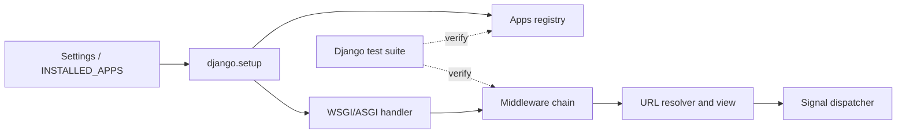

# Project Case Study: Django

> Repository: [django/django](https://github.com/django/django/tree/2b30f6255b5ef84afbd827993643d52ef2c0963a)
> Checkout: `/media/tinhanhnguyen/sub/oss-architecture/tmp/python-oss-architecture.LEjXfG/django`
> Default branch: `main`
> Commit: `2b30f6255b5ef84afbd827993643d52ef2c0963a`
> Python: `>=3.12` (from `pyproject.toml`)
> License: BSD-3-Clause ([LICENSE](https://github.com/django/django/blob/2b30f6255b5ef84afbd827993643d52ef2c0963a/LICENSE))
> Domain: Full-stack Python web framework
> Evidence level: A for registry, middleware, signal, WSGI/ASGI, and test claims; “framework/IoC monolith” is an architectural synthesis.

## 1. Architecture Summary

Django bootstraps installed applications into a process-wide app registry, resolves URL and middleware configuration, and exposes WSGI and ASGI handlers. The request path is a chain of middleware around a view; the signal dispatcher supplies an optional in-process observer mechanism. Settings and import strings make the framework highly configurable, while the registry makes application discovery consistent across the ORM and request stack.

The style is a configurable framework with inversion of control and a modular-monolith runtime. The registry and middleware chain are direct architectural evidence; the label is not a claim that every Django application follows clean/domain-driven layering.

## 2. Python Boundary

Django core in this checkout is Python. WSGI and ASGI are Python protocol boundaries, with `asgiref` handling sync/async adaptation. Database engines, cache backends, cryptography, and web servers are external adapters; their native implementations are not part of Django core. Django's architectural work is therefore orchestration, configuration, and boundary adaptation rather than a first-party native hot path.

| Boundary | Responsibility | Architectural consequence |
|---|---|---|
| `django.apps` | Discover and initialize application configs/models | Startup establishes a shared registry before serving |
| `django.core.handlers` | Build sync/async middleware chains and dispatch requests | Cross-cutting concerns are ordered and composable |
| `django.core.wsgi/asgi` | Expose server protocol adapters | Deployment protocol stays outside application views |
| `django.dispatch` | In-process observer dispatch | Decoupling is available, but delivery is not durable |

## 3. Pattern Map

| Pattern ID | Pattern | Source evidence | Test evidence | Book mapping |
|---|---|---|---|---|
| P08 | Factory, registry, and plugin architecture | [`AppConfig.create`](https://github.com/django/django/blob/2b30f6255b5ef84afbd827993643d52ef2c0963a/django/apps/config.py#L99-L150) resolves application entries; [`Apps.populate`](https://github.com/django/django/blob/2b30f6255b5ef84afbd827993643d52ef2c0963a/django/apps/registry.py#L61-L127) builds the registry | [`tests/apps/tests.py`](https://github.com/django/django/blob/2b30f6255b5ef84afbd827993643d52ef2c0963a/tests/apps/tests.py#L43-L129) tests app selection and readiness | Architecture Patterns ch13; Software Design ch34 |
| P06 | Ports, adapters, and dependency inversion | Middleware accepts a `get_response` port and may adapt sync/async methods; handler code is in [`base.py`](https://github.com/django/django/blob/2b30f6255b5ef84afbd827993643d52ef2c0963a/django/core/handlers/base.py#L38-L136) | [`tests/handlers/tests.py`](https://github.com/django/django/blob/2b30f6255b5ef84afbd827993643d52ef2c0963a/tests/handlers/tests.py#L15-L25) exercises handler/middleware initialization | Clean Architecture ch14, ch16, ch19–20 |
| P10 | Commands, events, and message bus | [`Signal.send` and `asend`](https://github.com/django/django/blob/2b30f6255b5ef84afbd827993643d52ef2c0963a/django/dispatch/dispatcher.py#L219-L320) dispatch in-process observers | [`tests/dispatch/tests.py`](https://github.com/django/django/blob/2b30f6255b5ef84afbd827993643d52ef2c0963a/tests/dispatch/tests.py) and [`tests/signals/tests.py`](https://github.com/django/django/blob/2b30f6255b5ef84afbd827993643d52ef2c0963a/tests/signals/tests.py#L1-L150) | Architecture Patterns ch08–11; Software Design ch37 |
| P12 | Adapter, façade, and provider router | [`get_wsgi_application`](https://github.com/django/django/blob/2b30f6255b5ef84afbd827993643d52ef2c0963a/django/core/wsgi.py#L5-L13) and [`get_asgi_application`](https://github.com/django/django/blob/2b30f6255b5ef84afbd827993643d52ef2c0963a/django/core/asgi.py#L5-L13) expose server-specific façades | [`tests/asgi/tests.py`](https://github.com/django/django/blob/2b30f6255b5ef84afbd827993643d52ef2c0963a/tests/asgi/tests.py) and handler/server tests | Clean Architecture ch19–20; Software Design ch35 |
| P14 | Decorator, middleware, and observability | [`load_middleware`](https://github.com/django/django/blob/2b30f6255b5ef84afbd827993643d52ef2c0963a/django/core/handlers/base.py#L38-L104) constructs an ordered wrapper chain and tracks process hooks | [`tests/handlers/tests.py`](https://github.com/django/django/blob/2b30f6255b5ef84afbd827993643d52ef2c0963a/tests/handlers/tests.py#L159-L186) checks request signal/handler behavior | Clean Architecture ch23; Software Design ch39 |
| P16 | Concurrency and resource lifecycle | App population is lock-protected and non-reentrant; async signals use task groups and middleware adapts execution modes | [`tests/apps/tests.py`](https://github.com/django/django/blob/2b30f6255b5ef84afbd827993643d52ef2c0963a/tests/apps/tests.py#L43-L61), handler, and dispatch tests | Clean Architecture ch21; Software Design ch41 |
| P17 | Testing seams and architecture fitness | App configs, handlers, middleware, and signals have focused test harnesses | [`tests/apps/tests.py`](https://github.com/django/django/blob/2b30f6255b5ef84afbd827993643d52ef2c0963a/tests/apps/tests.py), [`tests/handlers/tests.py`](https://github.com/django/django/blob/2b30f6255b5ef84afbd827993643d52ef2c0963a/tests/handlers/tests.py), and [`tests/dispatch/tests.py`](https://github.com/django/django/blob/2b30f6255b5ef84afbd827993643d52ef2c0963a/tests/dispatch/tests.py) | Clean Architecture ch21 |

## 4. Source Walkthrough

### Application registry

[`AppConfig.create`](https://github.com/django/django/blob/2b30f6255b5ef84afbd827993643d52ef2c0963a/django/apps/config.py#L99-L150) interprets an installed-app entry, imports the app, and chooses an explicit or default config. [`Apps.populate`](https://github.com/django/django/blob/2b30f6255b5ef84afbd827993643d52ef2c0963a/django/apps/registry.py#L61-L127) protects initialization with a lock, rejects reentrant population, imports models, and calls each config's `ready` hook.

### Middleware adapter

[`BaseHandler.load_middleware`](https://github.com/django/django/blob/2b30f6255b5ef84afbd827993643d52ef2c0963a/django/core/handlers/base.py#L38-L136) walks configured middleware in reverse, imports each factory, adapts sync and async modes, and assembles the callable chain. This gives middleware a stable `get_response` contract while allowing deployment/request modes to differ.

### WSGI/ASGI and signals

The small WSGI and ASGI bootstrap functions call setup and return protocol-specific handlers. [`Signal.send`](https://github.com/django/django/blob/2b30f6255b5ef84afbd827993643d52ef2c0963a/django/dispatch/dispatcher.py#L219-L320) dispatches synchronous receivers and asynchronous receivers according to the signal API; `send_robust` provides a deliberately different failure policy by returning receiver errors instead of immediately propagating them.

## 5. Theory Versus Practice

### Theoretical ideal

The books recommend a composition root that builds dependencies explicitly, adapters at framework boundaries, and events whose delivery and error semantics are visible. A registry should have a defined initialization lifecycle and tests should protect the boundary contracts.

### Production implementation

Django uses settings-driven import strings, a process-wide app registry, middleware factories, and signals. `django.setup()` is the practical bootstrap; application `ready` hooks and middleware construction happen during that lifecycle. WSGI/ASGI handlers keep server protocol details outside views, while signals offer optional decoupling within the process.

### Difference and rationale

The registry and settings are more implicit than constructor injection, but they make a large ecosystem of independently packaged Django apps composable. Signals reduce direct coupling at the cost of hidden control flow. Django also supports both sync and async modes, so the handler must adapt method execution rather than enforcing one uniform concurrency model.

## 6. Testing Strategy

- App tests cover singleton/readiness behavior, explicit versus default `AppConfig`, and invalid application configurations.
- Handler tests verify middleware initialization, request signals, streaming responses, and response cleanup.
- Dispatch tests cover weak references, duplicate registration, dispatch IDs, sync/async receivers, and robust error behavior.
- ASGI/server tests exercise the deployment adapter rather than treating WSGI/ASGI as documentation-only claims.

## 7. Lessons

- Copy the app-registry lifecycle when a modular framework must discover packages and initialize them once before serving requests.
- Use middleware for cross-cutting request concerns; use a direct function when a concern has one caller and no ordering requirement.
- Signals are useful for optional observers, but avoid them for core business workflows that need explicit sequencing, retries, or durable delivery.
- A process-wide registry/settings object simplifies framework integration and complicates isolation. Tests must reset or isolate application state.
- Do not infer database or server implementation details from Django's Python core; those are adapter/dependency boundaries outside this clone.

## 8. Practice Exercise

Build a mini web kernel with an `AppConfig` registry, a reverse-built middleware chain, and a signal dispatcher. Add sync and async handlers, duplicate-registration checks, a robust-send mode, and tests proving initialization is idempotent and middleware order is deterministic.
