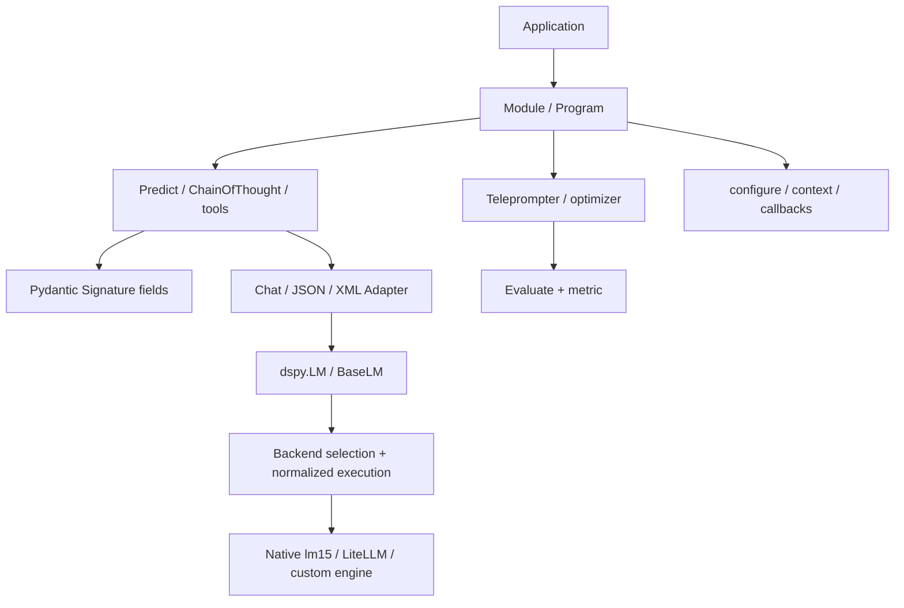

# Project Case Study: DSPy

> **Repository**: [stanfordnlp/dspy](https://github.com/stanfordnlp/dspy/tree/ecba33763316d2a4c6c756046a1118ecbff033e7)
> **Default branch**: `main`
> **Commit**: `ecba33763316d2a4c6c756046a1118ecbff033e7`
> **License**: MIT (`LICENSE`)
> **Domain**: Declarative language-model programs, typed signatures, prompt/response adapters, evaluation, and program optimization
> **Python version**: `>=3.10,<3.15` (`pyproject.toml`)
> **Package version at the revision**: `3.3.1`
> **Evidence level**: A for modules, signatures, adapters, LM execution, settings tests, and optimizer tests; B for factory/router and workflow analogues; C for command/event-bus claims (not claimed)

APwP means *Architecture Patterns with Python*, CAP means *Clean Architecture with Python*, and SDP means *Software Design for Python Programmers*.

## 1. Architecture Summary

DSPy lets a developer describe a program as composable `Module` objects and declare each LM task with a typed `Signature`. `Predict` turns a signature into a model call through an `Adapter`; the adapter formats inputs/demos, requests an LM response, and parses structured outputs back into a `Prediction`. Teleprompters/optimizers evaluate and transform a student module into a compiled program with better demonstrations or instructions.

The architecture is a **declarative program/composite pipeline with a normalized provider boundary**. `dspy.settings` supplies process defaults and task-local overrides. `dspy.LM` selects a native `lm15` engine, compatibility LiteLLM engine, or custom engine; `dspy.clients.execution` normalizes calls, caches results, translates errors, and owns retry/resource handling. This is an architecture for changing *how an LM program is compiled and executed*, not a durable agent workflow or a domain transaction system.

The most useful canonical IDs are P05, P06, P07, P08, P09, P12, P13, P14, P15, P16, and P17. P10 is deliberately not claimed: callbacks are lifecycle hooks, not a durable command/event bus. P01–P04 and P11 are also not shown as authoritative in this repository slice.

## 2. Python Boundary

The program/module graph, signatures, adapters, settings, optimizer loops, caches, callbacks, and test doubles are Python. There is no C++/CUDA/Rust hot path in the core paths studied here. The perimeter is:

- provider SDKs and HTTP services reached through LiteLLM, OpenAI, Anthropic, Databricks, or a custom engine;
- optional native/provider features such as tool calling, reasoning, citations, and response schemas;
- optional local/sandbox interpreters and external retrievers.

`BaseLM`, `Adapter`, and the normalized `dspy.lm15.Request`/`Response` boundary keep the module API independent of provider wire formats. The adapter still has to decide which provider-native features can be represented, and the execution layer may fall back from the native engine to LiteLLM when model/configuration representation is unsupported.

## 3. Pattern Map

| ID | Pattern observed | Exact source | Exact test | Book mapping | Evidence | Production trade-off |
|---|---|---|---|---|---|---|
| P05 | `Module`/`Predict` as composable application program | [`primitives/module.py`](https://github.com/stanfordnlp/dspy/blob/ecba33763316d2a4c6c756046a1118ecbff033e7/dspy/primitives/module.py), [`predict/predict.py`](https://github.com/stanfordnlp/dspy/blob/ecba33763316d2a4c6c756046a1118ecbff033e7/dspy/predict/predict.py) | [`primitives/test_module.py`](https://github.com/stanfordnlp/dspy/blob/ecba33763316d2a4c6c756046a1118ecbff033e7/tests/primitives/test_module.py), [`predict/test_predict.py`](https://github.com/stanfordnlp/dspy/blob/ecba33763316d2a4c6c756046a1118ecbff033e7/tests/predict/test_predict.py) | APwP ch04; CAP ch18 | A | A module is both program structure and execution object; the application does not receive a separate pure use-case layer. |
| P06 | `BaseLM` and `Adapter` dependency-inversion contracts | [`clients/base_lm.py`](https://github.com/stanfordnlp/dspy/blob/ecba33763316d2a4c6c756046a1118ecbff033e7/dspy/clients/base_lm.py), [`adapters/base.py`](https://github.com/stanfordnlp/dspy/blob/ecba33763316d2a4c6c756046a1118ecbff033e7/dspy/adapters/base.py) | [`clients/test_lm.py`](https://github.com/stanfordnlp/dspy/blob/ecba33763316d2a4c6c756046a1118ecbff033e7/tests/clients/test_lm.py), [`adapters/test_chat_adapter.py`](https://github.com/stanfordnlp/dspy/blob/ecba33763316d2a4c6c756046a1118ecbff033e7/tests/adapters/test_chat_adapter.py) | CAP ch14–16, ch19–20 | A | The ports are stable, but compatibility code and provider-native options make the boundary broader than a minimal text-in/text-out interface. |
| P07 | Global configuration plus task-local context overrides | [`dsp/utils/settings.py`](https://github.com/stanfordnlp/dspy/blob/ecba33763316d2a4c6c756046a1118ecbff033e7/dspy/dsp/utils/settings.py), [`predict/predict.py`](https://github.com/stanfordnlp/dspy/blob/ecba33763316d2a4c6c756046a1118ecbff033e7/dspy/predict/predict.py) | [`utils/test_settings.py`](https://github.com/stanfordnlp/dspy/blob/ecba33763316d2a4c6c756046a1118ecbff033e7/tests/utils/test_settings.py) | APwP ch13; CAP ch16 | B | `configure()` is process-wide and owner-thread restricted; `context()` is safer for concurrent work but still implicit to callees. |
| P08 | Backend/provider factory and routing | [`clients/lm.py`](https://github.com/stanfordnlp/dspy/blob/ecba33763316d2a4c6c756046a1118ecbff033e7/dspy/clients/lm.py), [`clients/backend_selection.py`](https://github.com/stanfordnlp/dspy/blob/ecba33763316d2a4c6c756046a1118ecbff033e7/dspy/clients/backend_selection.py), [`clients/provider.py`](https://github.com/stanfordnlp/dspy/blob/ecba33763316d2a4c6c756046a1118ecbff033e7/dspy/clients/provider.py) | [`clients/test_lm.py`](https://github.com/stanfordnlp/dspy/blob/ecba33763316d2a4c6c756046a1118ecbff033e7/tests/clients/test_lm.py) | SDP ch34; CAP ch19–20 | B | This is a router/factory rather than a general plugin registry; native-versus-compatibility decisions can be deferred until execution. |
| P09 | Predictor/adapter/teleprompter strategies | [`predict/chain_of_thought.py`](https://github.com/stanfordnlp/dspy/blob/ecba33763316d2a4c6c756046a1118ecbff033e7/dspy/predict/chain_of_thought.py), [`teleprompt/teleprompt.py`](https://github.com/stanfordnlp/dspy/blob/ecba33763316d2a4c6c756046a1118ecbff033e7/dspy/teleprompt/teleprompt.py), [`teleprompt/random_search.py`](https://github.com/stanfordnlp/dspy/blob/ecba33763316d2a4c6c756046a1118ecbff033e7/dspy/teleprompt/random_search.py) | [`teleprompt/test_random_search.py`](https://github.com/stanfordnlp/dspy/blob/ecba33763316d2a4c6c756046a1118ecbff033e7/tests/teleprompt/test_random_search.py) | SDP ch33; APwP ch04 | A | Optimization is a runtime strategy over program copies/evaluations, so compilation cost and metric quality become part of architecture. |
| P10 | Lifecycle callbacks only; no command/event bus claim | [`utils/callback.py`](https://github.com/stanfordnlp/dspy/blob/ecba33763316d2a4c6c756046a1118ecbff033e7/dspy/utils/callback.py) | [`callback/test_callback.py`](https://github.com/stanfordnlp/dspy/blob/ecba33763316d2a4c6c756046a1118ecbff033e7/tests/callback/test_callback.py) | SDP ch37 | C / not claimed | Callbacks observe module/LM/adapter/optimizer lifecycle; there is no proven durable message dispatch or event persistence in this slice. |
| P12 | Adapter translates signatures to/from provider messages | [`adapters/base.py`](https://github.com/stanfordnlp/dspy/blob/ecba33763316d2a4c6c756046a1118ecbff033e7/dspy/adapters/base.py), [`adapters/chat_adapter.py`](https://github.com/stanfordnlp/dspy/blob/ecba33763316d2a4c6c756046a1118ecbff033e7/dspy/adapters/chat_adapter.py) | [`adapters/test_chat_adapter.py`](https://github.com/stanfordnlp/dspy/blob/ecba33763316d2a4c6c756046a1118ecbff033e7/tests/adapters/test_chat_adapter.py), [`adapters/test_json_adapter.py`](https://github.com/stanfordnlp/dspy/blob/ecba33763316d2a4c6c756046a1118ecbff033e7/tests/adapters/test_json_adapter.py) | SDP ch35; CAP ch19–20 | A | Formatting/parsing normalizes providers, but native tools/reasoning/citations require feature-specific escape hatches. |
| P13 | Module/optimizer/evaluation pipeline (workflow analogue only) | [`primitives/module.py`](https://github.com/stanfordnlp/dspy/blob/ecba33763316d2a4c6c756046a1118ecbff033e7/dspy/primitives/module.py), [`teleprompt/random_search.py`](https://github.com/stanfordnlp/dspy/blob/ecba33763316d2a4c6c756046a1118ecbff033e7/dspy/teleprompt/random_search.py) | [`teleprompt/test_random_search.py`](https://github.com/stanfordnlp/dspy/blob/ecba33763316d2a4c6c756046a1118ecbff033e7/tests/teleprompt/test_random_search.py) | SDP ch38; CAP ch18 | B / analogue | It is an executable/optimization pipeline, not a durable state machine with pause/resume semantics. |
| P14 | Callback decorator, history, tracing, and streaming hooks | [`utils/callback.py`](https://github.com/stanfordnlp/dspy/blob/ecba33763316d2a4c6c756046a1118ecbff033e7/dspy/utils/callback.py), [`primitives/module.py`](https://github.com/stanfordnlp/dspy/blob/ecba33763316d2a4c6c756046a1118ecbff033e7/dspy/primitives/module.py) | [`callback/test_callback.py`](https://github.com/stanfordnlp/dspy/blob/ecba33763316d2a4c6c756046a1118ecbff033e7/tests/callback/test_callback.py), [`utils/test_settings.py`](https://github.com/stanfordnlp/dspy/blob/ecba33763316d2a4c6c756046a1118ecbff033e7/tests/utils/test_settings.py) | CAP ch23; SDP ch39 | A | Callback failures are logged rather than allowed to replace the primary call, which improves resilience but can hide instrumentation failures. |
| P15 | Composite modules, nested predictors, and parallel batch pipeline | [`primitives/module.py`](https://github.com/stanfordnlp/dspy/blob/ecba33763316d2a4c6c756046a1118ecbff033e7/dspy/primitives/module.py), [`predict/parallel.py`](https://github.com/stanfordnlp/dspy/blob/ecba33763316d2a4c6c756046a1118ecbff033e7/dspy/predict/parallel.py) | [`primitives/test_module.py`](https://github.com/stanfordnlp/dspy/blob/ecba33763316d2a4c6c756046a1118ecbff033e7/tests/primitives/test_module.py), [`predict/test_parallel.py`](https://github.com/stanfordnlp/dspy/blob/ecba33763316d2a4c6c756046a1118ecbff033e7/tests/predict/test_parallel.py) | SDP ch36, ch39 | A | Introspection over nested modules enables optimization and saving, but dynamic object graphs complicate ownership and serialization. |
| P16 | Parallel execution, async calls, cache, and LM resource lifecycle | [`utils/parallelizer.py`](https://github.com/stanfordnlp/dspy/blob/ecba33763316d2a4c6c756046a1118ecbff033e7/dspy/utils/parallelizer.py), [`clients/lm.py`](https://github.com/stanfordnlp/dspy/blob/ecba33763316d2a4c6c756046a1118ecbff033e7/dspy/clients/lm.py) | [`utils/test_parallelizer.py`](https://github.com/stanfordnlp/dspy/blob/ecba33763316d2a4c6c756046a1118ecbff033e7/tests/utils/test_parallelizer.py), [`clients/test_lm_async_execution.py`](https://github.com/stanfordnlp/dspy/blob/ecba33763316d2a4c6c756046a1118ecbff033e7/tests/clients/test_lm_async_execution.py) | SDP ch41 | A | Thread-local settings, cancellation, straggler resubmission, and shared engine pools require careful lifecycle boundaries. |
| P17 | Dummy LM, patched provider, transactional module load, and exact adapter tests | [`utils/dummies.py`](https://github.com/stanfordnlp/dspy/blob/ecba33763316d2a4c6c756046a1118ecbff033e7/dspy/utils/dummies.py), [`primitives/base_module.py`](https://github.com/stanfordnlp/dspy/blob/ecba33763316d2a4c6c756046a1118ecbff033e7/dspy/primitives/base_module.py) | [`primitives/test_module.py`](https://github.com/stanfordnlp/dspy/blob/ecba33763316d2a4c6c756046a1118ecbff033e7/tests/primitives/test_module.py), [`signatures/test_signature.py`](https://github.com/stanfordnlp/dspy/blob/ecba33763316d2a4c6c756046a1118ecbff033e7/tests/signatures/test_signature.py), [`clients/test_lm.py`](https://github.com/stanfordnlp/dspy/blob/ecba33763316d2a4c6c756046a1118ecbff033e7/tests/clients/test_lm.py) | CAP ch21; APwP ch13 | A | Fakes and exact formatting tests are fast, but live provider contracts and token/cost behavior need separate integration tests. |

P01, P02, P03, P04, and P11 are not authoritative claims for DSPy. Its `Signature` is a typed prompt contract, not a domain model; module state is not a DDD aggregate; LM/cache persistence is not a repository/UoW; and evaluation results are not a CQRS read projection.

## 4. Source Walkthrough

### 4.1 `Signature` is a typed prompt contract

[`dspy/signatures/signature.py`](https://github.com/stanfordnlp/dspy/blob/ecba33763316d2a4c6c756046a1118ecbff033e7/dspy/signatures/signature.py) uses a Pydantic-backed metaclass. A subclass declares `InputField` and `OutputField`; `Signature("input: int -> output: float")` can also construct a class dynamically. The metaclass preserves field order, defaults missing annotations to strings, sets prefixes/descriptions, validates input/output markers, and exposes instructions, input/output fields, and a string form.

`with_instructions` and `with_updated_fields` return new signature classes rather than mutating the original. This immutability is valuable to optimizers that compare or clone program candidates.

### 4.2 `Module` is a composite program with framework introspection

[`dspy/primitives/module.py`](https://github.com/stanfordnlp/dspy/blob/ecba33763316d2a4c6c756046a1118ecbff033e7/dspy/primitives/module.py) defines `ProgramMeta` and `Module`. The metaclass ensures base attributes exist even when a subclass forgets `super().__init__`. `Module.__call__` installs caller-module context, callbacks, usage tracking, and then invokes `forward`; `named_predictors`, `set_lm`, `dump_state`, and `batch` support recursive composition, optimization, saving, and parallel execution.

[`dspy/primitives/base_module.py`](https://github.com/stanfordnlp/dspy/blob/ecba33763316d2a4c6c756046a1118ecbff033e7/dspy/primitives/base_module.py) walks nested modules/lists/dicts, tracks duplicate references, and performs a deepcopy trial before applying a loaded state. The latter is a practical transactional seam: malformed state should not partially mutate a live program.

### 4.3 `Predict` delegates through the adapter

[`dspy/predict/predict.py`](https://github.com/stanfordnlp/dspy/blob/ecba33763316d2a4c6c756046a1118ecbff033e7/dspy/predict/predict.py) resolves a signature, demos, config, and LM; validates input types; picks the configured/default `ChatAdapter`; and turns completions into a `Prediction`. The module can be given a call-time LM/config override, but it rejects a missing or non-`BaseLM` LM rather than silently constructing one.

[`dspy/adapters/base.py`](https://github.com/stanfordnlp/dspy/blob/ecba33763316d2a4c6c756046a1118ecbff033e7/dspy/adapters/base.py) is the interface adapter. It preprocesses signatures for native tools/response types, formats messages, invokes sync/async LM calls, parses outputs, and restores fields removed for provider-native features. `__init_subclass__` decorates adapter formatting/parsing with callbacks, so the boundary is observable without changing every concrete adapter.

### 4.4 LM execution has a native/compatibility split

[`dspy/clients/lm.py`](https://github.com/stanfordnlp/dspy/blob/ecba33763316d2a4c6c756046a1118ecbff033e7/dspy/clients/lm.py) exposes `LM`, provider/model settings, retry/cache configuration, engine selection, and close/aclose. [`dspy/clients/backend_selection.py`](https://github.com/stanfordnlp/dspy/blob/ecba33763316d2a4c6c756046a1118ecbff033e7/dspy/clients/backend_selection.py) chooses native `lm15` versus LiteLLM compatibility based on model resolution and client options without performing inference I/O.

[`dspy/clients/execution.py`](https://github.com/stanfordnlp/dspy/blob/ecba33763316d2a4c6c756046a1118ecbff033e7/dspy/clients/execution.py) prepares legacy or canonical calls, converts provider-shaped input into `lm15.Request`, selects/reuses an engine, caches, retries, translates errors, and manages sync/async streams. If native conversion refuses a representation in `auto` mode, the code falls back to the compatibility engine instead of retrying a partially converted request.

### 4.5 Settings and optimizers are deliberately application-wide

[`dspy/dsp/utils/settings.py`](https://github.com/stanfordnlp/dspy/blob/ecba33763316d2a4c6c756046a1118ecbff033e7/dspy/dsp/utils/settings.py) implements a singleton with process-wide `configure()` and task/thread-local `context()` overrides. [`dspy/utils/parallelizer.py`](https://github.com/stanfordnlp/dspy/blob/ecba33763316d2a4c6c756046a1118ecbff033e7/dspy/utils/parallelizer.py) copies overrides into worker threads, tracks errors, cancels after a limit, and can resubmit stragglers.

[`dspy/teleprompt/teleprompt.py`](https://github.com/stanfordnlp/dspy/blob/ecba33763316d2a4c6c756046a1118ecbff033e7/dspy/teleprompt/teleprompt.py) defines the optimizer contract and compile callbacks. `random_search.py` demonstrates a concrete strategy: build zero-shot/labeled/bootstrapped/random candidates, evaluate each, retain scores, and return the best program. It is a strategy/optimization pipeline, not a durable command workflow.

## 5. Theory Versus Practice

### Theoretical ideal

Clean Architecture would put program policy behind application services, inject an LM/adapter port, and keep global configuration out of the core. Strategy and Factory patterns would select algorithms/providers; adapters would isolate wire formats; callbacks/events would be explicit and failures observable. A workflow engine would persist state at step boundaries.

### Production implementation

DSPy uses a very productive composite `Module` API, Pydantic-generated signatures, a global settings singleton with context-local overrides, callback decorators, and a layered LM execution system. `Adapter` owns prompt formatting and output parsing. `LM` can route through native lm15, LiteLLM, or a custom engine. Teleprompters compile modules by evaluating many program variants and mutating/copying predictor state.

### Difference and rationale

- **Global settings plus local contexts:** a process-wide default LM/adapter keeps examples short; context-local overrides make parallel tasks safe when propagated. The cost is ambient dependency lookup and a restriction on which thread/task may call `configure()`.
- **Dynamic Pydantic signatures:** typed fields and JSON schemas improve structured output and prompt clarity. Dynamic class creation, caller-frame type discovery, and metaclass behavior make serialization/static analysis more complex than a simple dataclass.
- **Adapter as a broad façade:** one adapter can normalize chat formatting, parsing, native tools, citations, reasoning, and response schemas. It is convenient, but its preprocessing/postprocessing contract grows with provider capabilities.
- **Native engine plus LiteLLM fallback:** the normalized request/response path enables stricter semantics and custom engines, while compatibility mode protects older providers. Two paths mean duplicated lifecycle/error/cache behavior and subtle representational fallbacks.
- **Optimizer as strategy pipeline:** compiling prompts/demos from measured metrics is the product’s core value. It may execute many model calls, copy module state, and rely on metric/test data; it is not a cheap runtime decorator.
- **Callbacks swallow callback errors:** observability should not break an LM call, so callback exceptions are logged. Production monitoring must separately alert on callback failures.
- **No durable workflow/event bus:** DSPy can batch, parallelize, cache, and save program state, but this revision does not show a durable pause/resume message workflow. Add one explicitly rather than inferring it from `Module` composition.

## 6. Testing Strategy

`tests/signatures/test_signature.py` checks typed fields, dynamic signatures, instruction immutability, serialization, and custom types. `tests/primitives/test_module.py` verifies recursive predictor discovery, nested composites, saved-program compatibility, and transactional load-state behavior.

`tests/adapters/test_chat_adapter.py` asserts exact rendered messages for simple, demo, typed, and nested Pydantic signatures; JSON/XML adapter tests cover alternate wire formats. `tests/clients/test_lm.py` patches LiteLLM or uses a test server to verify caching, retries, provider errors, response schemas, and model calls. `tests/clients/test_lm_async_execution.py` covers async lifecycle.

`tests/utils/test_settings.py` is an architecture test for global ownership and task/thread-local context propagation. It verifies that concurrent calls use their own LM without leaking settings back to the main context. `tests/utils/test_parallelizer.py` and `test_parallelizer_interrupt.py` cover cancellation and straggler behavior. `tests/teleprompt/test_random_search.py` validates an optimizer with `DummyLM`, trainset, validation metric, and candidate restriction.

The most useful layering is:

1. exact signature/adapter formatting tests;
2. `DummyLM`/patched provider tests for module behavior;
3. settings/concurrency isolation tests;
4. optimizer/evaluation tests;
5. a small number of real provider contract tests.

## 7. Lessons

- Use DSPy when the main design problem is iterating on LM program structure, prompts, demonstrations, adapters, and metrics.
- Define signatures as typed contracts and keep provider formatting inside an adapter.
- Use `dspy.context()` for per-call/per-task changes; reserve `configure()` for stable process defaults.
- Treat `LM` engine selection and fallback as a compatibility boundary, not a transparent implementation detail.
- Do not mistake `Module` composition or `save()` for a durable workflow/state machine.
- Do not call a Signature a domain model or LM cache a Unit of Work.
- For a small fixed prompt and one provider, a plain function around a provider SDK is simpler than the optimizer/settings stack.

## 8. Practice Exercise

Build a small DSPy-like pipeline:

1. Define a Pydantic-backed `Signature` with typed input/output fields and immutable instruction updates.
2. Implement a `Module` containing two predictors and recursive `named_predictors()` discovery.
3. Define an `Adapter` that renders a provider-neutral message and parses a structured response.
4. Define a `BaseLM` fake plus a provider router with native and compatibility modes; add cache and retry policy.
5. Add `context(lm=...)` overrides and a two-thread batch test proving no configuration leak.
6. Implement a tiny teleprompter that evaluates zero-shot versus few-shot candidates and returns the best copy.

The exercise is complete when exact adapter tests, a fake-LM test, and a failure-injection test all pass without network access.
