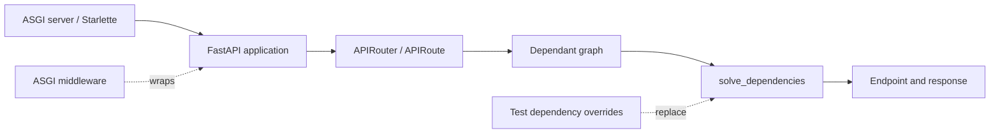

# Project Case Study: FastAPI

> Repository: [fastapi/fastapi](https://github.com/fastapi/fastapi/tree/50113da16fec53b66b80d75e80a89296de4fa5a5)
> Checkout: `/media/tinhanhnguyen/sub/oss-architecture/tmp/python-oss-architecture.LEjXfG/fastapi`
> Default branch: `master`
> Commit: `50113da16fec53b66b80d75e80a89296de4fa5a5`
> Python: `>=3.10` (from `pyproject.toml`)
> License: MIT ([LICENSE](https://github.com/fastapi/fastapi/blob/50113da16fec53b66b80d75e80a89296de4fa5a5/LICENSE))
> Domain: Declarative ASGI web/API framework
> Evidence level: A for dependency, routing, middleware, lifecycle, and test claims; the architecture-style label is a source-based synthesis.

## 1. Architecture Summary

FastAPI turns endpoint annotations and `Depends` declarations into a dependency graph. An `APIRoute` keeps the graph and provider reference, solves dependencies for each request, validates inputs, invokes the endpoint, and serializes the result. The application object composes routers, middleware, exception handlers, and lifespan behavior on top of Starlette's ASGI boundary.

The architecture is a declarative framework with a request-scoped dependency solver and composition root. It is an excellent framework-boundary example, but it does not force a domain/application/infrastructure split on the user.

## 2. Python Boundary

FastAPI's core is Python. It delegates the ASGI server and much request plumbing to Starlette and delegates validation/schema generation to Pydantic. Optional server and test-client packages are declared in `pyproject.toml`; no first-party native execution plane is present in this checkout. The important boundary is framework code versus user endpoint/dependency code.

| Boundary | Responsibility | Architectural consequence |
|---|---|---|
| `applications.py` | Assemble routers, middleware, overrides, and lifespan | Application startup is a visible composition point |
| `dependencies/` | Introspect signatures and solve nested dependencies | Dependency wiring is declarative and request-scoped |
| `routing.py` | Adapt ASGI requests to dependency solving and endpoint invocation | Framework concerns stay at the perimeter |
| Starlette/Pydantic | ASGI execution and data validation/schema | FastAPI coordinates specialized lower-level libraries |

## 3. Pattern Map

| Pattern ID | Pattern | Source evidence | Test evidence | Book mapping |
|---|---|---|---|---|
| P07 | Composition root and dependency injection | [`get_dependant`](https://github.com/fastapi/fastapi/blob/50113da16fec53b66b80d75e80a89296de4fa5a5/fastapi/dependencies/utils.py#L271-L347), [`solve_dependencies`](https://github.com/fastapi/fastapi/blob/50113da16fec53b66b80d75e80a89296de4fa5a5/fastapi/dependencies/utils.py#L577-L731), and the application's [`dependency_overrides`](https://github.com/fastapi/fastapi/blob/50113da16fec53b66b80d75e80a89296de4fa5a5/fastapi/applications.py#L967-L999) | [`test_dependency_overrides.py`](https://github.com/fastapi/fastapi/blob/50113da16fec53b66b80d75e80a89296de4fa5a5/tests/test_dependency_overrides.py#L208-L257) tests replacement and nested dependencies | Architecture Patterns ch13; Clean Architecture ch14, ch18 |
| P06 | Ports, adapters, and dependency inversion | `APIRoute` and the ASGI callable boundary adapt framework requests to user callables; [`routing.py`](https://github.com/fastapi/fastapi/blob/50113da16fec53b66b80d75e80a89296de4fa5a5/fastapi/routing.py#L1126-L1217) | [`test_custom_route_class.py`](https://github.com/fastapi/fastapi/blob/50113da16fec53b66b80d75e80a89296de4fa5a5/tests/test_custom_route_class.py#L10-L68) exercises a replaceable route adapter | Clean Architecture ch14, ch16, ch19–20; Software Design ch35 |
| P08 | Registry/factory extension surface | Routers collect route declarations and `APIRoute` instances; application [`add_api_route`](https://github.com/fastapi/fastapi/blob/50113da16fec53b66b80d75e80a89296de4fa5a5/fastapi/applications.py#L1165-L1220) forwards registration | [`test_custom_route_class.py`](https://github.com/fastapi/fastapi/blob/50113da16fec53b66b80d75e80a89296de4fa5a5/tests/test_custom_route_class.py#L50-L68) verifies route-class customization; this is a route registry, not a general plugin marketplace | Software Design ch34; Clean Architecture ch19–20 |
| P14 | Decorator, middleware, and observability | Application middleware is composed around the ASGI app; [`applications.py`](https://github.com/fastapi/fastapi/blob/50113da16fec53b66b80d75e80a89296de4fa5a5/fastapi/applications.py#L1020-L1045) builds the stack | [`test_custom_middleware_exception.py`](https://github.com/fastapi/fastapi/blob/50113da16fec53b66b80d75e80a89296de4fa5a5/tests/test_custom_middleware_exception.py#L13-L96) tests wrapping and error paths | Clean Architecture ch23; Software Design ch39 |
| P16 | Concurrency and resource lifecycle | Generator dependencies use an `AsyncExitStack`; [`_solve_generator`](https://github.com/fastapi/fastapi/blob/50113da16fec53b66b80d75e80a89296de4fa5a5/fastapi/dependencies/utils.py#L566-L600) and sync-to-threadpool solving make ownership explicit | [`test_dependency_contextmanager.py`](https://github.com/fastapi/fastapi/blob/50113da16fec53b66b80d75e80a89296de4fa5a5/tests/test_dependency_contextmanager.py#L23-L70) and [`test_router_events.py`](https://github.com/fastapi/fastapi/blob/50113da16fec53b66b80d75e80a89296de4fa5a5/tests/test_router_events.py#L89-L111) verify cleanup/lifespan | Clean Architecture ch21; Software Design ch41 |
| P17 | Testing seams and architecture fitness | Dependency override maps and custom route/middleware classes are explicit test seams | [`test_dependency_overrides.py`](https://github.com/fastapi/fastapi/blob/50113da16fec53b66b80d75e80a89296de4fa5a5/tests/test_dependency_overrides.py), context-manager, middleware, and route-class tests | Clean Architecture ch21 |

## 4. Source Walkthrough

### Application composition

[`FastAPI.__init__`](https://github.com/fastapi/fastapi/blob/50113da16fec53b66b80d75e80a89296de4fa5a5/fastapi/applications.py#L967-L1045) stores dependency overrides, creates the router, and builds the middleware/lifespan boundary. [`add_api_route`](https://github.com/fastapi/fastapi/blob/50113da16fec53b66b80d75e80a89296de4fa5a5/fastapi/applications.py#L1165-L1220) delegates route construction to that router instead of embedding route execution in the application object.

### Dependency graph

[`get_dependant`](https://github.com/fastapi/fastapi/blob/50113da16fec53b66b80d75e80a89296de4fa5a5/fastapi/dependencies/utils.py#L271-L347) recursively converts a callable signature into `Dependant` nodes. [`solve_dependencies`](https://github.com/fastapi/fastapi/blob/50113da16fec53b66b80d75e80a89296de4fa5a5/fastapi/dependencies/utils.py#L577-L731) applies overrides, solves child nodes, caches repeated dependencies where configured, and runs sync callables in a threadpool when required.

### Request adapter and cleanup

An `APIRoute` stores the compiled dependency graph and provider. Its request handler solves that graph before invoking the endpoint; the route-level context creates exit stacks for generator dependencies. This is a practical adapter from ASGI request state to application callables, with cleanup tied to the request scope.

## 5. Theory Versus Practice

### Theoretical ideal

Clean Architecture recommends keeping use cases independent of the web framework and assembling concrete dependencies at the outer composition root. Dependency injection should make replacements explicit, and adapters should translate framework data at the boundary.

### Production implementation

FastAPI uses Python introspection and annotations as the declaration language. The framework builds and solves a dependency graph at runtime, while `dependency_overrides` gives tests and applications a mutable replacement map. Routing, validation, middleware, and lifespan are composed in the framework layer; user code remains ordinary callables.

### Difference and rationale

The ergonomic declaration is more magical than constructor injection: signatures, scopes, caching, threadpool execution, and framework context all affect behavior. That trade-off pays for concise APIs and automatic OpenAPI generation. For a large domain, keep the domain services independent and let `Depends` adapt them at the HTTP edge rather than allowing framework objects to spread inward.

## 6. Testing Strategy

- Dependency override tests replace real providers and verify nested override behavior and validation.
- Generator-dependency tests verify `finally` cleanup and exception propagation through request scopes.
- Router-event/lifespan tests check startup and shutdown ordering for applications, routers, and subrouters.
- Custom route and middleware tests prove that extension points work through the public composition path.
- The TestClient-based tests exercise an ASGI integration boundary while remaining deterministic and local.

## 7. Lessons

- Copy the override seam when a dependency is expensive, external, or nondeterministic; keep the production dependency graph explicit.
- Use a direct function call for a tiny script. A runtime dependency graph is unnecessary overhead outside a request framework.
- Treat generator dependencies as resource managers, not just providers; test both success and failure cleanup.
- Avoid putting domain decisions into route functions merely because FastAPI makes them easy to declare.
- `dependency_overrides` is intentionally application-scoped mutable state. Isolate app instances in tests rather than relying on global cleanup.

## 8. Practice Exercise

Create a small FastAPI service with a `UserRepository` protocol, a real in-memory implementation, and a route dependency. Override it with a fake in tests, add a generator dependency that opens/closes a resource, and verify route-class middleware plus cleanup when the endpoint raises.
