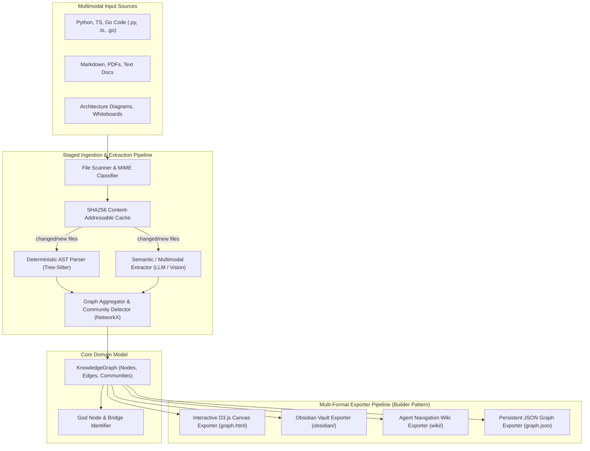

# Project Case Study: Graphify

> **Repository**: [Graphify-Labs/graphify](https://github.com/Graphify-Labs/graphify)  
> **Domain**: Multimodal Knowledge Graph, Codebase Intelligence & Agent Navigation Engine  
> **Scale & Maturity**: Open-source tool for Claude Code, Antigravity, and AI coding agents  
> **Core Tech Stack**: Python 3.10+, Tree-sitter (deterministic AST parsing), NetworkX, D3.js v7, Pydantic  

---

## 1. Executive Architecture Summary

LLM agents operating on large codebases often suffer from the "lost in the middle" problem and excessive token consumption when reading entire repository trees into the prompt context. Graphify solves this by transforming messy codebases, documentation, PDFs, and diagrams into a **persistent, queryable knowledge graph** with 71.5x fewer tokens required per query.

Architecturally, Graphify is designed as a **Hybrid Staged Processing Pipeline**. It pairs **deterministic local AST parsing** (via Tree-Sitter) for zero-cost, 100% accurate structural code mapping (imports, class hierarchies, function calls) with **semantic LLM extraction** for conceptual and multimodal connections (diagrams, architecture docs). A **SHA256 Content-Addressable Cache** ensures incremental updates only analyze modified files. Finally, an **Extensible Exporter Pipeline** serializes the graph into multiple domain-specific representations: an interactive D3.js visualization (`graph.html`), an Obsidian knowledge vault (`obsidian/`), and Wikipedia-style markdown documents optimized for autonomous AI agent navigation (`wiki/`).

### High-Level Architectural Diagram



---

## 2. Layering & Boundary Discipline

| Layer | Directory / Module | Responsibilities | Permitted Inward Dependencies |
| :--- | :--- | :--- | :--- |
| **Domain (Graph Model)** | `graphify/domain/` | Node, Edge, Community entities; graph invariants | Standard library only |
| **Pipeline (Processing)**| `graphify/pipeline/` | File detection, AST parsing, semantic extraction, cache management | Domain only |
| **Exporters (Presentation)**| `graphify/exporters/` | HTML/D3 template generation, Obsidian markdown, Agent wiki renderer | Domain, Pipeline |
| **Perimeter / Drivers** | `graphify/__main__.py`, `cli.py`| CLI argument handling (`/graphify .`), MCP integration, stdout formatting | Exporters, Pipeline |

### Inward Dependency Rule Audit
- **Purity of Graph Representation**: The internal graph representation relies on clean domain dataclasses (`GraphNode`, `GraphEdge`) that remain decoupled from how they are rendered (HTML, JSON, or Obsidian markdown).
- **Separation of Deterministic vs. Heuristic Extraction**: Tree-sitter AST extraction runs in an isolated submodule with zero LLM API dependencies, allowing the core code graph to build offline with zero API costs.
- **Single-Responsibility Exporters**: Each output format lives in a dedicated exporter adhering to an `IExporter` contract, making new formats (e.g. Neo4j Cypher export) straightforward to add.

---

## 3. Macro Architectural Patterns in Action

### A. The Staged Ingestion & Extraction Pipeline
Graphify executes a staged pipeline pattern where processing stages are strictly sequential and decoupled:

```python
# graphify/pipeline/runner.py
from dataclasses import dataclass
from typing import Protocol

@dataclass
class PipelineContext:
    root_dir: str
    incremental: bool
    changed_files: list[str] = None
    ast_graph: dict = None
    semantic_graph: dict = None
    final_graph: dict = None

class PipelineStage(Protocol):
    """Protocol contract for pipeline stages."""
    def execute(self, ctx: PipelineContext) -> None: ...

class PipelineRunner:
    def __init__(self, stages: list[PipelineStage]) -> None:
        self._stages = stages

    def run(self, ctx: PipelineContext) -> PipelineContext:
        for stage in self._stages:
            stage.execute(ctx)
        return ctx
```

### B. Content-Addressable SHA256 Incremental Cache
To prevent redundant LLM inference and parsing across unchanged files:

```python
# graphify/pipeline/cache.py
import hashlib
from pathlib import Path

class ContentCache:
    """Manages file hashes to enable incremental graph updates."""
    def __init__(self, cache_dir: Path) -> None:
        self._cache_dir = cache_dir
        self._hashes: dict[str, str] = self._load()

    def get_hash(self, file_path: Path) -> str:
        hasher = hashlib.sha256()
        with open(file_path, "rb") as f:
            while chunk := f.read(8192):
                hasher.update(chunk)
        return hasher.hexdigest()

    def filter_modified_files(self, paths: list[Path]) -> list[Path]:
        modified = []
        for p in paths:
            current_hash = self.get_hash(p)
            if self._hashes.get(str(p)) != current_hash:
                modified.append(p)
                self._hashes[str(p)] = current_hash
        return modified
```

### C. Multi-Format Exporter (Builder / Strategy Pattern)
The core graph is transformed into diverse client-facing artifacts:

```python
# graphify/exporters/base.py
from abc import ABC, abstractmethod
from graphify.domain.graph import KnowledgeGraph

class BaseGraphExporter(ABC):
    @abstractmethod
    def export(self, graph: KnowledgeGraph, output_dir: str) -> str:
        """Serializes the graph to disk and returns the main entrypoint file path."""
        pass

class AgentWikiExporter(BaseGraphExporter):
    """Generates cross-linked Wikipedia-style markdown articles for LLM agents."""
    def export(self, graph: KnowledgeGraph, output_dir: str) -> str:
        # Generates L0 index + L1 topic pages with clickable relative file links
        ...

class D3VisualExporter(BaseGraphExporter):
    """Generates a standalone, interactive D3.js v7 canvas HTML visualization."""
    def export(self, graph: KnowledgeGraph, output_dir: str) -> str:
        # Injects graph JSON into self-contained HTML template with CDN D3 script
        ...
```

---

## 4. Meso Tactical Design Patterns in Action

| Pattern | Module Location | Purpose & Implementation Details |
| :--- | :--- | :--- |
| **Pipeline** | `graphify/pipeline/` | Staged execution (Scan $\rightarrow$ Cache $\rightarrow$ AST $\rightarrow$ Semantic $\rightarrow$ Export). |
| **Builder / Exporter** | `graphify/exporters/` | Pluggable output generators for Obsidian, D3 HTML, Agent Wiki, and JSON. |
| **Flyweight / Cache** | `graphify/pipeline/cache.py` | SHA256 fingerprinting avoiding redundant AST parsing and API calls. |
| **Visitor / AST Dispatch**| `graphify/parsers/` | Tree-Sitter AST node traversal mapping imports, functions, and classes. |
| **Façade** | `graphify/api.py` | Simple high-level API `build_graph(directory, mode)` wrapping entire pipeline. |

---

## 5. Micro Code Craftsmanship & Idioms

- **Deterministic vs Heuristic Edge Separation**: Graph edges clearly distinguish between structural facts (`EdgeType.IMPORTS`, `EdgeType.CALLS`) and LLM guesses (`EdgeType.INFERRED_RELATIONSHIP`), avoiding AI hallucinations.
- **Resource Management for File Streaming**: File hashing uses chunked buffered reads (`f.read(8192)`) preventing out-of-memory errors on large videos, PDFs, or dataset files.
- **Self-Contained Output Artifacts**: HTML visualizations are generated as single standalone files with zero local dependencies, allowing immediate opening in any web browser.

---

## 6. Pragmatic Compromises & Architectural Trade-offs

1. **Tree-Sitter AST vs. Pure LLM Parsing**:
   - *Textbook GenAI approach*: Send every code file to an LLM to explain relationships.
   - *Pragmatic choice*: Use Tree-Sitter for deterministic code structure, reserving LLMs strictly for high-level semantic synthesis.
   - *Verdict*: 100x faster, zero API cost for code structure, and eliminates hallucinated function names.

2. **File-Based Output Directory (`graphify-out/`) vs Database Daemon**:
   - *Trade-off*: Writing markdown, HTML, and JSON files to disk vs running a persistent Neo4j service.
   - *Rationale*: Zero setup friction; fits naturally into developer Git repositories and Obsidian vaults without Docker prerequisites.

---

## 7. Curated File Tours

1. **`graphify/pipeline/runner.py`**: The sequential pipeline orchestrating extraction and incremental caching.
2. **`graphify/parsers/treesitter.py`**: The deterministic AST parser mapping Python and TypeScript dependencies.
3. **`graphify/exporters/wiki.py`**: The generator producing Wikipedia-style navigation docs for AI agents.
