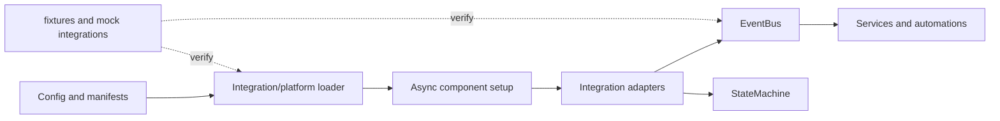

# Project Case Study: Home Assistant

> Repository: [home-assistant/core](https://github.com/home-assistant/core/tree/2f79d1fd2afdd19d28f9d4662a4de21865ea03ca)
> Checkout: `/media/tinhanhnguyen/sub/oss-architecture/tmp/python-oss-architecture.LEjXfG/home-assistant`
> Default branch: `dev`
> Commit: `2f79d1fd2afdd19d28f9d4662a4de21865ea03ca`
> Python: `>=3.14.2` (from `pyproject.toml`)
> License: Apache-2.0 ([LICENSE](https://github.com/home-assistant/core/blob/2f79d1fd2afdd19d28f9d4662a4de21865ea03ca/LICENSE.md))
> Domain: Async home-automation platform and integration ecosystem
> Evidence level: A for core, loader, setup, event, and test claims; some broader style labels are explicitly synthesis.

## 1. Architecture Summary

Home Assistant is a Python asyncio control plane that hosts many independently maintained integrations. A `HomeAssistant` object composes the event bus, service registry, state machine, configuration, and executor. Manifests describe integration capabilities and dependencies; the loader resolves and caches integrations/platforms; setup coordinates dependency ordering, requirements, async/sync entry points, and failure cleanup.

The architecture is an integration/plugin platform with an event-driven async runtime and explicit lifecycle state. It is closer to a modular host plus adapters than to a classic domain-model application; the framework must accommodate hardware, cloud APIs, and custom components with uneven capabilities.

## 2. Python Boundary

The core orchestration and event loop are Python asyncio. Integrations call external Python packages and hardware/cloud bindings declared in `pyproject.toml` (for example HTTP, serialization, Bluetooth, and database libraries). Those dependencies may contain native code, but this checkout has no single in-tree C/CUDA hot path analogous to an inference engine. The verified boundary is Python host/runtime versus integration-specific providers.

| Boundary | Responsibility | Architectural consequence |
|---|---|---|
| `homeassistant/core.py` | Root object, event bus, services, states, and runtime lifecycle | A single host coordinates shared process resources |
| `loader.py` | Manifest parsing, lazy imports, platform discovery, caches | Integrations remain independently packaged and loaded on demand |
| `setup.py` | Dependency ordering, setup/unload, sync/async adaptation, error policy | Lifecycle and failure handling are centralized |
| `components/<domain>/` | Concrete integration/provider adapter | Hardware and cloud differences stay at the edge |

## 3. Pattern Map

| Pattern ID | Pattern | Source evidence | Test evidence | Book mapping |
|---|---|---|---|---|
| P08 | Factory, registry, and plugin architecture | Manifest and integration resolution in [`loader.py`](https://github.com/home-assistant/core/blob/2f79d1fd2afdd19d28f9d4662a4de21865ea03ca/homeassistant/loader.py#L671-L796), platform caching in [`async_get_platforms`](https://github.com/home-assistant/core/blob/2f79d1fd2afdd19d28f9d4662a4de21865ea03ca/homeassistant/loader.py#L1115-L1225) | [`tests/test_loader.py`](https://github.com/home-assistant/core/blob/2f79d1fd2afdd19d28f9d4662a4de21865ea03ca/tests/test_loader.py#L117-L173) and concurrent-load tests | Architecture Patterns ch13; Clean Architecture ch19–20; Software Design ch34 |
| P06 | Ports, adapters, and dependency inversion | [`ComponentProtocol`](https://github.com/home-assistant/core/blob/2f79d1fd2afdd19d28f9d4662a4de21865ea03ca/homeassistant/loader.py#L379-L426) defines setup/unload entry points for integrations | [`tests/common.py`](https://github.com/home-assistant/core/blob/2f79d1fd2afdd19d28f9d4662a4de21865ea03ca/tests/common.py) and mock integration/platform usage in [`test_setup.py`](https://github.com/home-assistant/core/blob/2f79d1fd2afdd19d28f9d4662a4de21865ea03ca/tests/test_setup.py) | Clean Architecture ch14, ch16, ch19–20 |
| P10 | Commands, events, and message bus | [`EventBus`](https://github.com/home-assistant/core/blob/2f79d1fd2afdd19d28f9d4662a4de21865ea03ca/homeassistant/core.py#L1506-L1724) supports fire/listen, filters, thread-safe scheduling, and listener jobs | [`tests/test_core.py`](https://github.com/home-assistant/core/blob/2f79d1fd2afdd19d28f9d4662a4de21865ea03ca/tests/test_core.py#L1336-L1417) tests ordering, loop protection, and listener failures | Architecture Patterns ch08–11; Software Design ch37 |
| P12 | Adapter, façade, and provider router | Integration manifests route domain names to platform modules and provider-specific setup paths | [`tests/test_loader.py`](https://github.com/home-assistant/core/blob/2f79d1fd2afdd19d28f9d4662a4de21865ea03ca/tests/test_loader.py#L1967-L2029) tests manifest/cache resolution | Clean Architecture ch19–20; Software Design ch35 |
| P13 | State machine, workflow, and saga | [`CoreState` and `StateMachine`](https://github.com/home-assistant/core/blob/2f79d1fd2afdd19d28f9d4662a4de21865ea03ca/homeassistant/core.py#L365-L425) plus setup dependency phases in [`setup.py`](https://github.com/home-assistant/core/blob/2f79d1fd2afdd19d28f9d4662a4de21865ea03ca/homeassistant/setup.py#L193-L235) | [`tests/test_setup.py`](https://github.com/home-assistant/core/blob/2f79d1fd2afdd19d28f9d4662a4de21865ea03ca/tests/test_setup.py#L531-L584) covers dependency/config phases | Architecture Patterns ch04, ch06; Clean Architecture ch18; Software Design ch38 |
| P16 | Concurrency, scheduling, and resource lifecycle | Loader/setup use futures to coalesce concurrent work, executors for sync components, and async setup/unload contracts | [`tests/test_loader.py`](https://github.com/home-assistant/core/blob/2f79d1fd2afdd19d28f9d4662a4de21865ea03ca/tests/test_loader.py#L640-L645) and [`tests/test_setup.py`](https://github.com/home-assistant/core/blob/2f79d1fd2afdd19d28f9d4662a4de21865ea03ca/tests/test_setup.py#L426-L470) | Clean Architecture ch21; Software Design ch41 |
| P17 | Testing seams and architecture fitness | Fixtures and mock modules make integration boundaries replaceable and failure paths repeatable | [`tests/conftest.py`](https://github.com/home-assistant/core/blob/2f79d1fd2afdd19d28f9d4662a4de21865ea03ca/tests/conftest.py#L679-L752), [`test_loader.py`](https://github.com/home-assistant/core/blob/2f79d1fd2afdd19d28f9d4662a4de21865ea03ca/tests/test_loader.py), and [`test_core.py`](https://github.com/home-assistant/core/blob/2f79d1fd2afdd19d28f9d4662a4de21865ea03ca/tests/test_core.py#L1382-L1417) | Clean Architecture ch21, ch23 |

## 4. Source Walkthrough

### Host and event bus

[`HomeAssistant`](https://github.com/home-assistant/core/blob/2f79d1fd2afdd19d28f9d4662a4de21865ea03ca/homeassistant/core.py#L365-L500) constructs shared runtime services and tracks core state. [`EventBus.async_fire_internal`](https://github.com/home-assistant/core/blob/2f79d1fd2afdd19d28f9d4662a4de21865ea03ca/homeassistant/core.py#L1553-L1680) queues nested events instead of recursively dispatching them, guards against endless loops, filters listeners, and isolates listener exceptions through logging.

### Manifest-driven loader

[`Integration.resolve_from_root`](https://github.com/home-assistant/core/blob/2f79d1fd2afdd19d28f9d4662a4de21865ea03ca/homeassistant/loader.py#L671-L766) reads a domain's `manifest.json`, validates the integration identity, and creates an integration object. [`async_get_platforms`](https://github.com/home-assistant/core/blob/2f79d1fd2afdd19d28f9d4662a4de21865ea03ca/homeassistant/loader.py#L1115-L1225) coalesces concurrent imports with futures, caches successes, and removes failed in-progress entries so a later attempt can retry.

### Setup workflow

[`async_setup_component`](https://github.com/home-assistant/core/blob/2f79d1fd2afdd19d28f9d4662a4de21865ea03ca/homeassistant/setup.py#L141-L235) makes setup idempotent and processes dependencies. The deeper setup path handles disabled integrations, requirements, sync versus async setup, timeouts, boolean contracts, and exceptions ([`setup.py`](https://github.com/home-assistant/core/blob/2f79d1fd2afdd19d28f9d4662a4de21865ea03ca/homeassistant/setup.py#L280-L452)).

## 5. Theory Versus Practice

### Theoretical ideal

Ports-and-adapters theory favors explicit provider interfaces, a composition root, typed state transitions, and events with well-defined delivery semantics. A plugin should be replaceable behind a narrow port and a workflow should make failure compensation visible.

### Production implementation

Home Assistant combines a `ComponentProtocol` with JSON manifests, dynamic imports, a shared `hass` host object, and an in-memory event bus. Setup is a dependency-aware workflow, while loader futures prevent duplicate concurrent imports. Integration code is intentionally free to be sync or async, so the host runs sync work in an executor and contains errors at setup/listener boundaries.

### Difference and rationale

The `HomeAssistant` object behaves partly as a composition root and partly as a service locator through shared data and registries. That is less pure than constructor injection, but it lets thousands of integrations share lifecycle, event, and configuration services without every integration knowing the host's construction details. Events are fast and local rather than durable; persistence and retries belong to higher-level integrations or automations.

## 6. Testing Strategy

- Loader tests cover custom integrations, version/blocked behavior, circular and missing dependencies, cache invalidation, and concurrent calls that must load once.
- Setup tests inject mock modules/integrations and verify idempotency, dependency ordering, invalid return values, exceptions, and retryable failures.
- Core event tests verify listener filters, immediate callbacks, nested-event ordering, endless-loop protection, thread scheduling, and listener-error isolation.
- `hass` and mock-integration fixtures allow integration tests to exercise the host contract without real hardware or cloud credentials.

## 7. Lessons

- Copy the manifest-plus-loader approach when many optional integrations must be independently enabled, versioned, and lazy-loaded.
- Use a durable queue/workflow engine when an event must survive process failure, be retried, or be audited; Home Assistant's core event bus is in-memory.
- A shared host object is pragmatic for a plugin ecosystem, but hide it behind small integration helpers when building a smaller application.
- Coalesce concurrent setup/import work and remove failed futures so transient failures do not permanently poison the cache.
- Do not assume every integration has the same performance or async behavior; the host's boundary must make those compromises explicit.

## 8. Practice Exercise

Implement a mini async integration host. Load a domain manifest, resolve dependencies with circular-dependency detection, cache concurrent platform imports, expose `setup`/`unload`, and provide an event bus with filters and nested-event protection. Test it with fake integrations, a failing setup, and two concurrent callers.
