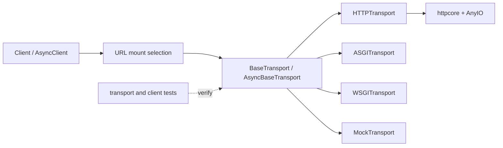

# Project Case Study: HTTPX

> Repository: [encode/httpx](https://github.com/encode/httpx/tree/b5addb64f0161ff6bfe94c124ef76f6a1fba5254)
> Checkout: `/media/tinhanhnguyen/sub/oss-architecture/tmp/python-oss-architecture.LEjXfG/httpx`
> Default branch: `master`
> Commit: `b5addb64f0161ff6bfe94c124ef76f6a1fba5254`
> Python: `>=3.9` (from `pyproject.toml`)
> License: BSD-3-Clause ([LICENSE.md](https://github.com/encode/httpx/blob/b5addb64f0161ff6bfe94c124ef76f6a1fba5254/LICENSE.md))
> Domain: Synchronous and asynchronous HTTP client
> Evidence level: A for HTTPX-owned transport, routing, lifecycle, and test claims; downstream `httpcore` internals were not part of this clone.

## 1. Architecture Summary

HTTPX keeps the public request API in `Client` and places network mechanics behind sync and async transport ports. The default transports adapt requests to `httpcore`; ASGI, WSGI, and mock transports adapt the same public contract to in-process applications or tests. URL mounts act as a small provider/router layer that selects a transport by request URL.

This is a focused ports-and-adapters library rather than a layered business application. Its useful architectural decision is the transport seam: the same client behavior can be exercised against a real network, an ASGI/WSGI app, or a deterministic handler.

## 2. Python/native Boundary

HTTPX itself is Python. The repository delegates connection pooling and protocol work to the separately packaged `httpcore`, and delegates async scheduling to AnyIO. Optional HTTP/2 and SOCKS support are also dependency boundaries declared in `pyproject.toml`; their implementations are not included in this checkout. There is no first-party C/CUDA hot path to report.

| Boundary | Responsibility | Architectural consequence |
|---|---|---|
| `httpx/_client.py` | Public sync/async API, mounts, hooks, and lifecycle | Application code depends on one stable client surface |
| `httpx/_transports/base.py` | Transport protocol and close contract | Network implementation is replaceable |
| `httpx/_transports/default.py` | Adapt HTTPX requests/responses to `httpcore` | Dependency-specific details stay at the edge |
| ASGI/WSGI/mock transports | Adapt non-network or test providers | Integration tests do not require a live socket |

## 3. Pattern Map

| Pattern ID | Pattern | Source evidence | Test evidence | Book mapping |
|---|---|---|---|---|
| P06 | Ports, adapters, and dependency inversion | [`BaseTransport`](https://github.com/encode/httpx/blob/b5addb64f0161ff6bfe94c124ef76f6a1fba5254/httpx/_transports/base.py#L14-L86) defines sync/async request and close contracts | [`test_client.py`](https://github.com/encode/httpx/blob/b5addb64f0161ff6bfe94c124ef76f6a1fba5254/tests/client/test_client.py#L232-L333) injects custom transports and checks lifecycle | Clean Architecture ch14, ch16, ch19–20; Software Design ch35 |
| P12 | Adapter, façade, and provider router | [`HTTPTransport`](https://github.com/encode/httpx/blob/b5addb64f0161ff6bfe94c124ef76f6a1fba5254/httpx/_transports/default.py#L135-L260), [`ASGITransport`](https://github.com/encode/httpx/blob/b5addb64f0161ff6bfe94c124ef76f6a1fba5254/httpx/_transports/asgi.py#L63-L175), and URL transport selection in [`Client`](https://github.com/encode/httpx/blob/b5addb64f0161ff6bfe94c124ef76f6a1fba5254/httpx/_client.py#L718-L769) | [`test_asgi.py`](https://github.com/encode/httpx/blob/b5addb64f0161ff6bfe94c124ef76f6a1fba5254/tests/test_asgi.py#L73-L100), [`test_wsgi.py`](https://github.com/encode/httpx/blob/b5addb64f0161ff6bfe94c124ef76f6a1fba5254/tests/test_wsgi.py#L94-L128), and proxy/mount tests | Clean Architecture ch19–20; Software Design ch35 |
| P14 | Decorator, middleware, and observability | Client event hooks provide request/response cross-cutting callbacks; client hook/mount setup is in [`_client.py`](https://github.com/encode/httpx/blob/b5addb64f0161ff6bfe94c124ef76f6a1fba5254/httpx/_client.py#L640-L769) | [`test_event_hooks.py`](https://github.com/encode/httpx/blob/b5addb64f0161ff6bfe94c124ef76f6a1fba5254/tests/client/test_event_hooks.py) | Clean Architecture ch23; Software Design ch37, ch39 |
| P16 | Concurrency, scheduling, and resource lifecycle | Separate sync/async transports implement context entry and close; clients close mounted transports too | [`test_client.py`](https://github.com/encode/httpx/blob/b5addb64f0161ff6bfe94c124ef76f6a1fba5254/tests/client/test_client.py#L232-L333) and async client tests | Clean Architecture ch21; Software Design ch41 |
| P17 | Testing seams and architecture fitness | `MockTransport`, custom transports, and in-process app transports are explicit seams | [`test_proxies.py`](https://github.com/encode/httpx/blob/b5addb64f0161ff6bfe94c124ef76f6a1fba5254/tests/client/test_proxies.py#L88-L126) plus ASGI/WSGI integration tests | Clean Architecture ch21 |

## 4. Source Walkthrough

### Transport port

[`BaseTransport` and `AsyncBaseTransport`](https://github.com/encode/httpx/blob/b5addb64f0161ff6bfe94c124ef76f6a1fba5254/httpx/_transports/base.py#L14-L86) define the minimum request and cleanup contract. The API is intentionally small: a transport receives an HTTPX request and returns an HTTPX response, while context methods make ownership explicit.

### Concrete adapters

[`HTTPTransport`](https://github.com/encode/httpx/blob/b5addb64f0161ff6bfe94c124ef76f6a1fba5254/httpx/_transports/default.py#L135-L260) creates connection pools, converts request and response objects, and maps downstream exceptions. [`ASGITransport`](https://github.com/encode/httpx/blob/b5addb64f0161ff6bfe94c124ef76f6a1fba5254/httpx/_transports/asgi.py#L63-L175) instead constructs an ASGI scope and exchanges messages with an in-process app. WSGI and mock transports implement the same public seam for other environments.

### Routing and ownership

[`Client._init_transport` and `_transport_for_url`](https://github.com/encode/httpx/blob/b5addb64f0161ff6bfe94c124ef76f6a1fba5254/httpx/_client.py#L718-L769) choose an injected/default transport and then select mounted transports. [`Client.close`](https://github.com/encode/httpx/blob/b5addb64f0161ff6bfe94c124ef76f6a1fba5254/httpx/_client.py#L1263-L1305) closes the main and mounted transports, so adapters cannot silently outlive the client that owns them.

## 5. Theory Versus Practice

### Theoretical ideal

The ports-and-adapters model puts a stable port toward the application and isolates protocol-specific adapters. A provider router should normalize provider selection while preserving a common contract, and tests should inject a fake adapter rather than patch networking globally.

### Production implementation

HTTPX exposes the transport port directly to users, keeps a rich convenience façade in `Client`, and uses URL mounts for selective routing. The default adapter is intentionally coupled to `httpcore`; the point is to isolate that coupling behind one transport implementation, not to erase every dependency from the library. Event hooks add observability without requiring middleware around every call.

### Difference and rationale

There is no separate domain layer or application service because the product is the HTTP client itself. Sync and async implementations are partly duplicated, which keeps each execution model legible but increases maintenance. The transport seam is more valuable than a larger abstraction hierarchy: it enables in-process integration tests and custom connection behavior with little ceremony.

## 6. Testing Strategy

- Custom context-managed transports verify that client shutdown reaches injected resources.
- ASGI and WSGI tests run real application call paths without a network server, checking request translation, response translation, and exception behavior.
- Mock transport tests provide deterministic handler-level unit tests.
- Mount and proxy tests verify URL-to-transport selection and unsupported configuration errors.
- Event-hook tests validate cross-cutting callbacks separately from the connection implementation.

## 7. Lessons

- Copy the transport-port design when the same client API must work across sockets, in-process applications, and fakes.
- Keep the adapter boundary narrow; do not expose `httpcore` objects through the public client API.
- Define ownership and close semantics at the port. Otherwise pools and background resources leak when a custom adapter is injected.
- Do not add a provider router for one stable backend. A direct client or function is simpler until routing, test substitution, or protocol variation is real.
- The downstream `httpcore` implementation was not audited in this checkout; claims here stop at HTTPX's delegation boundary.

## 8. Practice Exercise

Implement a `RetryingTransport` around a fake `BaseTransport`. Add a `RecordingTransport`, mount it only for `https://test.local`, and test request routing, exception translation, response hooks, context-manager cleanup, and both sync and async variants.
