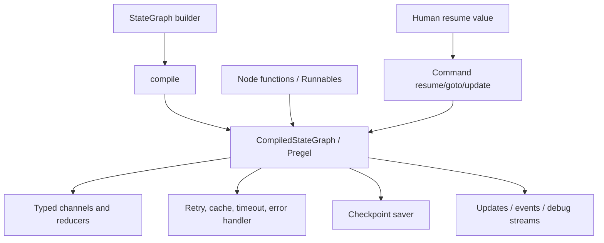

# Project Case Study: LangGraph

> **Repository**: [langchain-ai/langgraph](https://github.com/langchain-ai/langgraph/tree/e539ac122f4126f6dd850581c1494948cf620e31)
> **Default branch**: `main`
> **Commit**: `e539ac122f4126f6dd850581c1494948cf620e31`
> **License**: MIT (`LICENSE`)
> **Domain**: Stateful graph execution for agents, workflows, persistence, streaming, and human-in-the-loop control
> **Python version**: `>=3.10` (`libs/langgraph/pyproject.toml`)
> **Evidence level**: A for typed state, compilation, Pregel execution, checkpointing, interrupt/resume, and tests; B where the mapping is an architecture analogue rather than a book-defined DDD pattern

APwP means *Architecture Patterns with Python*, CAP means *Clean Architecture with Python*, and SDP means *Software Design for Python Programmers*.

## 1. Architecture Summary

LangGraph is a graph builder and runtime for stateful LLM applications. A `StateGraph` declares a state schema, nodes, edges, conditional routing, reducers, retry/cache/timeout policies, and optional context/input/output schemas. `compile()` turns the builder into a `CompiledStateGraph`, which implements the LangChain `Runnable` interface and runs through the Pregel engine.

The architecture is a **compiled workflow graph over versioned channels**. Nodes return partial state updates; channels and reducers merge them; the Pregel runner schedules tasks in steps. A checkpointer turns the evolving graph into resumable short-term memory keyed by `thread_id`. `Command`, `Send`, and `interrupt()` provide explicit routing, fan-out, and human-in-the-loop control.

This is an unusually direct production example of P13 State/Workflow/Saga and P16 Scheduling/Lifecycle. It also shows where book vocabulary needs qualification: a reducer-backed state schema is an aggregate-like consistency boundary, and a checkpointer is repository-shaped infrastructure, but neither is automatically a DDD aggregate or a domain repository.

## 2. Python Boundary

The assigned LangGraph packages are Python orchestration and persistence interfaces. No C++/CUDA/Rust hot path is present in the examined package. Python owns graph construction, channel/reducer semantics, Pregel task scheduling, retries, interrupts, checkpoints, stream modes, and `Runnable` integration.

The perimeter is:

- LangChain `Runnable`/callback/provider components;
- checkpoint implementations such as memory, SQLite, Postgres, and other external stores;
- application nodes that may call model APIs, databases, tools, or native services.

LangGraph’s core therefore illustrates a different boundary from vLLM-style serving systems: there is no native accelerator plane to separate, but there is a strong **workflow runtime versus user-node side-effect** boundary. A node is still application code; the runtime can retry or re-execute it, so its side effects must be designed accordingly.

## 3. Pattern Map

| ID | Pattern observed | Exact source | Exact test | Book mapping | Evidence | Production trade-off |
|---|---|---|---|---|---|---|
| P02 | Reducer-backed state consistency boundary (aggregate analogue, not a DDD aggregate) | [`graph/state.py`](https://github.com/langchain-ai/langgraph/blob/e539ac122f4126f6dd850581c1494948cf620e31/libs/langgraph/langgraph/graph/state.py), [`types.py`](https://github.com/langchain-ai/langgraph/blob/e539ac122f4126f6dd850581c1494948cf620e31/libs/langgraph/langgraph/types.py) | [`tests/test_state.py`](https://github.com/langchain-ai/langgraph/blob/e539ac122f4126f6dd850581c1494948cf620e31/libs/langgraph/tests/test_state.py) | APwP ch07; CAP ch17 | B | Reducers make concurrent updates predictable, but the state is usually infrastructure-shaped rather than a behavior-rich domain object. |
| P03 | Checkpoint saver as repository-shaped persistence port | [`checkpoint/base/__init__.py`](https://github.com/langchain-ai/langgraph/blob/e539ac122f4126f6dd850581c1494948cf620e31/libs/checkpoint/langgraph/checkpoint/base/__init__.py) | [`checkpoint/tests/test_memory.py`](https://github.com/langchain-ai/langgraph/blob/e539ac122f4126f6dd850581c1494948cf620e31/libs/checkpoint/tests/test_memory.py), [`checkpoint-sqlite/tests/test_sqlite.py`](https://github.com/langchain-ai/langgraph/blob/e539ac122f4126f6dd850581c1494948cf620e31/libs/checkpoint-sqlite/tests/test_sqlite.py) | APwP ch02; CAP ch19–20 | B | The port stores graph snapshots and pending writes, not domain aggregates; backend durability and latency are deployment choices. |
| P05 | Compiled graph as application workflow/use case | [`graph/state.py`](https://github.com/langchain-ai/langgraph/blob/e539ac122f4126f6dd850581c1494948cf620e31/libs/langgraph/langgraph/graph/state.py) | [`tests/test_pregel.py`](https://github.com/langchain-ai/langgraph/blob/e539ac122f4126f6dd850581c1494948cf620e31/libs/langgraph/tests/test_pregel.py) | APwP ch04; CAP ch18 | A | `compile()` is both composition root and executable use-case factory, which is ergonomic but framework-centric. |
| P06 | Runnable/checkpointer/store ports and dependency inversion | [`graph/state.py`](https://github.com/langchain-ai/langgraph/blob/e539ac122f4126f6dd850581c1494948cf620e31/libs/langgraph/langgraph/graph/state.py), [`checkpoint/base/__init__.py`](https://github.com/langchain-ai/langgraph/blob/e539ac122f4126f6dd850581c1494948cf620e31/libs/checkpoint/langgraph/checkpoint/base/__init__.py) | [`checkpoint-conformance/langgraph/checkpoint/conformance/spec/test_put.py`](https://github.com/langchain-ai/langgraph/blob/e539ac122f4126f6dd850581c1494948cf620e31/libs/checkpoint-conformance/langgraph/checkpoint/conformance/spec/test_put.py) | CAP ch14–16, ch19–20 | A | Multiple checkpoint packages preserve a narrow core port, at the cost of cross-package compatibility management. |
| P07 | Builder composition root and compile-time wiring | [`graph/state.py`](https://github.com/langchain-ai/langgraph/blob/e539ac122f4126f6dd850581c1494948cf620e31/libs/langgraph/langgraph/graph/state.py) | [`tests/test_state.py`](https://github.com/langchain-ai/langgraph/blob/e539ac122f4126f6dd850581c1494948cf620e31/libs/langgraph/tests/test_state.py) | APwP ch13; CAP ch16 | A | Defaults, schemas, policies, stores, and interrupts are assembled at compile time rather than at each node call. |
| P09 | Retry, cache, timeout, and error-handler strategies | [`graph/state.py`](https://github.com/langchain-ai/langgraph/blob/e539ac122f4126f6dd850581c1494948cf620e31/libs/langgraph/langgraph/graph/state.py), [`types.py`](https://github.com/langchain-ai/langgraph/blob/e539ac122f4126f6dd850581c1494948cf620e31/libs/langgraph/langgraph/types.py) | [`tests/test_retry.py`](https://github.com/langchain-ai/langgraph/blob/e539ac122f4126f6dd850581c1494948cf620e31/libs/langgraph/tests/test_retry.py) | SDP ch33; APwP ch04 | A | Per-node policy overrides are expressive, but retries and caching amplify the need for idempotent nodes. |
| P10 | Typed commands, stream events, and task updates | [`types.py`](https://github.com/langchain-ai/langgraph/blob/e539ac122f4126f6dd850581c1494948cf620e31/libs/langgraph/langgraph/types.py), [`pregel/_runner.py`](https://github.com/langchain-ai/langgraph/blob/e539ac122f4126f6dd850581c1494948cf620e31/libs/langgraph/langgraph/pregel/_runner.py) | [`tests/test_interruption.py`](https://github.com/langchain-ai/langgraph/blob/e539ac122f4126f6dd850581c1494948cf620e31/libs/langgraph/tests/test_interruption.py) | APwP ch08–11; SDP ch37 | B | `Command` is an explicit routing primitive; stream output is not by itself a durable message bus. |
| P11 | Checkpoint snapshots and read/state APIs (CQRS analogue) | [`types.py`](https://github.com/langchain-ai/langgraph/blob/e539ac122f4126f6dd850581c1494948cf620e31/libs/langgraph/langgraph/types.py), [`checkpoint/base/__init__.py`](https://github.com/langchain-ai/langgraph/blob/e539ac122f4126f6dd850581c1494948cf620e31/libs/checkpoint/langgraph/checkpoint/base/__init__.py) | [`tests/test_time_travel.py`](https://github.com/langchain-ai/langgraph/blob/e539ac122f4126f6dd850581c1494948cf620e31/libs/langgraph/tests/test_time_travel.py) | APwP ch12 | B | Reads expose snapshots/time travel, but this is not a full command/read-model split. |
| P13 | State graph, conditional edges, interrupt/resume, and subgraphs | [`graph/state.py`](https://github.com/langchain-ai/langgraph/blob/e539ac122f4126f6dd850581c1494948cf620e31/libs/langgraph/langgraph/graph/state.py), [`types.py`](https://github.com/langchain-ai/langgraph/blob/e539ac122f4126f6dd850581c1494948cf620e31/libs/langgraph/langgraph/types.py) | [`tests/test_interruption.py`](https://github.com/langchain-ai/langgraph/blob/e539ac122f4126f6dd850581c1494948cf620e31/libs/langgraph/tests/test_interruption.py), [`tests/test_time_travel.py`](https://github.com/langchain-ai/langgraph/blob/e539ac122f4126f6dd850581c1494948cf620e31/libs/langgraph/tests/test_time_travel.py) | SDP ch38; CAP ch18, ch24 | A | Checkpointed replay enables recovery, but an interrupted node restarts from its beginning. |
| P14 | Trace policy, stream transformers, and callback-style runtime hooks | [`types.py`](https://github.com/langchain-ai/langgraph/blob/e539ac122f4126f6dd850581c1494948cf620e31/libs/langgraph/langgraph/types.py), [`graph/state.py`](https://github.com/langchain-ai/langgraph/blob/e539ac122f4126f6dd850581c1494948cf620e31/libs/langgraph/langgraph/graph/state.py) | [`tests/test_pregel.py`](https://github.com/langchain-ai/langgraph/blob/e539ac122f4126f6dd850581c1494948cf620e31/libs/langgraph/tests/test_pregel.py) | CAP ch23; SDP ch39 | B | Observability is attached to node/runtime boundaries, so payload redaction and tracing policy must be configured deliberately. |
| P15 | Composite graphs, subgraphs, fan-out, and iterator-like streams | [`types.py`](https://github.com/langchain-ai/langgraph/blob/e539ac122f4126f6dd850581c1494948cf620e31/libs/langgraph/langgraph/types.py), [`pregel/main.py`](https://github.com/langchain-ai/langgraph/blob/e539ac122f4126f6dd850581c1494948cf620e31/libs/langgraph/langgraph/pregel/main.py) | [`tests/test_pregel.py`](https://github.com/langchain-ai/langgraph/blob/e539ac122f4126f6dd850581c1494948cf620e31/libs/langgraph/tests/test_pregel.py) | SDP ch36, ch39 | A | Composition gives reusable workflow units, but nested persistence and namespace behavior become operational concerns. |
| P16 | Pregel scheduling, concurrent tasks, retry, timeout, and durability modes | [`pregel/_runner.py`](https://github.com/langchain-ai/langgraph/blob/e539ac122f4126f6dd850581c1494948cf620e31/libs/langgraph/langgraph/pregel/_runner.py), [`types.py`](https://github.com/langchain-ai/langgraph/blob/e539ac122f4126f6dd850581c1494948cf620e31/libs/langgraph/langgraph/types.py) | [`tests/test_pregel_async.py`](https://github.com/langchain-ai/langgraph/blob/e539ac122f4126f6dd850581c1494948cf620e31/libs/langgraph/tests/test_pregel_async.py), [`tests/test_retry.py`](https://github.com/langchain-ai/langgraph/blob/e539ac122f4126f6dd850581c1494948cf620e31/libs/langgraph/tests/test_retry.py) | SDP ch41 | A | Sync/async/exit durability modes trade write latency against recovery guarantees. |
| P17 | Schema, interruption, retry, and checkpoint conformance seams | [`checkpoint/base/__init__.py`](https://github.com/langchain-ai/langgraph/blob/e539ac122f4126f6dd850581c1494948cf620e31/libs/checkpoint/langgraph/checkpoint/base/__init__.py) | [`tests/test_state.py`](https://github.com/langchain-ai/langgraph/blob/e539ac122f4126f6dd850581c1494948cf620e31/libs/langgraph/tests/test_state.py), [`checkpoint-conformance/langgraph/checkpoint/conformance/spec/test_put.py`](https://github.com/langchain-ai/langgraph/blob/e539ac122f4126f6dd850581c1494948cf620e31/libs/checkpoint-conformance/langgraph/checkpoint/conformance/spec/test_put.py) | CAP ch21 | A | Conformance tests protect backend contracts better than a single end-to-end graph test. |

P01 is not directly evidenced as domain modeling. P04 is not a Unit of Work: checkpoint writes are runtime persistence, not a business transaction boundary. P08 and P12 are not central in the assigned core package; provider adapters live above the graph runtime.

## 4. Source Walkthrough

### 4.1 `StateGraph` is a typed builder, not the executor

[`libs/langgraph/langgraph/graph/state.py`](https://github.com/langchain-ai/langgraph/blob/e539ac122f4126f6dd850581c1494948cf620e31/libs/langgraph/langgraph/graph/state.py) defines `StateGraph[StateT, ContextT, InputT, OutputT]`. A node reads the state and returns a partial state update. State keys become channels; `Annotated` reducers define how multiple writes combine. The builder also tracks input/output/context schemas, edges, conditional branches, and node policies.

`compile()` validates interrupts and graph structure, applies default retry/cache/timeout/error policies, creates channels, and attaches nodes/edges/branches to `CompiledStateGraph`. The compiled object implements invocation, streaming, batching, and async execution through the `Runnable` contract. This is the composition root of the workflow.

### 4.2 `Command`, `Send`, and `interrupt()` make control explicit

[`libs/langgraph/langgraph/types.py`](https://github.com/langchain-ai/langgraph/blob/e539ac122f4126f6dd850581c1494948cf620e31/libs/langgraph/langgraph/types.py) defines `Send` for dynamic fan-out and map/reduce-like execution. `Command` can carry a state update, `goto` destination(s), a parent-graph target, or a `resume` value. `interrupt(value)` raises a resumable graph interrupt; the client later supplies `Command(resume=...)`.

The important operational rule is in the implementation contract: resuming re-executes the node from its start. A database write or external API call before the interrupt must therefore be idempotent, moved after the pause point, or protected by an application-level idempotency key.

### 4.3 Pregel turns the graph into scheduled tasks

[`libs/langgraph/langgraph/pregel/main.py`](https://github.com/langchain-ai/langgraph/blob/e539ac122f4126f6dd850581c1494948cf620e31/libs/langgraph/langgraph/pregel/main.py) owns the bulk-synchronous runtime surface. [`pregel/_runner.py`](https://github.com/langchain-ai/langgraph/blob/e539ac122f4126f6dd850581c1494948cf620e31/libs/langgraph/langgraph/pregel/_runner.py) schedules independent Pregel tasks concurrently, commits writes, applies retry/error behavior, handles task timeouts, and propagates interrupts. This is why a node should be treated like a retryable workflow step, not like a transactionally isolated method call.

### 4.4 Checkpointing is a versioned persistence port

[`libs/checkpoint/langgraph/checkpoint/base/__init__.py`](https://github.com/langchain-ai/langgraph/blob/e539ac122f4126f6dd850581c1494948cf620e31/libs/checkpoint/langgraph/checkpoint/base/__init__.py) defines `Checkpoint`, `CheckpointMetadata`, `CheckpointTuple`, and `BaseCheckpointSaver`. The saver API is keyed by configuration, especially `thread_id`, and exposes get/list/put/pending-write behavior. Memory, SQLite, Postgres, and conformance packages implement the port separately.

The abstraction deliberately stores channel versions, metadata, parent configurations, and pending writes. That enables replay/time travel and recovery without pretending that all state belongs in one mutable object.

### 4.5 Tests expose the actual guarantees

[`libs/langgraph/tests/test_state.py`](https://github.com/langchain-ai/langgraph/blob/e539ac122f4126f6dd850581c1494948cf620e31/libs/langgraph/tests/test_state.py) checks TypedDict, Pydantic, and dataclass schemas, reducers, input/output schemas, defaults, and JSON schemas. [`test_interruption.py`](https://github.com/langchain-ai/langgraph/blob/e539ac122f4126f6dd850581c1494948cf620e31/libs/langgraph/tests/test_interruption.py) proves checkpointed pause/resume and next-node state. [`test_time_travel.py`](https://github.com/langchain-ai/langgraph/blob/e539ac122f4126f6dd850581c1494948cf620e31/libs/langgraph/tests/test_time_travel.py) exercises historical state. Backend tests and checkpoint conformance tests are the stronger seam for replacing persistence.

## 5. Theory Versus Practice

### Theoretical ideal

Clean Architecture would put use-case policy in an application layer, keep domain state independent of the workflow engine, and put persistence behind a repository port. APwP would distinguish command handling, events, aggregates, and read projections. A Unit of Work would make business transaction boundaries explicit.

### Production implementation

LangGraph intentionally makes the graph/runtime the primary architectural unit. The state schema is a channel declaration; reducers merge concurrent writes. Policies are attached to nodes and applied by `compile()`. Checkpoints are versioned runtime snapshots keyed by thread, and `stream()` exposes updates/tasks/debug/events. The runtime can retry, cache, time out, interrupt, and re-execute nodes.

### Difference and rationale

- **Framework state versus domain aggregates:** arbitrary dict-like/Pydantic/dataclass state keeps graph authoring accessible, but invariants are often reducers or node checks rather than methods on a domain aggregate.
- **Checkpoint saver versus repository/UoW:** a saver gives durable replay and time travel, not atomic coordination of several business repositories. An application that needs both should put a real transaction/idempotency layer inside the node boundary.
- **Compile-time policy defaults:** central defaults and per-node overrides reduce boilerplate, but a graph’s behavior is spread across builder declarations and runtime policy objects.
- **Interrupt replay:** restarting a node keeps the engine deterministic and simple. It shifts side-effect discipline to node authors.
- **Durability modes:** `sync`, `async`, and `exit` let deployments choose latency/consistency, but the choice is a correctness setting, not only a tuning knob.
- **External checkpoint packages:** the core remains small and providers can specialize for SQLite/Postgres/etc.; users must track package/version compatibility across the monorepo.

## 6. Testing Strategy

Use `test_state.py` as a schema contract suite and `test_interruption.py` as the human-in-the-loop contract. The interruption test builds a three-step graph, invokes with a `thread_id`, checks the pending `next` node, resumes with the same thread, and checks checkpoint behavior under durability settings.

`test_retry.py` and the Pregel sync/async tests validate the executor’s scheduling and failure policies. `test_time_travel.py` and `test_time_travel_async.py` check historical reads and replay. `libs/checkpoint/tests/test_memory.py`, `libs/checkpoint-sqlite/tests/test_sqlite.py`, and `libs/checkpoint-postgres/tests/test_sync.py` exercise concrete stores; `libs/checkpoint-conformance/...` lets a new saver prove the common contract.

The strongest testing seam is therefore layered:

1. schema/reducer tests with no persistence;
2. graph/runtime tests with deterministic nodes;
3. interruption/retry/time-travel tests;
4. persistence implementation and conformance tests;
5. application integration tests for node side effects.

## 7. Lessons

- Use LangGraph when work has explicit states, branching, parallel fan-out, checkpoints, human input, or replay requirements.
- Put durable identifiers (`thread_id`) and side-effect idempotency in the application design before adding interrupts.
- Treat `StateGraph.compile()` as a composition root and keep node functions small enough to test independently.
- Do not call a reducer-backed state dictionary a domain aggregate unless it enforces meaningful domain invariants.
- Do not use the checkpoint saver as a replacement for a database transaction spanning unrelated business resources.
- For a simple linear prompt chain, a plain Python function or a small `Runnable` pipeline is easier to maintain.

## 8. Practice Exercise

Implement a miniature LangGraph-like engine:

1. Define a `TypedDict` state with a list reducer and a separate context schema.
2. Add two nodes, a conditional route, and a `Command(goto=...)` path.
3. Implement an in-memory checkpoint saver keyed by `thread_id`, storing state, next nodes, and pending interrupts.
4. Add `interrupt("approve?")`; resume with `Command(resume="yes")`, and make the interrupted node re-run from its beginning.
5. Add retry and timeout policies, then test that an external side effect uses an idempotency key and is not duplicated across resume.

Finish with a small checkpoint conformance test so a SQLite-backed implementation could replace the memory saver without changing the graph.
