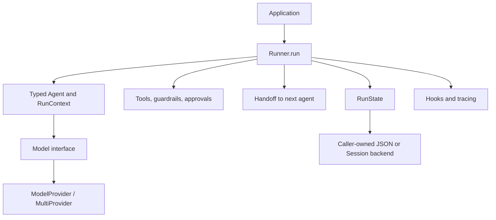

# Project Case Study: OpenAI Agents Python

> **Repository**: [openai/openai-agents-python](https://github.com/openai/openai-agents-python/tree/fbd2dbcaaf74a2c447c6d3fa9d5645d83fd7e292)
> **Default branch**: `main`
> **Commit**: `fbd2dbcaaf74a2c447c6d3fa9d5645d83fd7e292`
> **License**: MIT (`LICENSE`)
> **Domain**: Agent runners, tools, handoffs, guardrails, model providers, sessions, tracing, and human approval
> **Python version**: `>=3.10` (`pyproject.toml`)
> **Package version at the revision**: `0.22.2`
> **Evidence level**: A for the runner, provider seam, typed context, RunState serialization, ScriptedModel, and HITL tests; B for event/message-bus analogues

APwP means *Architecture Patterns with Python*, CAP means *Clean Architecture with Python*, and SDP means *Software Design for Python Programmers*.

## 1. Architecture Summary

The SDK models an agent as a typed, configured object with instructions, tools, handoffs, guardrails, output schema, hooks, and model settings. `Runner.run` is the application-facing use case: it invokes the current agent, processes model output, executes tools, follows handoffs, applies guardrails, and repeats until a final output or a turn/error limit is reached.

The architecture is a **runner-centered orchestration loop with provider-neutral model ports**. Model providers implement `ModelProvider.get_model`, while the runner speaks to the abstract `Model` interface. `MultiProviderMap` and `MultiProvider` route model identifiers to provider implementations. The run state is a first-class serialization boundary for human-in-the-loop interruptions, and sessions optionally persist conversation items outside the run snapshot.

This is deliberately a compact agent SDK rather than a full domain architecture. P05, P06, P07, P08, P09, P12, P13, P14, P15, P16, and P17 are the useful canonical IDs. A handoff is a control transition, not a general-purpose durable workflow engine, and a session is conversation persistence, not automatically a Unit of Work.

## 2. Python Boundary

The repository’s runner, agent objects, tool execution, sessions, tracing, and test model are Python. There is no C++/CUDA/Rust hot path in this assigned package slice. The external boundary consists of:

- OpenAI Responses/Chat Completions clients and other provider SDKs;
- MCP servers and tool transports;
- optional LiteLLM/any-llm providers;
- optional sandbox and session backends.

`Model` and `ModelProvider` isolate the runner from provider calls, but the model interface is intentionally shaped around the SDK’s response/tool semantics. Provider adapters translate their native wire behavior into that common model contract. The runner owns lifecycle hooks and can close a model or provider, while the application remains responsible for storing serialized run state and deciding how approvals are authorized.

## 3. Pattern Map

| ID | Pattern observed | Exact source | Exact test | Book mapping | Evidence | Production trade-off |
|---|---|---|---|---|---|---|
| P05 | `Runner` as application service/use-case loop | [`run.py`](https://github.com/openai/openai-agents-python/blob/fbd2dbcaaf74a2c447c6d3fa9d5645d83fd7e292/src/agents/run.py) | [`test_agent_runner.py`](https://github.com/openai/openai-agents-python/blob/fbd2dbcaaf74a2c447c6d3fa9d5645d83fd7e292/tests/test_agent_runner.py) | APwP ch04; CAP ch18 | A | The runner owns orchestration policy for convenience; applications do not get a small independent use-case layer. |
| P06 | Model and provider dependency-inversion ports | [`models/interface.py`](https://github.com/openai/openai-agents-python/blob/fbd2dbcaaf74a2c447c6d3fa9d5645d83fd7e292/src/agents/models/interface.py) | [`models/test_map.py`](https://github.com/openai/openai-agents-python/blob/fbd2dbcaaf74a2c447c6d3fa9d5645d83fd7e292/tests/models/test_map.py) | CAP ch14–16, ch19–20 | A | A stable SDK model contract requires adapters to translate provider-specific capabilities and errors. |
| P07 | Typed run context and explicit agent construction | [`agent.py`](https://github.com/openai/openai-agents-python/blob/fbd2dbcaaf74a2c447c6d3fa9d5645d83fd7e292/src/agents/agent.py) | [`test_agent_runner.py`](https://github.com/openai/openai-agents-python/blob/fbd2dbcaaf74a2c447c6d3fa9d5645d83fd7e292/tests/test_agent_runner.py) | APwP ch13; CAP ch16 | A | `RunContextWrapper` is explicit, but the `Agent` dataclass still contains a large amount of framework wiring. |
| P08 | Prefix-to-provider registry/router | [`models/multi_provider.py`](https://github.com/openai/openai-agents-python/blob/fbd2dbcaaf74a2c447c6d3fa9d5645d83fd7e292/src/agents/models/multi_provider.py) | [`models/test_map.py`](https://github.com/openai/openai-agents-python/blob/fbd2dbcaaf74a2c447c6d3fa9d5645d83fd7e292/tests/models/test_map.py) | SDP ch34; CAP ch19–20 | A | Runtime prefix discovery is extensible, but aliases and unknown-prefix modes can make configuration errors late. |
| P09 | Tool-use, guardrail, retry, and turn-limit policies | [`run.py`](https://github.com/openai/openai-agents-python/blob/fbd2dbcaaf74a2c447c6d3fa9d5645d83fd7e292/src/agents/run.py), [`run_internal/guardrails.py`](https://github.com/openai/openai-agents-python/blob/fbd2dbcaaf74a2c447c6d3fa9d5645d83fd7e292/src/agents/run_internal/guardrails.py) | [`test_agent_runner.py`](https://github.com/openai/openai-agents-python/blob/fbd2dbcaaf74a2c447c6d3fa9d5645d83fd7e292/tests/test_agent_runner.py) | SDP ch33; APwP ch04 | A | Policy is centralized and consistent, but a single runner must coordinate many independent failure/termination modes. |
| P10 | Stream events, hooks, and handoff/tool messages | [`run_internal/run_loop.py`](https://github.com/openai/openai-agents-python/blob/fbd2dbcaaf74a2c447c6d3fa9d5645d83fd7e292/src/agents/run_internal/run_loop.py), [`handoffs/__init__.py`](https://github.com/openai/openai-agents-python/blob/fbd2dbcaaf74a2c447c6d3fa9d5645d83fd7e292/src/agents/handoffs/__init__.py) | [`test_agent_runner_streamed.py`](https://github.com/openai/openai-agents-python/blob/fbd2dbcaaf74a2c447c6d3fa9d5645d83fd7e292/tests/test_agent_runner_streamed.py), [`test_handoff_tool.py`](https://github.com/openai/openai-agents-python/blob/fbd2dbcaaf74a2c447c6d3fa9d5645d83fd7e292/tests/test_handoff_tool.py) | APwP ch08–11; SDP ch37 | B | The protocol is run-local and SDK-oriented; it is not a durable message bus with broker-level delivery guarantees. |
| P12 | Provider adapter and multi-provider façade | [`models/interface.py`](https://github.com/openai/openai-agents-python/blob/fbd2dbcaaf74a2c447c6d3fa9d5645d83fd7e292/src/agents/models/interface.py), [`models/multi_provider.py`](https://github.com/openai/openai-agents-python/blob/fbd2dbcaaf74a2c447c6d3fa9d5645d83fd7e292/src/agents/models/multi_provider.py) | [`models/test_map.py`](https://github.com/openai/openai-agents-python/blob/fbd2dbcaaf74a2c447c6d3fa9d5645d83fd7e292/tests/models/test_map.py) | SDP ch35; CAP ch19–20 | A | One provider-neutral surface simplifies agent code, while provider feature negotiation still leaks through options and errors. |
| P13 | Handoff state machine and serializable RunState | [`run_state.py`](https://github.com/openai/openai-agents-python/blob/fbd2dbcaaf74a2c447c6d3fa9d5645d83fd7e292/src/agents/run_state.py), [`run.py`](https://github.com/openai/openai-agents-python/blob/fbd2dbcaaf74a2c447c6d3fa9d5645d83fd7e292/src/agents/run.py) | [`test_run_state.py`](https://github.com/openai/openai-agents-python/blob/fbd2dbcaaf74a2c447c6d3fa9d5645d83fd7e292/tests/test_run_state.py), [`test_run_impl_resume_paths.py`](https://github.com/openai/openai-agents-python/blob/fbd2dbcaaf74a2c447c6d3fa9d5645d83fd7e292/tests/test_run_impl_resume_paths.py) | SDP ch38; CAP ch18, ch24 | A | The SDK serializes decision state, but durable storage, agent reconstruction, and context deserialization remain application concerns. |
| P14 | Guardrails, lifecycle hooks, and tracing middleware | [`guardrail.py`](https://github.com/openai/openai-agents-python/blob/fbd2dbcaaf74a2c447c6d3fa9d5645d83fd7e292/src/agents/guardrail.py), [`tracing/`](https://github.com/openai/openai-agents-python/tree/fbd2dbcaaf74a2c447c6d3fa9d5645d83fd7e292/src/agents/tracing) | [`test_provider_span_errors.py`](https://github.com/openai/openai-agents-python/blob/fbd2dbcaaf74a2c447c6d3fa9d5645d83fd7e292/tests/test_provider_span_errors.py) | CAP ch23; SDP ch39 | B | Cross-cutting hooks are useful for policy and observability, but hook ordering and error ownership must be understood. |
| P15 | Composite tools and handoff graph | [`agent.py`](https://github.com/openai/openai-agents-python/blob/fbd2dbcaaf74a2c447c6d3fa9d5645d83fd7e292/src/agents/agent.py), [`handoffs/__init__.py`](https://github.com/openai/openai-agents-python/blob/fbd2dbcaaf74a2c447c6d3fa9d5645d83fd7e292/src/agents/handoffs/__init__.py) | [`test_handoff_tool.py`](https://github.com/openai/openai-agents-python/blob/fbd2dbcaaf74a2c447c6d3fa9d5645d83fd7e292/tests/test_handoff_tool.py) | SDP ch36, ch39 | A | Composing agents as tools makes routing natural, but names, schemas, and history filters become part of the contract. |
| P16 | Async streaming and provider/model resource lifecycle | [`models/interface.py`](https://github.com/openai/openai-agents-python/blob/fbd2dbcaaf74a2c447c6d3fa9d5645d83fd7e292/src/agents/models/interface.py), [`run_internal/run_loop.py`](https://github.com/openai/openai-agents-python/blob/fbd2dbcaaf74a2c447c6d3fa9d5645d83fd7e292/src/agents/run_internal/run_loop.py) | [`test_agent_runner_streamed.py`](https://github.com/openai/openai-agents-python/blob/fbd2dbcaaf74a2c447c6d3fa9d5645d83fd7e292/tests/test_agent_runner_streamed.py) | SDP ch41 | A | Async close/stream cleanup is part of correctness; a model implementation that leaks a stream can corrupt later runs. |
| P17 | Scripted model and serializable-run test seams | [`testing/model.py`](https://github.com/openai/openai-agents-python/blob/fbd2dbcaaf74a2c447c6d3fa9d5645d83fd7e292/src/agents/testing/model.py) | [`test_hitl_session_scenario.py`](https://github.com/openai/openai-agents-python/blob/fbd2dbcaaf74a2c447c6d3fa9d5645d83fd7e292/tests/test_hitl_session_scenario.py), [`test_run_state.py`](https://github.com/openai/openai-agents-python/blob/fbd2dbcaaf74a2c447c6d3fa9d5645d83fd7e292/tests/test_run_state.py) | CAP ch21; APwP ch13 | A | A deterministic model makes approval/resume tests fast, but it cannot prove provider wire compatibility. |

P01, P02, P03, P04, and P11 are not authoritative claims here. The SDK does not define a DDD aggregate, domain repository, Unit of Work, or CQRS read model in this slice. Sessions are persistence components for conversation/run items, not proof of those patterns.

## 4. Source Walkthrough

### 4.1 `Agent` is a typed but rich declaration

[`src/agents/agent.py`](https://github.com/openai/openai-agents-python/blob/fbd2dbcaaf74a2c447c6d3fa9d5645d83fd7e292/src/agents/agent.py) defines `AgentBase` and `Agent` as dataclasses. An agent declares instructions/prompt, tools, MCP servers, handoffs, model/model settings, input/output guardrails, output type, hooks, and tool-use behavior. `RunContextWrapper[TContext]` carries an application-created context object to tools, handoffs, and guardrails.

The type parameter documents the dependency boundary, but the object is also the place where user configuration, runtime metadata, and provider-facing behavior meet. That is a deliberate ergonomic compromise.

### 4.2 `Runner.run` is the orchestration loop

[`src/agents/run.py`](https://github.com/openai/openai-agents-python/blob/fbd2dbcaaf74a2c447c6d3fa9d5645d83fd7e292/src/agents/run.py) accepts an agent, input or `RunState`, context, run configuration, maximum turns, sessions, and identifiers. The loop invokes the current agent; a final output ends the run, a handoff changes the current agent, and tool calls execute before another model turn. Guardrails, approvals, tracing, and error handlers are coordinated around these steps.

This makes a handoff a state transition in the current run rather than a separate workflow service. It is easy to teach and compose, but every new policy adds another branch in the runner’s lifecycle.

### 4.3 `Model` and `ModelProvider` are the adapter port

[`src/agents/models/interface.py`](https://github.com/openai/openai-agents-python/blob/fbd2dbcaaf74a2c447c6d3fa9d5645d83fd7e292/src/agents/models/interface.py) defines asynchronous response/stream methods, cleanup hooks, retry advice, and `ModelProvider.get_model`/`aclose`. [`models/multi_provider.py`](https://github.com/openai/openai-agents-python/blob/fbd2dbcaaf74a2c447c6d3fa9d5645d83fd7e292/src/agents/models/multi_provider.py) routes prefixes through an explicit `MultiProviderMap`, built-in OpenAI provider, or lazily created LiteLLM/any-llm fallbacks.

Explicit mappings win; `openai_prefix_mode` and `unknown_prefix_mode` make the difference between a provider alias and a literal namespaced model ID configurable. This is a good real-world provider router because it makes the ambiguity visible rather than silently guessing in every adapter.

### 4.4 `RunState` is a durable boundary, not a database

[`src/agents/run_state.py`](https://github.com/openai/openai-agents-python/blob/fbd2dbcaaf74a2c447c6d3fa9d5645d83fd7e292/src/agents/run_state.py) stores current/starting agent, original input, model responses, generated/session items, pending input, conversation IDs, guardrail results, approval/tool state, the current resumable step, and schema version. `to_json()` creates a JSON-compatible snapshot; `from_json()` validates the version and reconstructs it with an initial agent plus optional context deserialization/override.

The snapshot includes safeguards for pending session writes and duplicate tool/history reconciliation. It is portable enough for an application to persist, but it cannot serialize arbitrary live clients or an arbitrary custom context without help.

### 4.5 `ScriptedModel` and the HITL scenario show the seam

[`src/agents/testing/model.py`](https://github.com/openai/openai-agents-python/blob/fbd2dbcaaf74a2c447c6d3fa9d5645d83fd7e292/src/agents/testing/model.py) records provider-neutral `ModelCall` values and returns scripted outputs, errors, streams, or retry advice. [`tests/test_hitl_session_scenario.py`](https://github.com/openai/openai-agents-python/blob/fbd2dbcaaf74a2c447c6d3fa9d5645d83fd7e292/tests/test_hitl_session_scenario.py) uses an approval-required tool, captures an interrupted run, converts it to state, approves/rejects, resumes through `Runner`, and verifies session history and one-time tool execution.

That test is the practical architecture lesson: approval pauses before side effects, and the resumed runner must reconcile state/session history rather than blindly replaying a completed tool.

## 5. Theory Versus Practice

### Theoretical ideal

Clean Architecture would keep an application use case independent of the model SDK, inject a narrow provider port, and place approval/workflow state behind an explicit persistence boundary. A message bus would separate commands/events, and middleware would be independently composable.

### Production implementation

The SDK chooses a single runner loop and highly capable `Agent` dataclasses. Provider selection is dynamic and prefix-based. The model interface is provider-neutral but intentionally aligned with response/tool concepts. `RunState` serializes enough SDK-owned decisions to pause/resume; `Session` implementations handle conversation history separately. Tools, handoffs, guardrails, and tracing are runner policies rather than a separate domain layer.

### Difference and rationale

- **Rich dataclass versus pure domain object:** one agent declaration lowers setup cost and lets the SDK validate the complete tool/handoff surface; it couples configuration and framework concepts.
- **OpenAI-shaped model contract versus lowest-common-denominator port:** the contract can preserve streaming, tools, and response IDs, but adapters must translate non-OpenAI providers into it.
- **RunState versus workflow database:** SDK-owned serialization gives applications a clear pause/resume artifact without forcing a storage product. The caller must choose storage, initial agent identity, context serializer, and concurrency policy.
- **Approval plus session reconciliation:** pausing before tool execution protects side effects; pending session writes and exclusive session ownership are still required when a process crashes or two snapshots resume concurrently.
- **MultiProvider fallbacks:** lazy optional providers keep installation modular, but unknown prefixes and alias modes can defer configuration failures until a run.
- **Runner policy concentration:** max turns, guardrails, handoffs, errors, and tracing are consistent because one loop owns them; the loop is correspondingly complex.

## 6. Testing Strategy

`tests/test_agent_runner.py` and `tests/test_agent_runner_streamed.py` exercise the normal and streaming runner paths with deterministic models. `tests/test_run_state.py` validates serialization fields, schema versions, and approval state. `tests/test_run_impl_resume_paths.py` focuses on the branches that resume from an interruption.

The high-value integration seam is [`tests/test_hitl_session_scenario.py`](https://github.com/openai/openai-agents-python/blob/fbd2dbcaaf74a2c447c6d3fa9d5645d83fd7e292/tests/test_hitl_session_scenario.py): it tests approval, state conversion, resume, session rehydration, and duplicate side-effect avoidance together. Provider routing is isolated in `tests/models/test_map.py`; provider-specific response clients have their own model tests. Handoff schema and behavior are covered by `tests/test_handoff_tool.py`.

Recommended test layers are:

1. `ScriptedModel` unit tests for runner decisions;
2. `RunState` JSON round-trip and schema-version tests;
3. session tests for append/reconciliation behavior;
4. provider contract tests for model/stream/error translation;
5. a small number of live provider integration tests.

## 7. Lessons

- Use this architecture when agents need tools, handoffs, guardrails, streaming, model substitution, or explicit human approval.
- Keep context application-owned and typed; let tools consume it through `RunContextWrapper`.
- Treat `RunState.to_json/from_json` as a versioned contract and persist it only with an exclusive resume policy.
- Do not confuse `Session` with a business transaction or `RunState` with a durable workflow database.
- If there is no pause/resume or handoff, a direct model adapter plus a small application service may be simpler.
- Provider adapters should expose capability/feature failures explicitly; silently flattening every provider to “text in/text out” loses useful guarantees.

## 8. Practice Exercise

Create a small runner with the same seams:

1. Define a `Model` protocol and a `ScriptedModel` that records calls and returns a scripted tool call/final output.
2. Define two typed agents and a handoff tool that changes the current agent.
3. Define an approval-required tool whose side effect is recorded in a list only after approval.
4. Serialize the interrupted `RunState` to JSON, reconstruct it with `from_json`, approve the tool, and resume.
5. Add a fake session that can fail one append; test that resuming reconciles the pending batch and does not run the side effect twice.

The exercise is complete when the runner can swap the fake model for a second provider adapter without changing agent or tool code.
