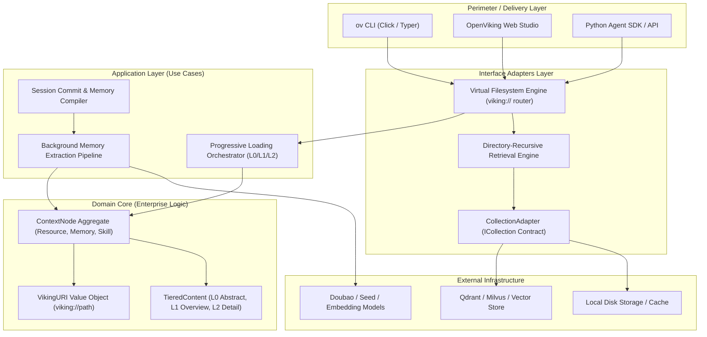

# Project Case Study: OpenViking

> **Repository**: [volcengine/OpenViking](https://github.com/volcengine/OpenViking)  
> **Domain**: Agent Context Database, Long-term Memory & Knowledge RAG  
> **Scale & Maturity**: 36.7k+ stars, production-grade agent infrastructure (ByteDance / Volcengine)  
> **Core Tech Stack**: Python 3.10+, Qdrant / Vector backends, Pydantic, Click/Typer CLI (`ov`), Pytest  

---

## 1. Executive Architecture Summary

OpenViking addresses a fundamental bottleneck in modern LLM agent systems: context bloat, token wastage, and fractured long-term memory. Rather than treating agent context as flat vector chunks stored in isolated vector databases, OpenViking introduces a **Virtual Filesystem Paradigm** under the `viking://` URI scheme.

The architecture models all agent data—memories (preferences, past experiences), resources (source code, documentation, papers), and skills (executable operational instructions)—as a hierarchical virtual directory tree. By pairing this tree with a **3-tier progressive loading ladder** (L0 abstract, L1 overview, L2 full content) and **directory-recursive retrieval**, agents can navigate knowledge hierarchically using familiar filesystem commands (`ls`, `tree`, `read`, `write`, `find`), reducing token consumption by up to 70-80% compared to brute-force context stuffing.

### High-Level Architectural Diagram



---

## 2. Layering & Boundary Discipline

| Layer | Directory / Module | Responsibilities | Permitted Inward Dependencies |
| :--- | :--- | :--- | :--- |
| **Domain (Core)** | `openviking/domain/` | Pure context entities (`ContextNode`), `VikingURI` parsing, tier invariants | None (Standard library only) |
| **Application (Use Cases)** | `openviking/services/` | Session compilation, progressive loading logic, memory extraction workflows | Domain only |
| **Interface Adapters** | `openviking/storage/` | `CollectionAdapter`, file serialization, search query translation | Application, Domain |
| **Drivers / Perimeter** | `openviking/cli/`, `api/` | `ov` command handlers, Web Studio FastAPI endpoints | Adapters, Application |

### Inward Dependency Rule Audit
- **Purity Check**: Core context node definitions and URI value objects have zero dependencies on vector libraries or web frameworks.
- **Seam Definitions**: The vector database is isolated behind an explicit `ICollection` / `CollectionAdapter` interface. Swapping Qdrant for Chroma or Milvus requires zero modifications to the retrieval or filesystem logic.
- **Progressive Data Boundaries**: Content transfers between layers as structured dataclass DTOs separating `.abstract.md`, `.overview.md`, and raw content files.

---

## 3. Macro Architectural Patterns in Action

### A. The 3-Tier Progressive Loading Ladder
Instead of loading entire documents into an agent's context window, OpenViking strictly enforces progressive loading tiers:
- **L0 (Abstract)**: A single-sentence summary (~20-40 tokens) used for rapid relevance checks.
- **L1 (Overview)**: Core architectural concepts, key points, and usage scenarios (~200-400 tokens) for planning.
- **L2 (Full Detail)**: Complete raw data, loaded strictly on demand when an agent confirms relevance.

```python
# openviking/domain/tiered_content.py
from dataclasses import dataclass
from typing import Optional

@dataclass(frozen=True)
class TieredContent:
    """Immutable value object representing multi-tier context data."""
    l0_abstract: str
    l1_overview: Optional[str] = None
    l2_detail: Optional[str] = None

    def get_for_level(self, tier: str) -> str:
        if tier == "L0":
            return self.l0_abstract
        elif tier == "L1":
            return self.l1_overview or self.l0_abstract
        elif tier == "L2":
            if self.l2_detail is None:
                raise ValueError("L2 content not yet hydrated from storage")
            return self.l2_detail
        raise ValueError(f"Unknown tier: {tier}")
```

### B. Storage Decoupling via `CollectionAdapter`
The vector storage backend is abstracted behind an explicit adapter seam:

```python
# openviking/storage/adapter.py
from typing import Protocol, runtime_checkable
from dataclasses import dataclass

@dataclass(frozen=True)
class VectorRecord:
    id: str
    vector: list[float]
    metadata: dict[str, str]

@runtime_checkable
class ICollection(Protocol):
    """Abstract port isolating vector database operations."""
    def insert(self, collection_name: str, records: list[VectorRecord]) -> None: ...
    def search(self, collection_name: str, query_vector: list[float], limit: int) -> list[VectorRecord]: ...
    def delete(self, collection_name: str, ids: list[str]) -> None: ...

class QdrantCollectionAdapter:
    """Concrete adapter bridging Qdrant client to ICollection port."""
    def __init__(self, host: str, port: int) -> None:
        self._host = host
        self._port = port
        self._client = None  # Lazily instantiated client

    def _get_client(self):
        if self._client is None:
            from qdrant_client import QdrantClient
            self._client = QdrantClient(host=self._host, port=self._port)
        return self._client

    def insert(self, collection_name: str, records: list[VectorRecord]) -> None:
        client = self._get_client()
        # Translates internal VectorRecord domain objects to Qdrant PointStruct
        ...
```

### C. Directory Recursive Retrieval
Rather than performing a global flat vector scan across millions of chunks, OpenViking performs **hierarchical pruning**:
1. Search across directory-level L0/L1 vector representations.
2. Select the top-$K$ candidate directories.
3. Drill down into child nodes within candidate branches.
4. Return precision paths for agent inspection.

---

## 4. Meso Tactical Design Patterns in Action

| Pattern | Module Location | Purpose & Implementation Details |
| :--- | :--- | :--- |
| **Adapter** | `openviking/storage/` | `QdrantCollectionAdapter` adapting third-party vector databases to `ICollection`. |
| **Composite** | `openviking/vfs/node.py` | Virtual filesystem hierarchy (`DirectoryNode` contains `FileNode` or nested `DirectoryNode`). |
| **Strategy** | `openviking/retrieval/` | Pluggable retrieval strategies: pure semantic vector search vs. keyword BM25 vs. hybrid planner. |
| **Observer / Pipeline**| `openviking/compilation/` | Session commit triggers background extraction pipelines and sidecar generator hooks. |
| **Façade** | `openviking/vfs/facade.py` | Unified `viking://` VFS interface providing high-level `ls()`, `read()`, `tree()`, and `find()`. |

---

## 5. Micro Code Craftsmanship & Idioms

- **Immutable Value Objects**: `VikingURI` parses and validates URI patterns (`viking://resources/{project}/...`) using Python `@dataclass(frozen=True)` with slots.
- **Fail-Fast Boundary Parsing**: Perimeter checks reject malformed paths before any database queries execute.
- **Sidecar Files (`.abstract.md`, `.overview.md`)**: Metadata and summaries are stored alongside source content rather than hidden in opaque binary blobs, ensuring human and agent inspectability.

---

## 6. Pragmatic Compromises & Architectural Trade-offs

1. **Virtual Filesystem vs. RDBMS Schemas**:
   - *Textbook purity*: Store all metadata in normalized SQL tables with foreign keys.
   - *Pragmatic choice*: Represent context as files and directories under `viking://`.
   - *Rationale*: LLM agents are pre-trained on bash, file manipulation, and directory navigation. Making the context database look like a filesystem allows agents to use intuitive mental models without SQL translation.

2. **Sidecar Markdown Files vs. Binary Index**:
   - *Trade-off*: Writing `.abstract.md` files causes filesystem IO overhead.
   - *Verdict*: Greatly improves debuggability and transparency; human developers can open `.overview.md` in any editor to see what the agent knows.

---

## 7. Curated File Tours

1. **`openviking/vfs/router.py`**: The core virtual filesystem router mapping `viking://` URIs to concrete storage handlers.
2. **`openviking/storage/collection.py`**: The `ICollection` abstract port definition and concrete vector adapter.
3. **`openviking/compilation/pipeline.py`**: The background session-to-memory distillation pipeline.
