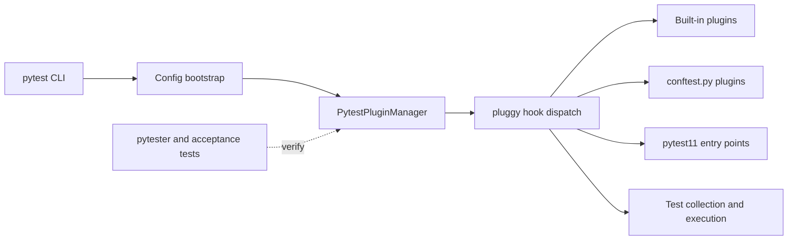

# Project Case Study: pytest

> Repository: [pytest-dev/pytest](https://github.com/pytest-dev/pytest/tree/3fd8675d6d798507c06cf9c60753be6d9d7b0e17)
> Checkout: `/media/tinhanhnguyen/sub/oss-architecture/tmp/python-oss-architecture.LEjXfG/pytest`
> Default branch: `main`
> Commit: `3fd8675d6d798507c06cf9c60753be6d9d7b0e17`
> Python: `>=3.10` (from `pyproject.toml`)
> License: MIT ([LICENSE](https://github.com/pytest-dev/pytest/blob/3fd8675d6d798507c06cf9c60753be6d9d7b0e17/LICENSE))
> Domain: Python testing framework and extensible test runner
> Evidence level: A for the pattern claims below; the overall architecture label is a synthesis of the source and test layout.

## 1. Architecture Summary

pytest is a plugin-oriented test runner. The command-line entry point creates a `Config`, configures a `PytestPluginManager`, loads built-in, `conftest.py`, environment, and entry-point plugins, and then drives the test lifecycle through pluggy hooks. Collection, reporting, fixtures, and terminal behavior are therefore extension points rather than a single hard-coded call chain.

The architecture is best described as a microkernel with a hook bus and a dynamic composition root (evidence A). It is not a domain/application/infrastructure layering example: extensibility and compatibility are the primary design constraints.

## 2. Python Boundary

The checked-out pytest project is predominantly Python (`src/_pytest` and `testing`). Its central boundary is between pytest's Python framework and pluggy's hook-dispatch library, not between Python and an in-tree C/CUDA hot path. Optional third-party plugins may depend on native extensions, but that is outside this repository's verified boundary.

| Boundary | Responsibility | Architectural consequence |
|---|---|---|
| `_pytest.config` | Parse options, load plugins, own startup/teardown | Composition is centralized and observable |
| `PytestPluginManager` / pluggy | Register implementations and dispatch hooks | Features depend on hook contracts instead of each other |
| Built-in and external plugins | Implement collection, fixtures, reporting, and integrations | The framework core remains replaceable in places |
| `testing/` and pytester | Exercise plugins in isolated runners | Plugin seams are testable without only using end-to-end shell tests |

## 3. Pattern Map

| Pattern ID | Pattern | Source evidence | Test evidence | Book mapping |
|---|---|---|---|---|
| P08 | Factory, registry, and plugin architecture | [`PytestPluginManager.register` and plugin loading](https://github.com/pytest-dev/pytest/blob/3fd8675d6d798507c06cf9c60753be6d9d7b0e17/src/_pytest/config/__init__.py#L490-L614), [`import_plugin`](https://github.com/pytest-dev/pytest/blob/3fd8675d6d798507c06cf9c60753be6d9d7b0e17/src/_pytest/config/__init__.py#L915-L973) | [`test_pluginmanager.py`](https://github.com/pytest-dev/pytest/blob/3fd8675d6d798507c06cf9c60753be6d9d7b0e17/testing/test_pluginmanager.py#L276-L389) covers registration, duplicates, entry points, and failures | Software Design ch34; Clean Architecture ch19–20 |
| P06 | Ports, adapters, and dependency inversion | Hook specifications define the callable contract and pluggy supplies the dispatch adapter; [`hookspec.py`](https://github.com/pytest-dev/pytest/blob/3fd8675d6d798507c06cf9c60753be6d9d7b0e17/src/_pytest/hookspec.py#L46-L120) | [`test_pytester.py`](https://github.com/pytest-dev/pytest/blob/3fd8675d6d798507c06cf9c60753be6d9d7b0e17/testing/test_pytester.py#L194-L194) and plugin-manager tests exercise added hook specifications | Architecture Patterns ch13; Clean Architecture ch14, ch16 |
| P07 | Composition root and dependency injection (DI-like) | [`Config.parse` and startup plugin loading](https://github.com/pytest-dev/pytest/blob/3fd8675d6d798507c06cf9c60753be6d9d7b0e17/src/_pytest/config/__init__.py#L1631-L1720) | [`test_config.py`](https://github.com/pytest-dev/pytest/blob/3fd8675d6d798507c06cf9c60753be6d9d7b0e17/testing/test_config.py#L2235-L2235) and acceptance tests exercise configured startup | Architecture Patterns ch13; Clean Architecture ch14 |
| P10 | Commands, events, and message bus | Historic hook calls notify already-registered plugins and let later plugins participate in lifecycle events; [`_do_configure`](https://github.com/pytest-dev/pytest/blob/3fd8675d6d798507c06cf9c60753be6d9d7b0e17/src/_pytest/config/__init__.py#L1316-L1337) | [`test_pluginmanager.py`](https://github.com/pytest-dev/pytest/blob/3fd8675d6d798507c06cf9c60753be6d9d7b0e17/testing/test_pluginmanager.py#L299-L331) checks historic registration callbacks | Architecture Patterns ch08–11; Software Design ch37 |
| P14 | Decorator, middleware, and observability | Hook markers and wrappers provide cross-cutting lifecycle/reporting behavior without changing every caller | Hook and acceptance tests in [`testing/`](https://github.com/pytest-dev/pytest/tree/3fd8675d6d798507c06cf9c60753be6d9d7b0e17/testing) exercise plugin-added hooks and reporting | Clean Architecture ch23; Software Design ch39 |
| P16 | Concurrency, scheduling, and resource lifecycle | Configuration has explicit configure/unconfigure phases; [`_do_configure`](https://github.com/pytest-dev/pytest/blob/3fd8675d6d798507c06cf9c60753be6d9d7b0e17/src/_pytest/config/__init__.py#L1316-L1337) | [`test_pluginmanager.py`](https://github.com/pytest-dev/pytest/blob/3fd8675d6d798507c06cf9c60753be6d9d7b0e17/testing/test_pluginmanager.py#L522-L580) covers blocked and disabled plugin lifecycle behavior | Architecture Patterns ch06, ch13; Clean Architecture ch21 |
| P17 | Testing seams and architecture fitness | Plugin manager and pytester make hook contracts executable test seams | [`test_pluginmanager.py`](https://github.com/pytest-dev/pytest/blob/3fd8675d6d798507c06cf9c60753be6d9d7b0e17/testing/test_pluginmanager.py) and [`acceptance_test.py`](https://github.com/pytest-dev/pytest/blob/3fd8675d6d798507c06cf9c60753be6d9d7b0e17/testing/acceptance_test.py) | Clean Architecture ch21; ch24 |

## 4. Source Walkthrough

### Plugin contract and registration

[`PytestPluginManager`](https://github.com/pytest-dev/pytest/blob/3fd8675d6d798507c06cf9c60753be6d9d7b0e17/src/_pytest/config/__init__.py#L490-L614) subclasses pluggy's manager, installs pytest hook specifications, registers itself, and filters `pytest_` hook implementations. [`import_plugin`](https://github.com/pytest-dev/pytest/blob/3fd8675d6d798507c06cf9c60753be6d9d7b0e17/src/_pytest/config/__init__.py#L915-L973) resolves built-ins and `pytest11` entry points, imports them, and turns import failures into pytest-specific diagnostics.

### Composition and lifecycle

[`Config.parse`](https://github.com/pytest-dev/pytest/blob/3fd8675d6d798507c06cf9c60753be6d9d7b0e17/src/_pytest/config/__init__.py#L1631-L1720) is the practical composition root. It parses options, loads plugins, and establishes the hook environment. [`_do_configure`](https://github.com/pytest-dev/pytest/blob/3fd8675d6d798507c06cf9c60753be6d9d7b0e17/src/_pytest/config/__init__.py#L1316-L1337) invokes configuration hooks and later coordinates unconfiguration, so plugins receive lifecycle boundaries rather than only a registration callback.

### Contract tests

[`testing/test_pluginmanager.py`](https://github.com/pytest-dev/pytest/blob/3fd8675d6d798507c06cf9c60753be6d9d7b0e17/testing/test_pluginmanager.py#L276-L389) verifies normal registration, duplicate handling, module-declared plugins, entry-point resolution, and failed imports. The test suite also uses pytester to construct temporary projects and run the real plugin path, which checks the contract across the CLI boundary.

## 5. Theory Versus Practice

### Theoretical ideal

The books' dependency-inversion and plugin guidance favors stable ports, explicit composition, and adapters that can be replaced in tests. A message bus should make event ownership and failure behavior explicit, and a composition root should assemble dependencies once.

### Production implementation

pytest uses a central, mutable plugin manager and dynamic imports. Hook specifications are the stable port; pluggy handles ordering and dispatch; plugins can arrive from local files, environment variables, built-ins, or package entry points. Historic hooks preserve lifecycle notifications for plugins loaded at different times. Error types distinguish an invalid pytest invocation from a plugin import failure.

### Difference and rationale

The global-ish manager and import-time discovery are more implicit than a small application's dependency injection container, but they support pytest's central requirement: third-party plugins must extend an already-running ecosystem without editing the core. The cost is more runtime state, import-order behavior, and diagnostics that must be understood by plugin authors.

## 6. Testing Strategy

- Unit tests cover registration identity, duplicate plugins, blocked plugins, entry-point lookup, import failures, and historic callbacks.
- Hook-spec tests verify that external behavior can be added through a contract rather than through private calls.
- pytester and acceptance tests run temporary projects through the actual command-line/bootstrap path, providing an integration seam for plugins.
- The test layout is itself an architecture fitness signal: plugin behavior is tested at both manager level and user-visible runner level.

## 7. Lessons

- Copy the approach when a framework needs many independently released extensions and a stable lifecycle contract.
- Prefer direct functions or a small explicit service object when the application has only a few collaborators; a dynamic plugin manager would add unnecessary discovery and failure modes.
- Treat plugin loading as untrusted configuration: validate names, report import context, test duplicates, and define teardown behavior.
- Do not call pytest's hook bus a durable event system. It is an in-process dispatch mechanism with framework-specific ordering and lifecycle semantics.

## 8. Practice Exercise

Build a small `MiniRunner` with a hook specification for `before_test`, `after_test`, and `report`. Support explicit registration plus a simulated entry-point name, reject duplicate names, and provide a cleanup phase. Write tests for a missing plugin, a plugin that raises during import, historic registration, ordering, and a temporary subprocess run that loads a local plugin.
