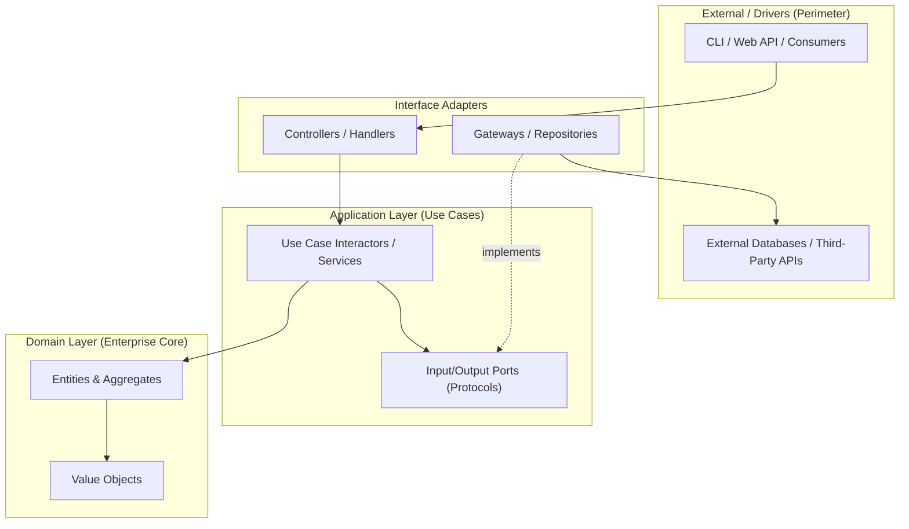

# Project Case Study Template: [Project Name]

> **Repository**: [GitHub URL]  
> **Commit / Tag**: `[e.g., v2.4.1 or commit-hash]`  
> **Domain**: [e.g., HTTP Client, ETL Pipeline, Web Framework, Task Queue]  
> **Scale & Maturity**: [e.g., 25k+ stars, 10+ years production use, high-throughput]  
> **Core Tech Stack**: [e.g., Python 3.12+, AnyIO, Pydantic, SQLAlchemy 2.0]  

---

## 1. Executive Architecture Summary

[Provide a concise 2-3 paragraph architectural summary: what problem the project solves, what architectural style it adopts (Clean Onion, Hexagonal, Modular Monolith, Pipeline/Microkernel), and why this architecture was chosen.]

### High-Level Architectural Diagram



---

## 2. Layering & Boundary Discipline

| Layer | Directory / Module | Responsibilities | Permitted Inward Dependencies |
| :--- | :--- | :--- | :--- |
| **Domain (Core)** | `src/domain/` | Pure business entities, invariants, value objects | None (Standard library only) |
| **Application (Use Cases)** | `src/application/` | Interactors, orchestrators, ports/protocols | Domain only |
| **Adapters (Gateways)** | `src/adapters/` | Concrete DB repos, external clients, presenters | Application, Domain |
| **Drivers / Perimeter** | `src/entrypoints/` | FastAPI/Flask routes, Typer CLI commands | Adapters, Application |

### Inward Dependency Rule Audit
- **Purity Check**: Does the domain layer import third-party frameworks (SQLAlchemy, Django, Flask, FastAPI)?
- **Seam Definitions**: How are side-effects (I/O, database, network) abstracted? Look for `typing.Protocol` or `abc.ABC`.
- **Data Transfer**: How does data cross layer boundaries? (e.g., DTO dataclasses, Pydantic models, or raw primitives).

---

## 3. Macro Architectural Patterns in Action

### A. Domain Modeling & Invariants
- **Location**: `[path/to/models.py]`
- **Pattern Description**: How entities and value objects are modeled.
- **Example Code**:
```python
# [Annotated code snippet showing pure domain logic & invariant enforcement]
```

### B. Repository & Unit of Work
- **Location**: `[path/to/repositories/]`
- **Abstract Seam**: `[Protocol / ABC definition]`
- **Concrete Implementation**: `[SQLAlchemy / Memory / Disk implementation]`
- **Example Code**:
```python
# [Annotated code snippet showing Repository or UoW context manager]
```

### C. Service Layer / Use Case Interactors
- **Location**: `[path/to/services/ or use_cases/]`
- **Coordination Mechanics**: How the service fetches aggregates via repo, executes business methods, and commits via Unit of Work.

### D. Events, Messaging & CQRS (if applicable)
- **Location**: `[path/to/events/ or bus/]`
- **Mechanics**: In-memory message bus, Celery/Redis tasks, or event listeners.

---

## 4. Meso Tactical Design Patterns in Action

| Pattern | Module Location | Purpose & Implementation Details |
| :--- | :--- | :--- |
| **Strategy** | `[path]` | [How algorithms or policies are swapped at runtime] |
| **Registry / Factory** | `[path]` | [How plugins or handler classes are registered and instantiated] |
| **Adapter / Façade** | `[path]` | [How third-party SDKs are wrapped and adapted to internal protocols] |
| **Decorator** | `[path]` | [Cross-cutting concerns: retry, telemetry, caching, authentication] |
| **Dependency Injection** | `[path]` | [Manual composition root, Dishka, Dependency Injector, or FastAPI Depends] |

### Pattern Deep Dive: [Featured Pattern Name]
```python
# [Annotated real-world implementation snippet]
```

---

## 5. Micro Code Craftsmanship & Idioms

- **Protocols & Structural Typing**: Usage of `typing.Protocol` with `@runtime_checkable` for zero-coupling seams.
- **Resource Management & Context Managers**: Reusable `@contextmanager` or `__enter__` / `__exit__` handling network sockets, locks, or DB sessions.
- **Sentinel Values & Absence Handling**: Handling missing vs default parameters cleanly.
- **Fail-Fast Guard Clauses**: Input perimeter validation vs domain assertions.

```python
# [Annotated micro-level idiom snippet from the codebase]
```

---

## 6. Pragmatic Compromises & Architectural Trade-offs

Real open-source codebases rarely follow textbook architecture dogmatically. Highlight where this project intentionally made pragmatic concessions:

1. **Trade-off 1: [e.g., ORM models used directly in read paths]**
   - *Textbook purity*: Complete separation between ORM models and domain models with manual mapping.
   - *Pragmatic choice*: Raw SQL read-models or lightweight mapping for performance / velocity.
   - *Verdict*: Justified for read-heavy query paths (CQRS read optimization).

2. **Trade-off 2: [e.g., In-memory event dispatch vs distributed message broker]**
   - *Rationale*: Avoided operational complexity of Kafka/RabbitMQ until distributed scaling was proven necessary.

---

## 7. Curated File Tours (Annotated Walkthroughs)

Highlight 3-5 pivotal files in the repository that every architect should study:

1. **[`path/to/file1.py`](file://path/to/file1.py)**: The Composition Root / Wiring Layer.
2. **[`path/to/file2.py`](file://path/to/file2.py)**: The Core Domain Aggregate Root.
3. **[`path/to/file3.py`](file://path/to/file3.py)**: The Port & Adapter Boundary.

---

## 8. Test Harness & Verification Strategy

- **Fake-First Port Testing**: How ports are faked in unit tests (`FakeRepository`, `FakeEmailSender`) enabling fast in-memory suites without Docker/DB.
- **Integration Seams**: How end-to-end tests exercise the entrypoints with test databases (testcontainers, sqlite in-memory).
- **Test Ratio**: Domain unit tests vs integration tests.
